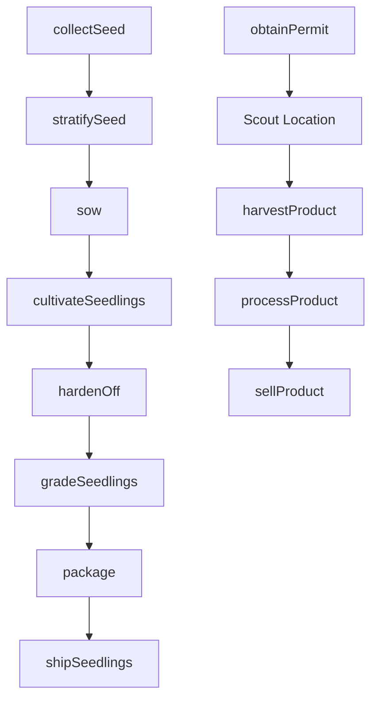
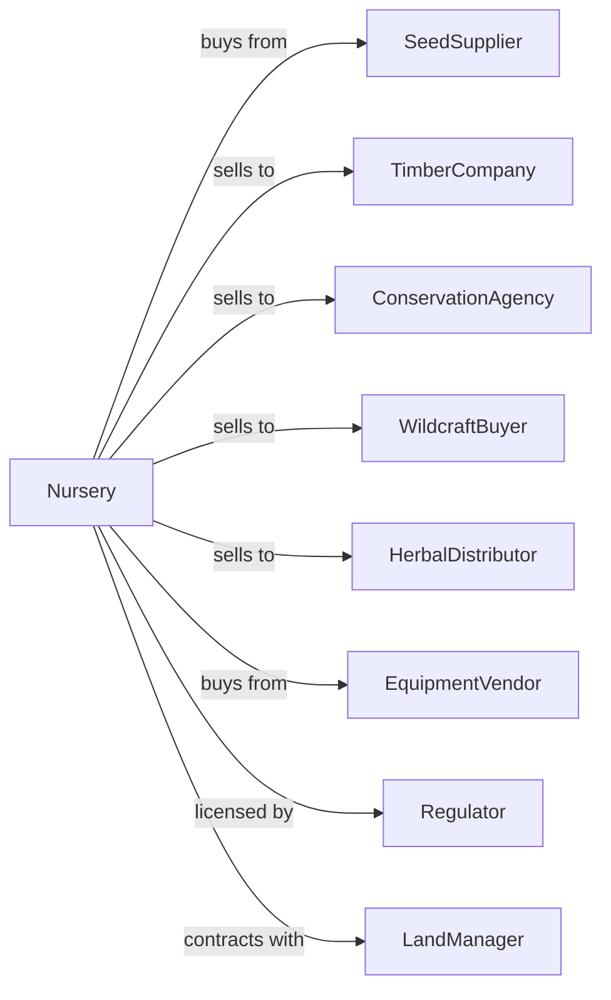

# Forest Nurseries and Gathering of Forest Products

> Business-as-Code definition for forest nursery and non-timber forest product operations. Models seedling production for reforestation and gathering of specialty forest products including ginseng, mushrooms, and botanicals.

## Overview

Forest nurseries and gathering operations produce tree seedlings for reforestation and harvest non-timber forest products from wild or managed lands. Nurseries grow containerized and bare-root seedlings for commercial and conservation plantings. Gatherers harvest ginseng, mushrooms, mosses, bark, and other specialty products. This definition exposes actions for nursery management, harvesting protocols, and product marketing with events for automation and searches for production analytics.

## Actors

| Actor | Description |
|-------|-------------|
| SeedSupplier | Provides certified tree seed by species and provenance |
| TimberCompany | Purchases seedlings for reforestation |
| ConservationAgency | Purchases seedlings for restoration projects |
| WildcraftBuyer | Purchases gathered forest products |
| HerbalDistributor | Purchases ginseng and medicinal botanicals |
| EquipmentVendor | Sells nursery and harvesting equipment |
| Regulator | Oversees seed certification and gathering permits |
| LandManager | Grants access for gathering on managed lands |

## Roles

| Role | Description |
|------|-------------|
| NurseryOwner | Owns operation and manages production strategy |
| PropagationManager | Oversees seed processing and germination |
| GrowingTechnician | Manages seedling culture and irrigation |
| GathererForeman | Leads wild harvest crews |
| QualityInspector | Grades seedlings and forest products |
| Bookkeeper | Manages orders, permits, and compliance |
| WildcraftGatherer | Locates and harvests ginseng, ramps, and medicinal botanicals in season |

## Entities

| Entity | Description |
|--------|-------------|
| Seed | Tree seed by species and genetic source |
| Seedling | Young tree grown for transplanting |
| Bareroot | Dormant seedling shipped without soil |
| Container | Pot or plug for growing containerized stock |
| Greenhouse | Controlled environment for seedling production |
| SeedBed | Outdoor growing area for bareroot stock |
| Ginseng | Medicinal root harvested wild or cultivated |
| Mushroom | Edible fungi gathered from forest |
| Botanical | Bark, moss, or other gathered plant material |
| Permit | License to gather on specific lands |

## Actions

| Action | Description |
|--------|-------------|
| collectSeed | Harvest and process tree seed |
| stratifySeed | Treat seed for dormancy release |
| sow | Plant seed in containers or beds |
| cultivateSeedlings | Manage irrigation, fertilization, and growth |
| hardenOff | Acclimate seedlings to outdoor conditions |
| gradeSeedlings | Sort by size and quality standards |
| package | Prepare seedlings for shipping |
| shipSeedlings | Deliver orders to customers |
| obtainPermit | Secure gathering rights from landowner |
| harvestProduct | Gather forest products from wild |
| processProduct | Clean, dry, or prepare gathered materials |
| sellProduct | Market forest products to buyers |

## Events

| Event | Description |
|-------|-------------|
| seedCollected | Tree seed harvested and received |
| seedSown | Planting completed |
| germinationCompleted | Seedlings emerged |
| seedlingsGraded | Quality assessment finished |
| orderFilled | Seedlings shipped to customer |
| permitObtained | Gathering license secured |
| productHarvested | Forest products collected |
| productSold | Sale completed to buyer |
| frostWarningIssued | Frost warning issued for nursery area |
| diseaseDetected | Plant health issue identified |

## Searches

| Search | Description |
|--------|-------------|
| getSeedlingInventory | List seedlings by species and size |
| trackGrowingProgress | Get germination and growth metrics |
| getOrderQueue | List pending customer orders |
| findSeedSources | List certified seed suppliers by species |
| getPermitStatus | Check gathering permit validity |
| getHarvestHistory | Retrieve past product volumes |
| findBuyers | List active product purchasers |
| getWeatherForecast | Check conditions for frost protection |

## Workflow



## Actor Relationships



## Usage

### Calling Actions

```typescript
import { growForestSeedlings } from '@headlessly/grow-forest-seedlings'

const nursery = growForestSeedlings()

// Review seedling inventory by species and size class
const inventory = await nursery.getSeedlingInventory({ species: 'pinus-taeda' })

// Check pending customer orders
const orders = await nursery.getOrderQueue({ season: '2025' })

// Sow pine seed for next year's orders
await nursery.sow({
  species: 'pinus-taeda',
  seedLotId: 'loblolly-2024-coastal',
  containerType: 'plug-tray',
  quantity: 500000,
  sowDate: new Date('2024-03-01')
})

// Grade and package seedlings for shipment
const grading = await nursery.gradeSeedlings({
  batchId: 'loblolly-2024-coastal',
  standards: { minHeight: 8, minCaliper: 3, rootScore: 'A' }
})

await nursery.package({
  batchId: grading.passedBatch,
  orderId: 'order-timber-co-2025',
  bundleSize: 500
})

// Harvest wild ginseng
await nursery.harvestProduct({
  product: 'ginseng',
  permitId: 'permit-national-forest-2024',
  location: 'appalachian-zone-5',
  quantity: 50 // pounds
})
```

### Event-Driven Automation

```typescript
// Protect seedlings from frost
nursery.frostWarningIssued(async ({ greenhouseId, forecastLow, date }) => {
  if (forecastLow < 32) {
    await nursery.activateHeating({
      greenhouseId,
      targetTemp: 40,
      duration: 'until-sunrise'
    })
  }
})

// Auto-notify customers when orders ready
nursery.seedlingsGraded(async ({ batchId, passedCount, orderId }) => {
  const order = await nursery.getOrder({ orderId })

  if (passedCount >= order.quantity) {
    await notifyCustomer({
      customerId: order.customerId,
      message: 'Your seedling order is ready for shipment',
      quantity: order.quantity,
      species: order.species
    })
  }
})
```

## Related

- [Timber Tract Operations](../1131-TimberTractOperations/113110-TimberTractOperations.mdx)
- [Logging](../1133-Logging/113310-Logging.mdx)
- [Support Activities for Forestry](../../115-SupportActivitiesForAgricultureAndForestry/1153-SupportActivitiesForForestry/115310-SupportActivitiesForForestry.mdx)
