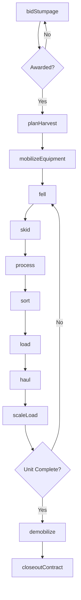
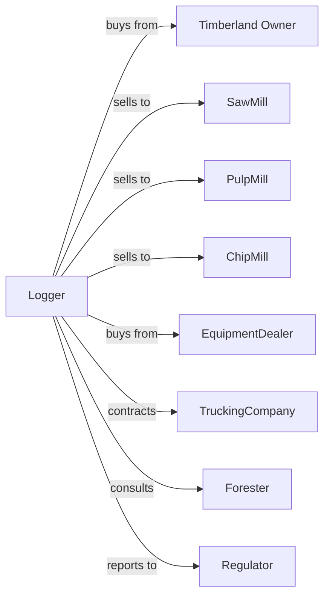

# Logging

> Business-as-Code definition for timber harvesting operations. Models the complete logging cycle from stumpage acquisition through log delivery including felling, skidding, processing, and trucking.

## Overview

Logging operations cut, process, and transport timber from forests to mills. Contractors purchase stumpage rights, mobilize equipment, fell trees, skid logs to landings, process them to specifications, and haul them to buyers. This definition exposes actions for harvest execution, equipment management, and mill delivery with events for automation and searches for production tracking.

## Actors

| Actor | Description |
|-------|-------------|
| Timberland Owner | Sells stumpage rights for harvest |
| SawMill | Purchases sawlogs for lumber production |
| PulpMill | Purchases pulpwood for paper production |
| ChipMill | Purchases wood for chip production |
| EquipmentDealer | Sells and services logging equipment |
| TruckingCompany | Provides log transportation services |
| Forester | Provides harvest planning and oversight |
| Regulator | Oversees forest practices and safety compliance |

## Roles

| Role | Description |
|------|-------------|
| LoggingContractor | Owns operation and bids on stumpage |
| HarvestSupervisor | Oversees daily logging operations |
| FellerOperator | Operates feller-buncher or chainsaw |
| SkidderOperator | Moves logs from stump to landing |
| LoaderOperator | Loads trucks at landing |
| TruckDriver | Hauls logs to mill |
| Bucker | Measures and cuts felled trees into specified log lengths at the landing |

## Entities

| Entity | Description |
|--------|-------------|
| StumpageContract | Agreement to harvest standing timber |
| HarvestUnit | Defined area for timber cutting |
| FellerBuncher | Machine for cutting and bunching trees |
| Skidder | Machine for dragging logs to landing |
| Processor | Machine for delimbing and bucking |
| Loader | Machine for loading trucks |
| LogTruck | Vehicle for transporting logs |
| Landing | Staging area for log processing |
| Sawlog | Log meeting dimensional requirements |
| Pulpwood | Small timber for pulp production |

## Actions

| Action | Description |
|--------|-------------|
| bidStumpage | Submit offer for standing timber |
| planHarvest | Design harvest layout and access |
| mobilizeEquipment | Move machines to harvest site |
| fell | Cut standing trees |
| skid | Drag logs from stump to landing |
| process | Delimb and buck trees to length |
| sort | Separate logs by product and grade |
| load | Place logs on trucks for transport |
| haul | Transport logs to mill |
| scaleLoad | Measure volume for payment |
| demobilize | Remove equipment from site |
| closeoutContract | Finalize stumpage payment |

## Events

| Event | Description |
|-------|-------------|
| stumpageAwarded | Bid accepted by landowner |
| harvestPlanApproved | Cutting plan certified |
| equipmentMobilized | Machines arrived on site |
| fellingStarted | Tree cutting begun |
| loadingComplete | Truck filled and ready |
| loadDelivered | Logs arrived at mill |
| loadScaled | Volume measured and recorded |
| harvestComplete | All timber removed from unit |
| contractClosed | Final settlement complete |
| equipmentBreakdown | Machine failure requiring repair |
| weatherDelay | Operations suspended for conditions |

## Searches

| Search | Description |
|--------|-------------|
| getActiveContracts | List stumpage agreements |
| trackProduction | Get daily loads and volumes |
| getEquipmentStatus | Check machine locations and condition |
| findStumpage | List available timber sales |
| getMillPrices | Query current log prices by grade |
| getScaleTickets | Retrieve delivered load records |
| getCrewSchedule | View operator assignments |
| getWeatherForecast | Check conditions for operations |

## Workflow



## Actor Relationships



## Usage

### Calling Actions

```typescript
import { harvestTimber } from '@headlessly/harvest-timber'

const logging = harvestTimber()

// Bid on stumpage sale
const bid = await logging.bidStumpage({
  saleId: 'sale-pine-40-2024',
  bidPrice: 425, // per MBF
  harvestWindow: { start: new Date('2024-06-01'), end: new Date('2024-12-31') }
})

// Plan and mobilize for harvest
await logging.planHarvest({
  contractId: bid.contractId,
  accessRoutes: ['road-a', 'road-b'],
  landingLocations: ['landing-1', 'landing-2'],
  bmPs: ['streamBuffers', 'erosionControl']
})

await logging.mobilizeEquipment({
  contractId: bid.contractId,
  equipment: ['feller-1', 'skidder-2', 'loader-3'],
  mobilizeDate: new Date('2024-06-01')
})

// Load and haul to mill
const load = await logging.load({
  landingId: 'landing-1',
  truckId: 'truck-42',
  product: 'sawlog',
  estimatedVolume: 5.2 // MBF
})

await logging.haul({
  loadId: load.id,
  destinationMill: 'georgia-pacific-mill-5'
})
```

### Event-Driven Automation

```typescript
// Auto-dispatch trucks when loads ready
logging.loadingComplete(async ({ landingId, truckId, product, volume }) => {
  const bestMill = await logging.getMillPrices({
    product,
    maxDistance: 50
  })

  await logging.haul({
    truckId,
    destinationMill: bestMill[0].millId,
    estimatedVolume: volume
  })
})

// Alert on equipment breakdown
logging.equipmentBreakdown(async ({ machineId, issue, severity }) => {
  await notifySupervisor({
    alert: 'equipmentDown',
    machineId,
    issue,
    severity
  })

  if (severity === 'critical') {
    await logging.requestService({
      machineId,
      issue,
      urgency: 'emergency'
    })
  }
})
```

## Related

- [Timber Tract Operations](../1131-TimberTractOperations/113110-TimberTractOperations.mdx)
- [Forest Nurseries and Gathering of Forest Products](../1132-ForestNurseriesAndGatheringOfForestProducts/113210-ForestNurseriesAndGatheringOfForestProducts.mdx)
- [Support Activities for Forestry](../../115-SupportActivitiesForAgricultureAndForestry/1153-SupportActivitiesForForestry/115310-SupportActivitiesForForestry.mdx)
