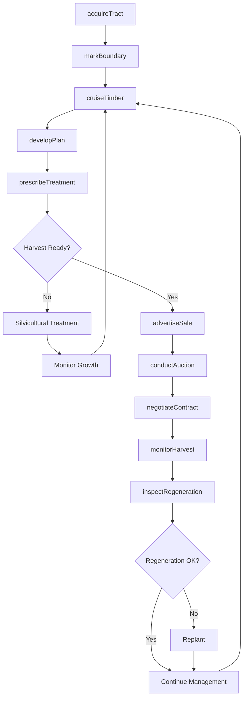
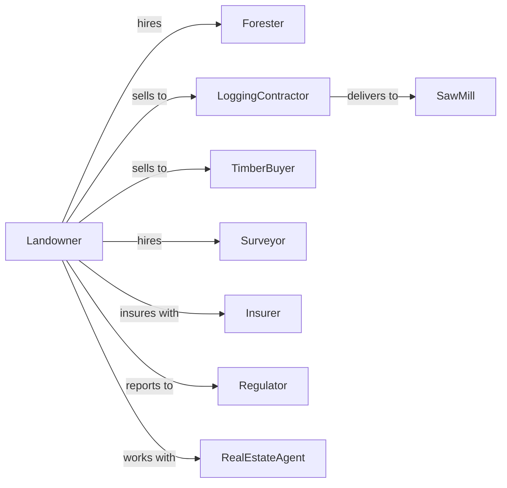

# Timber Tract Operations

> Business-as-Code definition for timberland management operations. Models the complete forest management cycle from acquisition through timber sales including stand inventory, silviculture, and stumpage marketing.

## Overview

Timber tract operations involve owning and managing forestland for the purpose of selling standing timber or stumpage rights. Operations maintain long-term forest management plans, conduct periodic inventories, and market timber to logging contractors. This definition exposes actions for forest stewardship, timber marketing, and land management with events for automation and searches for inventory analytics.

## Actors

| Actor | Description |
|-------|-------------|
| LoggingContractor | Purchases stumpage and harvests timber |
| Forester | Provides forest management consulting |
| TimberBuyer | Purchases standing timber at auction |
| SawMill | End buyer of harvested timber |
| Surveyor | Provides boundary and mapping services |
| Insurer | Provides timberland insurance coverage |
| Regulator | Oversees forest practice rules and permits |
| RealEstateAgent | Facilitates timberland acquisitions and sales |

## Roles

| Role | Description |
|------|-------------|
| LandOwner | Owns timberland and makes strategic decisions |
| ForestManager | Oversees forest management plan execution |
| TimberCruiser | Conducts stand inventories and valuations |
| BoundaryTech | Maintains property boundaries and signs |
| SalesManager | Markets timber and negotiates contracts |
| Bookkeeper | Manages timber accounts and tax records |
| Silviculturist | Plans and executes thinning, prescribed burns, and reforestation |

## Entities

| Entity | Description |
|--------|-------------|
| Tract | Parcel of forestland under management |
| Stand | Distinct unit of forest with uniform characteristics |
| Timber | Standing trees with commercial value |
| Stumpage | Right to harvest standing timber |
| Inventory | Assessment of timber volume and value |
| ManagementPlan | Long-term forest stewardship document |
| Easement | Access or conservation right on land |
| Boundary | Property line delimiting ownership |
| HarvestUnit | Area designated for timber cutting |
| Regeneration | New tree growth after harvest |

## Actions

| Action | Description |
|--------|-------------|
| acquireTract | Purchase or lease forestland |
| cruiseTimber | Inventory standing timber volume and value |
| developPlan | Create forest management plan |
| markBoundary | Establish and maintain property lines |
| prescribeTreatment | Specify silvicultural practices |
| advertiseSale | Market stumpage opportunity |
| conductAuction | Sell timber through competitive bidding |
| negotiateContract | Finalize stumpage sale terms |
| monitorHarvest | Oversee logging operations |
| inspectRegeneration | Assess post-harvest regrowth |
| payTaxes | Manage property and timber taxes |
| renewCertification | Maintain sustainable forestry certification |

## Events

| Event | Description |
|-------|-------------|
| tractAcquired | New forestland purchased |
| inventoryComplete | Timber cruise finished |
| planApproved | Management plan certified |
| saleAdvertised | Timber marketed for sale |
| bidReceived | Offer submitted for stumpage |
| contractSigned | Sale agreement executed |
| harvestStarted | Logging operations begun |
| harvestComplete | Timber removal finished |
| regenerationEstablished | New forest growth confirmed |
| certificationRenewed | Sustainability audit passed |
| taxesPaid | Property tax obligation met |

## Searches

| Search | Description |
|--------|-------------|
| getTractInventory | List tracts with timber volumes |
| getStandConditions | Retrieve stand data by age and species |
| getHarvestSchedule | View planned cutting dates |
| findBuyers | List active timber purchasers |
| getSalesHistory | Retrieve past stumpage prices |
| getManagementPlan | Access current forest plan |
| getCertificationStatus | Check sustainable forestry status |
| getTaxRecords | Retrieve property tax history |

## Workflow



## Actor Relationships



## Usage

### Calling Actions

```typescript
import { manageTimberTracts } from '@headlessly/manage-timber-tracts'

const forest = manageTimberTracts()

// Cruise timber for inventory
const inventory = await forest.cruiseTimber({
  tractId: 'tract-north-40',
  method: 'systematic-strip',
  plotIntensity: 0.05,
  date: new Date()
})

// Develop management plan based on inventory
await forest.developPlan({
  tractId: 'tract-north-40',
  inventoryId: inventory.id,
  objectives: ['timber-production', 'wildlife-habitat'],
  planHorizon: 20
})

// Advertise timber sale
await forest.advertiseSale({
  harvestUnitId: 'unit-15',
  volume: inventory.mbf,
  species: ['pine', 'oak'],
  saleMethod: 'sealed-bid',
  bidDeadline: new Date('2024-06-01')
})

// Execute sale contract
await forest.negotiateContract({
  buyerId: 'summit-logging',
  harvestUnitId: 'unit-15',
  stumpageRate: 450,
  harvestWindow: { start: new Date('2024-07-01'), end: new Date('2024-12-31') }
})
```

### Event-Driven Automation

```typescript
// Schedule regeneration inspection after harvest
forest.harvestComplete(async ({ harvestUnitId, completionDate }) => {
  await forest.inspectRegeneration({
    harvestUnitId,
    inspectionDate: addMonths(completionDate, 12),
    criteria: ['stocking', 'species-composition', 'competing-vegetation']
  })
})

// Alert on certification expiration
forest.certificationRenewed(async ({ certId, expirationDate }) => {
  const monthsRemaining = monthsBetween(new Date(), expirationDate)

  if (monthsRemaining <= 6) {
    await scheduleAudit({
      certId,
      auditDate: subtractMonths(expirationDate, 3),
      auditor: 'sfi-certifier'
    })
  }
})
```

## Related

- [Forest Nurseries and Gathering of Forest Products](../1132-ForestNurseriesAndGatheringOfForestProducts/113210-ForestNurseriesAndGatheringOfForestProducts.mdx)
- [Logging](../1133-Logging/113310-Logging.mdx)
- [Support Activities for Forestry](../../115-SupportActivitiesForAgricultureAndForestry/1153-SupportActivitiesForForestry/115310-SupportActivitiesForForestry.mdx)
