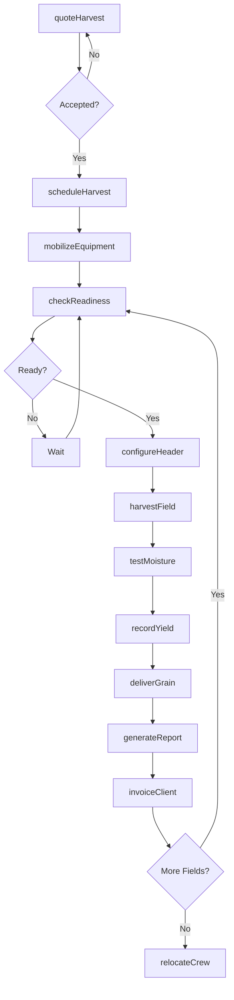
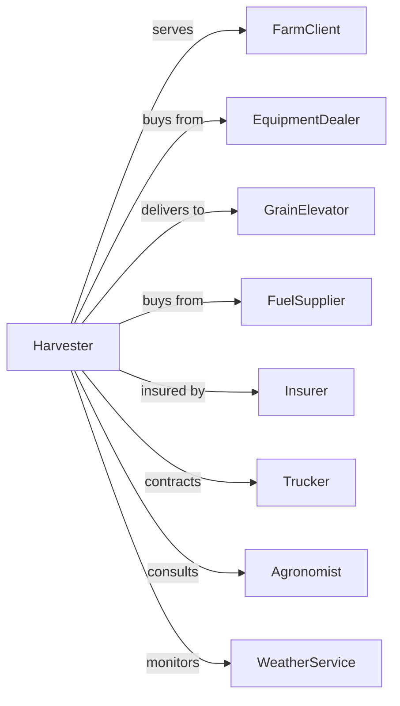

# Crop Harvesting, Primarily by Machine

> Business-as-Code definition for custom harvesting service operations. Models contract combining, picking, and harvesting services performed for farm clients using operator-owned machinery.

## Overview

Custom harvesting services provide mechanized crop harvesting to farmers who lack equipment, labor, or capacity during peak harvest windows. Custom harvesters operate combines, cotton pickers, forage harvesters, and specialty equipment, often traveling regionally to follow crop maturity from south to north. This definition exposes actions for harvest scheduling, field operations, and logistics coordination with events for automation and searches for production analytics.

## Actors

| Actor | Description |
|-------|-------------|
| FarmClient | Hires custom harvest services |
| EquipmentDealer | Sells and services harvesting machinery |
| GrainElevator | Receives harvested grain for storage or sale |
| FuelSupplier | Provides diesel for harvest operations |
| Insurer | Provides equipment and liability coverage |
| Trucker | Transports grain from field to storage |
| Agronomist | Advises on harvest timing and conditions |
| WeatherService | Provides forecasts for harvest planning |

## Roles

| Role | Description |
|------|-------------|
| HarvestOwner | Owns custom harvest operation and equipment |
| CrewManager | Coordinates crews and schedules |
| CombineOperator | Operates combine harvester |
| HeaderOperator | Handles header changes and adjustments |
| GrainCartOperator | Transfers grain from combine to trucks |
| Mechanic | Maintains and repairs harvest equipment |
| YieldMonitorTech | Calibrates combine yield monitors and builds field yield maps |

## Entities

| Entity | Description |
|--------|-------------|
| ServiceContract | Agreement for custom harvesting |
| HarvestJob | Specific field to be harvested |
| Combine | Self-propelled harvesting machine |
| Header | Crop-specific attachment for combines |
| GrainCart | Equipment for field grain transfer |
| Field | Client parcel for harvest |
| Crop | Plant material being harvested |
| YieldData | Per-acre production measurements |
| MoistureReading | Grain water content measurement |
| Invoice | Bill for services rendered |

## Actions

| Action | Description |
|--------|-------------|
| quoteHarvest | Provide pricing estimate to client |
| scheduleHarvest | Book harvest date and crew |
| mobilizeEquipment | Transport machinery to client location |
| checkReadiness | Assess crop maturity and field conditions |
| configureHeader | Set up appropriate header for crop |
| harvestField | Combine crop and transfer to cart |
| testMoisture | Measure grain moisture content |
| recordYield | Capture per-acre production data |
| deliverGrain | Transport harvested grain to destination |
| generateReport | Document harvest results and data |
| invoiceClient | Bill for services rendered |
| relocateCrew | Move operation to next client location |

## Events

| Event | Description |
|-------|-------------|
| harvestQuoted | Estimate provided to client |
| harvestScheduled | Job booked on calendar |
| equipmentMobilized | Machinery arrived at location |
| readinessConfirmed | Crop ready for harvest |
| headerConfigured | Equipment set up for crop |
| fieldHarvested | Combining completed |
| moistureTested | Grain moisture recorded |
| yieldRecorded | Production data captured |
| grainDelivered | Load received at destination |
| reportGenerated | Harvest documentation completed |
| invoiceSent | Bill transmitted to client |
| crewRelocated | Operation moved to next location |

## Searches

| Search | Description |
|--------|-------------|
| getSchedule | View booked harvests by date and location |
| findClients | List active farm customers |
| getEquipmentStatus | Check machine availability and condition |
| trackAcreage | Get seasonal acres harvested |
| getYieldData | Retrieve harvest yields by client and field |
| getWeatherForecast | Check conditions for operations |
| getRouteProgress | Track crew movement through region |
| getBillingStatus | Review unpaid invoices |

## Workflow



## Actor Relationships



## Usage

### Calling Actions

```typescript
import { provideHarvestServices } from '@headlessly/provide-harvest-services'

const harvester = provideHarvestServices()

// View upcoming harvest schedule
const schedule = await harvester.getSchedule({ month: 6, year: 2024 })

// Check combine availability and condition
const equipment = await harvester.getEquipmentStatus({ type: 'combine' })

// Quote harvest for wheat field
const quote = await harvester.quoteHarvest({
  clientId: 'farmer-anderson',
  fieldId: 'field-west-160',
  crop: 'winter-wheat',
  acres: 160,
  estimatedYield: 50 // bushels per acre
})

// Schedule the harvest
await harvester.scheduleHarvest({
  quoteId: quote.id,
  targetDate: new Date('2024-06-25'),
  crewId: 'crew-alpha',
  combines: ['combine-s790', 'combine-s770']
})

// Harvest the field
const harvest = await harvester.harvestField({
  jobId: quote.jobId,
  combineId: 'combine-s790',
  headerId: 'header-draper-40',
  grainCartId: 'cart-1200'
})

// Record yield and generate report
await harvester.recordYield({
  jobId: quote.jobId,
  totalBushels: harvest.bushels,
  acres: 160,
  avgMoisture: 13.2
})

await harvester.generateReport({
  jobId: quote.jobId,
  includeYieldMaps: true,
  includeMoistureData: true
})
```

### Event-Driven Automation

```typescript
// Auto-invoice after harvest report
harvester.reportGenerated(async ({ jobId, clientId, acres }) => {
  const job = await harvester.getJob({ jobId })

  await harvester.invoiceClient({
    jobId,
    clientId,
    ratePerAcre: job.contractRate,
    acres,
    dueDate: addDays(new Date(), 30)
  })
})

// Auto-alert on moisture issues
harvester.moistureTested(async ({ jobId, moisture, fieldId }) => {
  if (moisture > 15.5) {
    await notifyClient({
      alert: 'highMoisture',
      fieldId,
      moisture,
      message: 'Grain moisture above storage threshold, drying recommended'
    })
  }
})
```

## Related

- [Soil Preparation, Planting, and Cultivating](./115112-SoilPreparationPlantingAndCultivating.mdx)
- [Postharvest Crop Activities](./115114-PostharvestCropActivitiesExceptCottonGinning.mdx)
