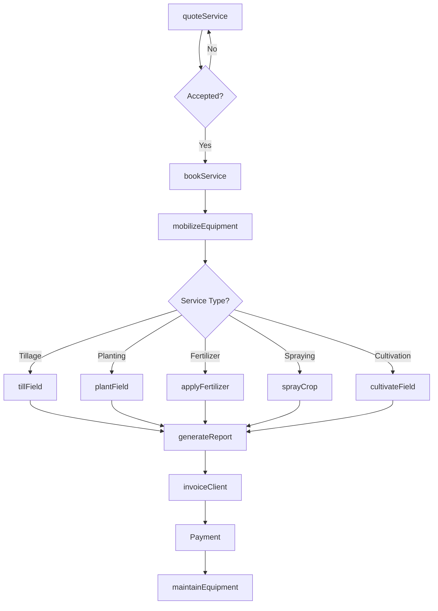
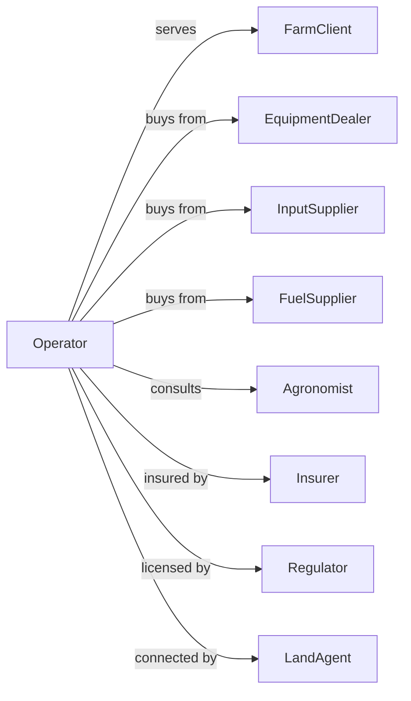

# Soil Preparation, Planting, and Cultivating

> Business-as-Code definition for custom farming service operations. Models contract services for tillage, planting, fertilizing, spraying, and cultivation performed for farm clients.

## Overview

Soil preparation, planting, and cultivating services provide contract field operations to farmers who lack equipment or labor for specific tasks. Custom operators offer tillage, seedbed preparation, planting, fertilizer application, herbicide and pesticide spraying, and cultivation services. This definition exposes actions for service scheduling, field operations, and client billing with events for automation and searches for production analytics.

## Actors

| Actor | Description |
|-------|-------------|
| FarmClient | Hires custom services for field operations |
| EquipmentDealer | Sells and services farm machinery |
| InputSupplier | Provides seed, fertilizer, and chemicals |
| FuelSupplier | Provides diesel and fuel for operations |
| Agronomist | Provides crop consulting recommendations |
| Insurer | Provides liability and equipment coverage |
| Regulator | Oversees pesticide applicator licensing |
| LandAgent | Connects operators with farm clients |

## Roles

| Role | Description |
|------|-------------|
| OperatorOwner | Owns custom operation and equipment |
| FieldManager | Schedules and oversees field operations |
| EquipmentOperator | Operates tractors and implements |
| SprayTechnician | Applies chemicals per regulations |
| Mechanic | Maintains and repairs equipment |
| Bookkeeper | Manages billing and client accounts |
| GPSMappingTech | Sets up auto-steer and variable-rate prescription maps for precision planting |

## Entities

| Entity | Description |
|--------|-------------|
| ServiceContract | Agreement for custom work |
| WorkOrder | Specific job to perform |
| Field | Client parcel for operations |
| Tractor | Prime mover for implements |
| Planter | Equipment for seed placement |
| Sprayer | Equipment for chemical application |
| Tillage | Equipment for soil preparation |
| Input | Seed, fertilizer, or chemical applied |
| Invoice | Bill for services rendered |
| GPS | Guidance and mapping system |

## Actions

| Action | Description |
|--------|-------------|
| quoteService | Provide pricing estimate to client |
| bookService | Schedule custom operation |
| mobilizeEquipment | Move machinery to client field |
| tillField | Prepare soil with tillage equipment |
| plantField | Place seed with planting equipment |
| applyFertilizer | Spread nutrients on field |
| sprayCrop | Apply herbicides or pesticides |
| cultivateField | Perform inter-row cultivation |
| scoutField | Inspect crop conditions |
| generateReport | Document completed work |
| invoiceClient | Bill for services rendered |
| maintainEquipment | Service machinery between jobs |

## Events

| Event | Description |
|-------|-------------|
| serviceQuoted | Estimate provided to client |
| serviceBooked | Job scheduled on calendar |
| equipmentMobilized | Machinery arrived at field |
| fieldTilled | Tillage operation completed |
| fieldPlanted | Planting completed |
| fertilizerApplied | Nutrient application finished |
| fieldSprayed | Chemical application completed |
| fieldCultivated | Cultivation finished |
| reportGenerated | Work documentation completed |
| invoiceSent | Bill transmitted to client |
| paymentReceived | Client payment processed |

## Searches

| Search | Description |
|--------|-------------|
| getSchedule | View booked services by date |
| findClients | List active farm customers |
| getEquipmentStatus | Check machine availability |
| trackAcreage | Get seasonal acreage by service |
| getInputUsage | Track seed and chemical application |
| getBillingStatus | Review unpaid invoices |
| getWeatherForecast | Check conditions for operations |
| getFieldHistory | Retrieve past services by field |

## Workflow



## Actor Relationships



## Usage

### Calling Actions

```typescript
import { provideFieldServices } from '@headlessly/provide-field-services'

const operator = provideFieldServices()

// View upcoming service schedule
const schedule = await operator.getSchedule({ month: 4, year: 2024 })

// Check equipment availability
const equipment = await operator.getEquipmentStatus({ type: 'planter' })

// Quote planting service
const quote = await operator.quoteService({
  clientId: 'farmer-williams',
  serviceType: 'planting',
  fieldId: 'field-south-80',
  acres: 80,
  crop: 'corn',
  seedPopulation: 34000
})

// Book the service
await operator.bookService({
  quoteId: quote.id,
  scheduledDate: new Date('2024-04-25'),
  priority: 'high'
})

// Perform planting
await operator.plantField({
  workOrderId: quote.workOrderId,
  tractorId: 'tractor-jd8400',
  planterId: 'planter-16row',
  seed: { variety: 'dekalb-6015', treatment: 'acceleron' },
  settings: { population: 34000, depth: 2.0 }
})

// Generate report and invoice
await operator.generateReport({
  workOrderId: quote.workOrderId,
  includeMaps: true,
  includeApplicationData: true
})

await operator.invoiceClient({
  workOrderId: quote.workOrderId,
  rate: quote.ratePerAcre,
  acres: 80
})
```

### Event-Driven Automation

```typescript
// Auto-generate report after field work
operator.fieldPlanted(async ({ workOrderId, fieldId, acres, seedUsed }) => {
  await operator.generateReport({
    workOrderId,
    data: { acres, seedUsed, completionDate: new Date() },
    includeMaps: true
  })
})

// Auto-invoice after report generated
operator.reportGenerated(async ({ workOrderId, clientId }) => {
  const workOrder = await operator.getWorkOrder({ workOrderId })

  await operator.invoiceClient({
    workOrderId,
    clientId,
    amount: workOrder.acres * workOrder.ratePerAcre,
    dueDate: addDays(new Date(), 30)
  })
})
```

## Related

- [Crop Harvesting, Primarily by Machine](./115113-CropHarvestingPrimarilyByMachine.mdx)
- [Farm Management Services](./115116-FarmManagementServices.mdx)
