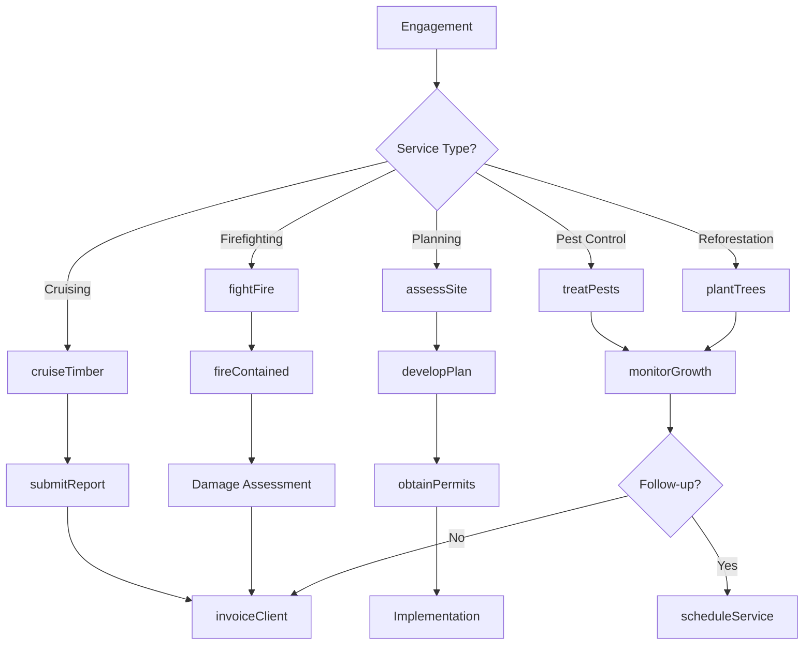
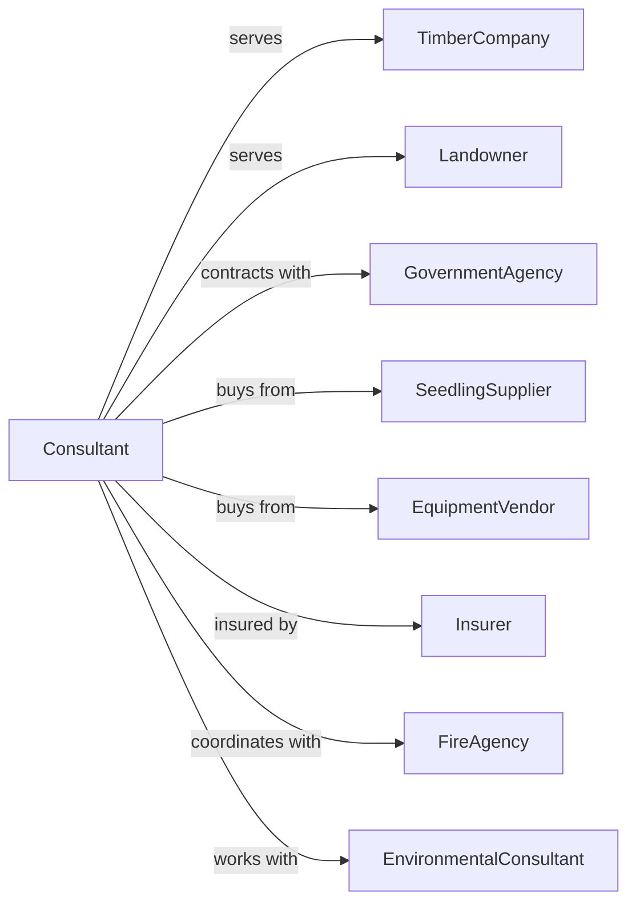

# Support Activities for Forestry

> Business-as-Code definition for forestry support service operations. Models contract services for timber cruising, forest firefighting, pest control, reforestation consulting, and forest management planning.

## Overview

Support activities for forestry provide specialized services to timber companies, landowners, and government agencies. Services include timber cruising and inventory, forest management planning, reforestation consulting, forest firefighting, pest and disease control, and wood technology consulting. These services support sustainable forest management and timber production. This definition exposes actions for forestry services, resource assessment, and client coordination with events for automation and searches for operational analytics.

## Actors

| Actor | Description |
|-------|-------------|
| TimberCompany | Hires forestry services for operations |
| Landowner | Owns forest land requiring management |
| GovernmentAgency | Manages public forests and contracts services |
| SeedlingSupplier | Provides trees for reforestation |
| EquipmentVendor | Sells and services forestry equipment |
| Insurer | Provides liability and property coverage |
| FireAgency | Coordinates wildfire response |
| EnvironmentalConsultant | Provides regulatory compliance support |

## Roles

| Role | Description |
|------|-------------|
| ForestryConsultant | Owns consulting practice and advises clients |
| TimberCruiser | Estimates timber volume and value |
| FirefightingCrew | Suppresses forest fires |
| PestSpecialist | Diagnoses and treats forest diseases |
| ReforestationPlanner | Designs tree planting programs |
| GISAnalyst | Creates maps and spatial analysis |
| PrescribedBurnBoss | Plans and leads controlled forest burns for fuel reduction |

## Entities

| Entity | Description |
|--------|-------------|
| ServiceContract | Agreement for forestry services |
| TimberStand | Area of forest for assessment |
| CruiseReport | Timber volume and value estimate |
| ManagementPlan | Long-term forest strategy document |
| FireIncident | Wildfire event requiring response |
| PestInfestation | Disease or insect outbreak |
| ReforestationProject | Tree planting program |
| GISMap | Spatial data and forest mapping |
| Invoice | Bill for services rendered |
| Permit | Authorization for forest activities |

## Actions

| Action | Description |
|--------|-------------|
| cruiseTimber | Estimate timber volume and value |
| developPlan | Create forest management strategy |
| assessSite | Evaluate land for reforestation |
| plantTrees | Execute reforestation planting |
| fightFire | Suppress wildfire on contract |
| treatPests | Apply pest or disease control |
| consultWoodTech | Advise on wood properties and uses |
| mapForest | Create GIS maps and inventories |
| monitorGrowth | Track stand development over time |
| submitReport | Deliver findings to client |
| invoiceClient | Bill for services rendered |
| obtainPermits | Secure required authorizations |

## Events

| Event | Description |
|-------|-------------|
| cruiseCompleted | Timber assessment finished |
| planDeveloped | Management strategy created |
| siteAssessed | Reforestation evaluation done |
| treesPlanted | Planting operation completed |
| fireContained | Wildfire suppressed |
| pestsTreated | Disease control applied |
| consultationCompleted | Technical advice delivered |
| mapCreated | GIS data produced |
| growthMonitored | Stand measurements recorded |
| reportSubmitted | Findings delivered to client |
| invoiceSent | Service bill transmitted |
| permitObtained | Authorization secured |

## Searches

| Search | Description |
|--------|-------------|
| getProjects | List active service contracts |
| findClients | List landowners and companies |
| getCruiseData | Retrieve timber assessments |
| getManagementPlans | Query forest strategies |
| getFireStatus | Check active fire incidents |
| getPestAlerts | Get disease and insect warnings |
| getGrowthData | Retrieve stand measurements |
| getMapInventory | List available GIS data |

## Workflow



## Actor Relationships



## Usage

### Calling Actions

```typescript
import { deliverForestryServices } from '@headlessly/deliver-forestry-services'

const forestry = deliverForestryServices()

// View active service contracts
const projects = await forestry.getProjects({ status: 'active' })

// Check pest and disease alerts for region
const alerts = await forestry.getPestAlerts({ region: 'pacific-northwest' })

// Cruise timber for harvest planning
const cruise = await forestry.cruiseTimber({
  clientId: 'northwest-timber-co',
  standId: 'stand-ridge-40',
  acres: 120,
  species: ['douglas-fir', 'western-red-cedar'],
  method: 'variable-radius-plot'
})

// Submit cruise report
await forestry.submitReport({
  cruiseId: cruise.id,
  reportType: 'timber-cruise',
  data: {
    totalVolume: cruise.boardFeet,
    speciesBreakdown: cruise.bySpecies,
    estimatedValue: cruise.value,
    harvestRecommendations: cruise.recommendations
  }
})

// Develop forest management plan
const plan = await forestry.developPlan({
  clientId: 'family-forest-trust',
  propertyId: 'mountain-tract',
  acres: 500,
  objectives: ['timber-production', 'wildlife-habitat', 'water-quality'],
  planHorizon: 20 // years
})

// Assess reforestation site
const assessment = await forestry.assessSite({
  clientId: 'northwest-timber-co',
  siteId: 'clearcut-unit-7',
  acres: 40,
  previousStand: 'douglas-fir',
  assessmentType: 'reforestation-potential'
})

// Execute reforestation planting
await forestry.plantTrees({
  siteId: assessment.siteId,
  species: 'douglas-fir',
  seedlingCount: 17200, // 430 per acre
  spacing: '10x10',
  plantingDate: new Date('2024-03-01')
})
```

### Event-Driven Automation

```typescript
// Auto-schedule follow-up monitoring after planting
forestry.treesPlanted(async ({ siteId, plantingDate, seedlingCount }) => {
  // Schedule survival check at 1 year
  await forestry.scheduleService({
    siteId,
    serviceType: 'survival-survey',
    date: addYears(plantingDate, 1),
    notes: `Check survival of ${seedlingCount} seedlings`
  })
})

// Alert on pest detection
forestry.pestsTreated(async ({ siteId, pestType, severity }) => {
  if (severity === 'high') {
    // Notify adjacent landowners
    const neighbors = await forestry.findAdjacentOwners({ siteId })

    for (const neighbor of neighbors) {
      await notifyLandowner({
        ownerId: neighbor.id,
        alert: 'pestWarning',
        pestType,
        message: `${pestType} detected in adjacent forest, monitoring recommended`
      })
    }
  }
})

// Fire response coordination
forestry.fireContained(async ({ incidentId, acresBurned, clientId }) => {
  // Schedule damage assessment
  await forestry.assessSite({
    relatedIncident: incidentId,
    clientId,
    assessmentType: 'fire-damage',
    priority: 'high'
  })

  // Notify client
  await notifyClient({
    clientId,
    alert: 'fireContained',
    incidentId,
    acresBurned,
    message: 'Fire contained, damage assessment scheduled'
  })
})
```

## Related

- [Timber Tract Operations](../../113-Forestry/1131-TimberTractOperations/113110-TimberTractOperations.mdx)
- [Logging](../../113-Forestry/1133-Logging/113310-Logging.mdx)
