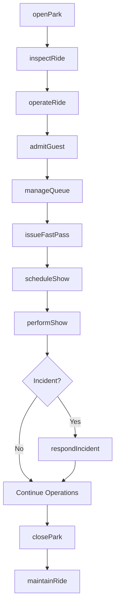
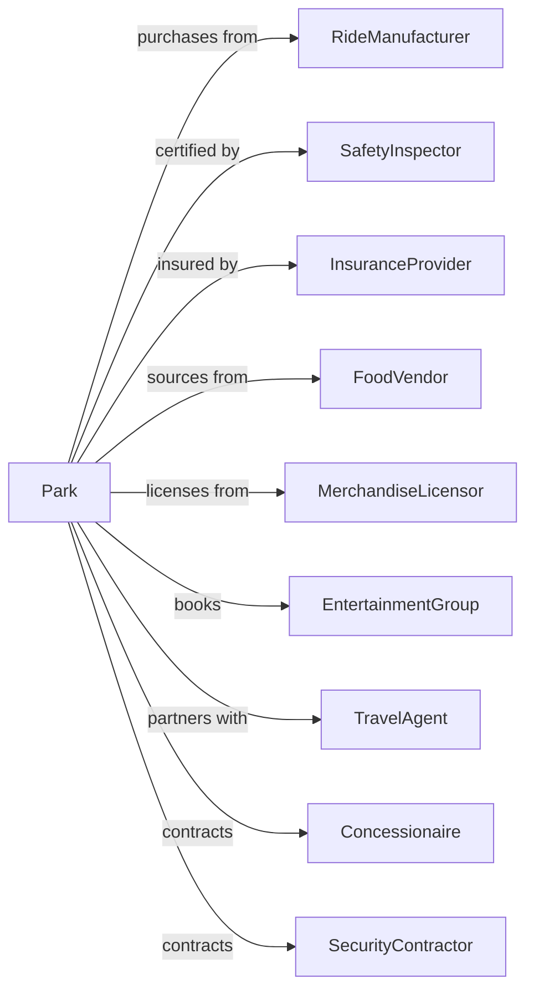

# Amusement and Theme Parks

> Business-as-Code definition for amusement park operations. Models the complete lifecycle from ride operations through guest services, entertainment, and facility management.

## Overview

Amusement and theme parks operate attractions including mechanical rides, water rides, games, shows, and themed exhibits. This definition exposes actions for ride operations, guest services, entertainment scheduling, and safety management, with events for workflow automation and searches for operational and revenue tracking.

## Actors

| Actor | Description |
|-------|-------------|
| RideManufacturer | Supplies and maintains attraction equipment |
| SafetyInspector | Certifies rides and operations compliance |
| InsuranceProvider | Covers liability for operations and guests |
| FoodVendor | Supplies food service operations |
| MerchandiseLicensor | Provides branded products for retail |
| EntertainmentGroup | Provides shows and live performances |
| TravelAgent | Books group visits and packages |
| Concessionaire | Operates games and secondary attractions |
| SecurityContractor | Provides park security services |

## Roles

| Role | Description |
|------|-------------|
| ParkManager | Oversees overall operations and strategy |
| RideOperator | Operates attractions and ensures guest safety |
| GuestServices | Handles admissions, information, and assistance |
| MaintenanceTech | Maintains rides and facility equipment |
| EntertainmentDirector | Schedules shows and character appearances |
| SafetyManager | Ensures compliance and incident response |

## Entities

| Entity | Description |
|--------|-------------|
| Ride | A mechanical or water attraction |
| Attraction | Any guest experience including shows and exhibits |
| Ticket | Admission pass for park entry |
| Pass | Multi-day or season admission credential |
| Zone | A themed area within the park |
| Show | A scheduled entertainment performance |
| Inspection | Safety verification of ride or facility |
| Incident | A safety or guest service event |
| Queue | Guest waiting line for attractions |
| FastPass | Priority access credential for attractions |

## Actions

| Action | Description |
|--------|-------------|
| openPark | Begin daily operations and admit guests |
| operateRide | Run attraction cycles and load guests |
| inspectRide | Conduct safety verification before operation |
| admitGuest | Process ticket or pass for park entry |
| issueFastPass | Provide priority access credential |
| scheduleShow | Plan entertainment performance times |
| performShow | Execute scheduled entertainment |
| respondIncident | Handle safety or guest service events |
| maintainRide | Service and repair attraction equipment |
| closePark | End daily operations and secure facility |
| processRefund | Handle ticket returns and cancellations |
| manageQueue | Monitor and optimize wait times |

## Events

| Event | Description |
|-------|-------------|
| parkOpened | Daily operations began |
| rideOperated | Attraction cycle completed |
| rideInspected | Safety verification completed |
| guestAdmitted | Entry processed for visitor |
| fastPassIssued | Priority access provided |
| showScheduled | Entertainment time confirmed |
| showPerformed | Entertainment completed |
| incidentResponded | Safety event handled |
| rideMaintained | Service completed on attraction |
| parkClosed | Daily operations ended |
| refundProcessed | Ticket return handled |

## Searches

| Search | Description |
|--------|-------------|
| getRides | List attractions with status and wait times |
| getShows | Retrieve scheduled entertainment |
| getAttendance | Access guest count and demographics |
| getIncidents | Review safety and service events |
| getRevenue | Retrieve sales by category or period |
| getInspections | Check ride certification status |
| getQueueTimes | Monitor current attraction wait times |

## Workflow



## Actor Relationships



## Usage

### Calling Actions

```typescript
import { entertainThemeParkGuests } from '@headlessly/entertain-theme-park-guests'

const park = entertainThemeParkGuests()

// Monitor current attraction wait times
const queues = await park.getQueueTimes({ area: 'all' })

// Check ride inspection and certification status
const inspections = await park.getInspections({ status: 'due' })

// Open the park
await park.openPark({
  date: '2024-07-15',
  expectedAttendance: 15000,
  operatingHours: { open: '09:00', close: '22:00' },
  specialEvents: ['summer-fireworks']
})

// Inspect and operate a ride
await park.inspectRide({
  rideId: 'coaster-001',
  inspector: 'maint-tech-123',
  checklist: ['restraints', 'track', 'brakes', 'sensors'],
  certification: 'daily-opening'
})

await park.operateRide({
  rideId: 'coaster-001',
  capacity: 24,
  cycleTime: 180,
  heightRequirement: 48
})

// Issue FastPass
await park.issueFastPass({
  guestId: 'guest-456',
  rideId: 'coaster-001',
  returnWindow: { start: '14:00', end: '15:00' }
})
```

### Event-Driven Automation

```typescript
// Auto-adjust staffing based on queue times
park.rideOperated(async ({ rideId }) => {
  const queue = await park.getQueueTimes({ rideId })

  if (queue.waitMinutes > 60) {
    await adjustStaffing({
      rideId,
      action: 'add-operator',
      reason: 'high-wait-time'
    })
  }
})

// Handle incidents with escalation
park.incidentResponded(async ({ incidentId, severity, rideId }) => {
  if (severity === 'major') {
    await park.inspectRide({
      rideId,
      inspector: 'safety-team',
      checklist: ['full-inspection'],
      reason: 'incident-followup'
    })

    await notifyManagement({
      incidentId,
      severity,
      action: 'ride-closed-pending-inspection'
    })
  }
})
```
