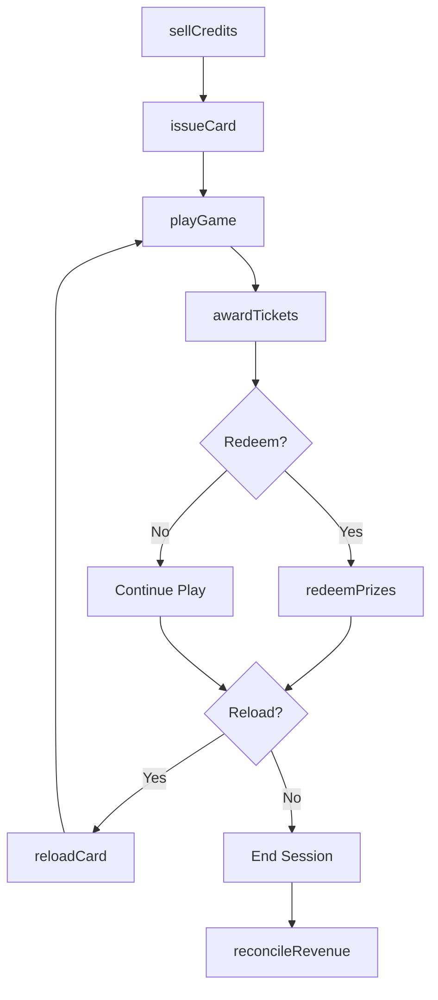
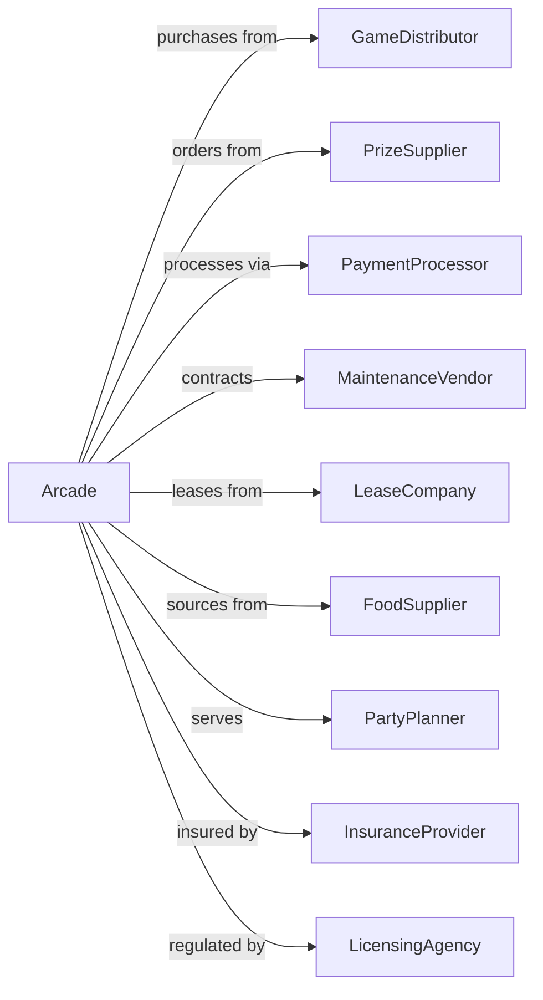

# Amusement Arcades

> Business-as-Code definition for arcade entertainment operations. Models game floor management, prize redemption, and guest engagement.

## Overview

Amusement arcades operate entertainment facilities featuring video games, redemption games, simulators, and prize counters. This definition exposes actions for game management, credit systems, prize operations, and facility management, with events for workflow automation and searches for revenue and operational tracking.

## Actors

| Actor | Description |
|-------|-------------|
| GameDistributor | Supplies arcade equipment and games |
| PrizeSupplier | Provides merchandise for redemption counters |
| PaymentProcessor | Handles credit card and digital transactions |
| MaintenanceVendor | Services and repairs gaming equipment |
| LeaseCompany | Provides equipment financing or revenue-share |
| FoodSupplier | Provides snacks and beverages |
| PartyPlanner | Books group events and celebrations |
| InsuranceProvider | Covers liability for operations |
| LicensingAgency | Provides permits for arcade operations |

## Roles

| Role | Description |
|------|-------------|
| ArcadeManager | Oversees overall facility operations |
| GameTechnician | Maintains and repairs gaming equipment |
| FloorAttendant | Assists guests and monitors game floor |
| PrizeCounter | Manages redemption merchandise and exchanges |
| PartyHost | Coordinates group events and celebrations |
| Cashier | Processes game credits and transactions |

## Entities

| Entity | Description |
|--------|-------------|
| Game | An individual arcade machine or attraction |
| Credit | Purchased game play currency |
| Card | Reloadable game credit storage device |
| Ticket | Redemption currency earned from games |
| Prize | Merchandise available for ticket redemption |
| Party | A booked group event or celebration |
| Revenue | Income from credits, prizes, and events |
| Maintenance | Service record for gaming equipment |
| Payout | Ticket or prize distribution rate for games |
| Promotion | Special offer or event to drive traffic |

## Actions

| Action | Description |
|--------|-------------|
| sellCredits | Process game credit purchases |
| issueCard | Provide reloadable game card to guest |
| reloadCard | Add credits to existing game card |
| playGame | Process game play transaction |
| awardTickets | Dispense redemption currency from games |
| redeemPrizes | Exchange tickets for merchandise |
| bookParty | Reserve group event package |
| hostParty | Execute group celebration event |
| maintainGame | Service and repair gaming equipment |
| adjustPayout | Configure game ticket distribution rates |
| runPromotion | Execute special offers or events |
| reconcileRevenue | Balance daily transactions and payouts |

## Events

| Event | Description |
|-------|-------------|
| creditsSold | Game credits purchased |
| cardIssued | New game card provided |
| cardReloaded | Credits added to card |
| gamePlayed | Game play transaction processed |
| ticketsAwarded | Redemption currency dispensed |
| prizesRedeemed | Merchandise exchanged for tickets |
| partyBooked | Group event reserved |
| partyHosted | Group celebration completed |
| gameMaintained | Equipment service completed |
| payoutAdjusted | Game distribution rate changed |
| promotionRun | Special offer executed |

## Searches

| Search | Description |
|--------|-------------|
| getGames | List machines with status and revenue |
| getCards | Retrieve active cards with balances |
| getPrizes | Check inventory and redemption rates |
| getParties | List booked events with details |
| getRevenue | Access income by category or period |
| getMaintenance | Review service history by machine |
| getPromotions | Check active and scheduled offers |

## Workflow



## Actor Relationships



## Usage

### Calling Actions

```typescript
import { entertainArcadePlayers } from '@headlessly/entertain-arcade-players'

const arcade = entertainArcadePlayers()

// Check game machine status and revenue
const games = await arcade.getGames({ status: 'active' })

// Review prize inventory and redemption rates
const prizes = await arcade.getPrizes({ category: 'plush' })

// Issue a new game card
const card = await arcade.issueCard({
  initialCredits: 50,
  payment: { method: 'card', amount: 25 },
  guestName: 'Guest',
  bonusCredits: 10
})

// Process game play
await arcade.playGame({
  cardId: card.id,
  gameId: 'skee-ball-03',
  creditsUsed: 2
})

// Award tickets
await arcade.awardTickets({
  cardId: card.id,
  gameId: 'skee-ball-03',
  tickets: 45,
  score: 280
})

// Book a party
const party = await arcade.bookParty({
  date: '2024-08-10',
  time: '14:00',
  package: 'deluxe',
  guestCount: 15,
  addons: ['pizza', 'extra-credits'],
  deposit: 150
})
```

### Event-Driven Automation

```typescript
// Auto-reorder prizes when inventory low
arcade.prizesRedeemed(async ({ prizeId, quantity }) => {
  const prize = await arcade.getPrizes({ id: prizeId })

  if (prize.inventory < prize.reorderThreshold) {
    await reorderPrize({
      prizeId,
      quantity: prize.reorderQuantity,
      supplier: prize.preferredSupplier
    })
  }
})

// Alert maintenance when games underperform
arcade.gamePlayed(async ({ gameId }) => {
  const game = await arcade.getGames({ id: gameId })

  if (game.dailyRevenue < game.expectedMinimum * 0.5) {
    await arcade.maintainGame({
      gameId,
      issue: 'underperformance-check',
      priority: 'routine'
    })

    await notifyTechnician({
      gameId,
      message: 'Low revenue - check functionality'
    })
  }
})
```
