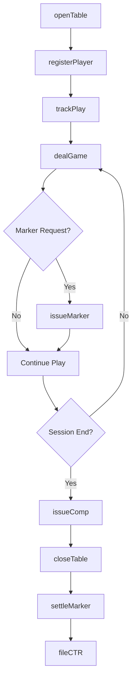
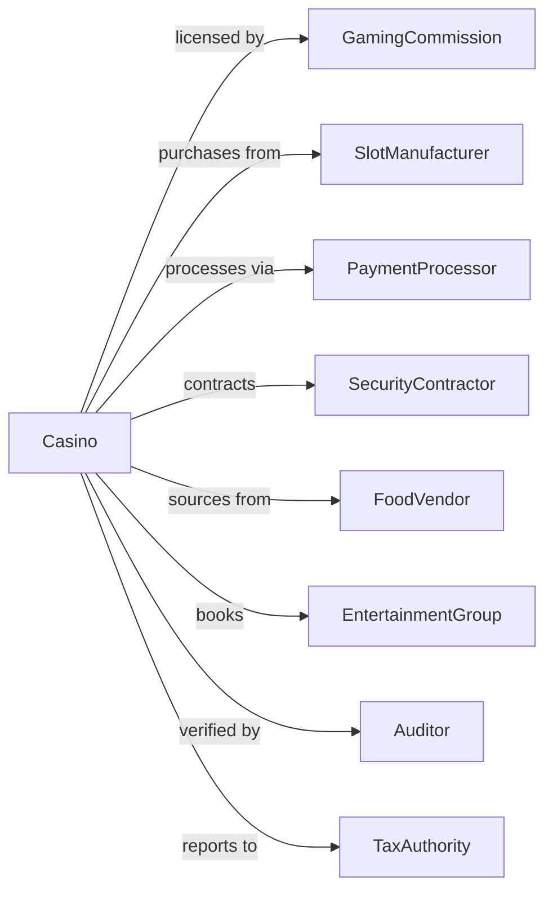

# Casinos (except Casino Hotels)

> Business-as-Code definition for casino gaming operations. Models table games, slot machines, sports betting, and responsible gaming compliance.

## Overview

Casinos operate gambling facilities with table games, slot machines, and sports betting without lodging services. This definition exposes actions for gaming operations, cage management, player tracking, and regulatory compliance, with events for workflow automation and searches for revenue and compliance reporting.

## Actors

| Actor | Description |
|-------|-------------|
| GamingCommission | Regulates licensing and operations compliance |
| SlotManufacturer | Supplies and maintains gaming machines |
| PaymentProcessor | Handles cash advances and transactions |
| SecurityContractor | Provides surveillance and security services |
| FoodVendor | Supplies food and beverage operations |
| EntertainmentGroup | Provides shows and promotions |
| Auditor | Verifies financial and gaming compliance |
| JunketOperator | Brings high-value players to the facility |
| TaxAuthority | Collects gaming taxes and reports |

## Roles

| Role | Description |
|------|-------------|
| CasinoManager | Oversees overall gaming operations |
| PitBoss | Supervises table game areas |
| Dealer | Operates table games |
| SlotAttendant | Services gaming machines and guests |
| CageManager | Oversees cash operations and transactions |
| ComplianceOfficer | Ensures regulatory adherence |
| SurveillanceOperator | Monitors gaming floor via closed-circuit cameras to detect cheating and theft |

## Entities

| Entity | Description |
|--------|-------------|
| TableGame | A dealer-operated gaming station |
| SlotMachine | An electronic gaming device |
| Sportsbook | Sports betting operations |
| Player | A registered gaming guest |
| Marker | Credit extended to qualified players |
| Jackpot | A significant slot machine win |
| Drop | Total cash and chips collected at games |
| Hold | Casino revenue retained from wagers |
| Comp | Complimentary benefit awarded to players |
| CTR | Currency Transaction Report for compliance |

## Actions

| Action | Description |
|--------|-------------|
| openTable | Start dealer-operated game |
| dealGame | Execute rounds of table play |
| closeTable | End table game operations |
| payJackpot | Process significant slot win |
| issueMarker | Extend credit to qualified player |
| settleMarker | Collect on player credit |
| registerPlayer | Enroll guest in rewards program |
| trackPlay | Record player gaming activity |
| issueComp | Award complimentary benefit |
| acceptSportsBet | Process wager on sporting event |
| payoutBet | Settle winning sports wager |
| fileCTR | Submit currency transaction report |
| conductAudit | Verify gaming and financial compliance |

## Events

| Event | Description |
|-------|-------------|
| tableOpened | Dealer game started |
| gameDealt | Table round completed |
| tableClosed | Dealer game ended |
| jackpotPaid | Significant slot win processed |
| markerIssued | Player credit extended |
| markerSettled | Player credit collected |
| playerRegistered | Guest enrolled in rewards |
| playTracked | Gaming activity recorded |
| compIssued | Complimentary benefit awarded |
| sportsBetAccepted | Wager processed |
| betPaidOut | Winning wager settled |
| ctrFiled | Transaction report submitted |

## Searches

| Search | Description |
|--------|-------------|
| getTables | List games with status and limits |
| getSlots | Retrieve machines with performance data |
| getPlayers | Access player profiles and activity |
| getMarkers | Check outstanding player credit |
| getJackpots | List significant wins requiring reporting |
| getRevenue | Access gaming income by category |
| getCompliance | Review regulatory filing status |

## Workflow



## Actor Relationships



## Usage

### Calling Actions

```typescript
import { operateCasinos } from '@headlessly/operate-casinos'

const casino = operateCasinos()

// Check table game status and limits
const tables = await casino.getTables({ status: 'active' })

// Review outstanding player markers
const markers = await casino.getMarkers({ status: 'outstanding' })

// Open a table game
await casino.openTable({
  tableId: 'blackjack-15',
  game: 'blackjack',
  limits: { min: 25, max: 5000 },
  dealerId: 'dealer-123',
  shift: 'swing'
})

// Register a player
const player = await casino.registerPlayer({
  name: 'John Smith',
  idType: 'drivers-license',
  idNumber: 'DL123456',
  tier: 'gold',
  preferences: { game: 'blackjack', limits: 'mid' }
})

// Track play and issue comp
await casino.trackPlay({
  playerId: player.id,
  tableId: 'blackjack-15',
  averageBet: 100,
  duration: 180,
  result: -500
})

await casino.issueComp({
  playerId: player.id,
  type: 'dining',
  value: 50,
  location: 'steakhouse',
  reason: 'table-play'
})
```

### Event-Driven Automation

```typescript
// Auto-file CTR for large transactions
casino.jackpotPaid(async ({ playerId, amount, machineId }) => {
  if (amount >= 10000) {
    await casino.fileCTR({
      playerId,
      transactionType: 'jackpot',
      amount,
      machineId,
      timestamp: new Date()
    })
  }
})

// Alert for marker collection
casino.markerIssued(async ({ playerId, amount, dueDate }) => {
  scheduleReminder({
    type: 'marker-due',
    playerId,
    amount,
    date: dueDate,
    escalation: [
      { days: -7, action: 'courtesy-call' },
      { days: 0, action: 'collection-notice' },
      { days: 30, action: 'collections' }
    ]
  })
})
```
