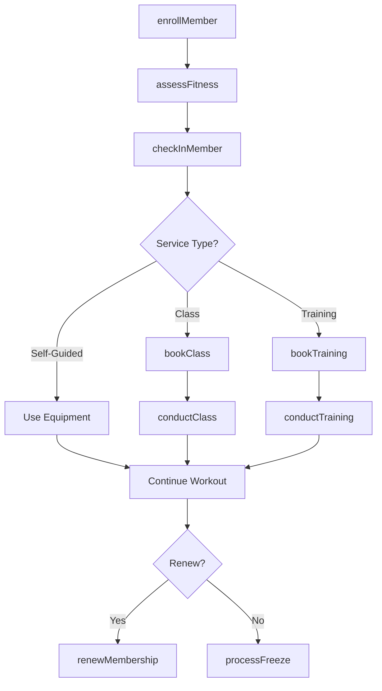
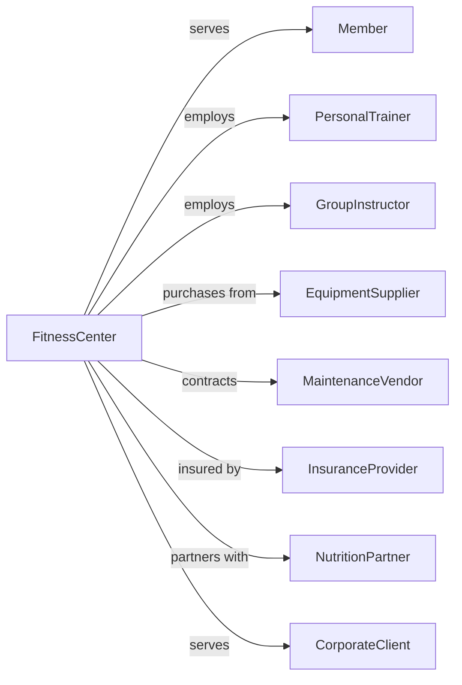

# Fitness and Recreational Sports Centers

> Business-as-Code definition for fitness center operations. Models membership management, class scheduling, personal training, and facility amenities.

## Overview

Fitness and recreational sports centers operate facilities featuring exercise equipment, group classes, pools, courts, and personal training. This definition exposes actions for membership services, class management, trainer scheduling, and facility operations, with events for workflow automation and searches for member engagement and utilization tracking.

## Actors

| Actor | Description |
|-------|-------------|
| Member | Enrolled participant with access privileges |
| PersonalTrainer | Provides one-on-one fitness instruction |
| GroupInstructor | Leads fitness classes |
| EquipmentSupplier | Provides fitness machines and gear |
| MaintenanceVendor | Services and repairs equipment |
| InsuranceProvider | Covers liability for operations |
| NutritionPartner | Provides supplements and dietary services |
| SoftwareVendor | Provides management and scheduling systems |
| CorporateClient | Books group memberships for employees |

## Roles

| Role | Description |
|------|-------------|
| ClubManager | Oversees overall facility operations |
| FitnessDirector | Manages training and class programs |
| MembershipAdvisor | Handles enrollment and retention |
| FrontDesk | Processes check-ins and guest services |
| MaintenanceTech | Maintains equipment and facility |
| ChildcareStaff | Operates kids club services |
| Lifeguard | Monitors pool and aquatic areas to ensure swimmer safety |

## Entities

| Entity | Description |
|--------|-------------|
| Membership | Enrolled access agreement |
| Class | A scheduled group fitness session |
| PersonalTraining | One-on-one instruction session |
| Equipment | Fitness machines and apparatus |
| Facility | Pools, courts, and activity spaces |
| CheckIn | Member visit record |
| Assessment | Fitness evaluation or goal setting |
| Package | Bundled services or sessions |
| GuestPass | Temporary visitor access |
| Childcare | Kids club service during visits |

## Actions

| Action | Description |
|--------|-------------|
| enrollMember | Process new membership signup |
| renewMembership | Extend member agreement |
| checkInMember | Process member arrival |
| bookClass | Reserve spot in group fitness |
| conductClass | Deliver group fitness session |
| bookTraining | Schedule personal training session |
| conductTraining | Deliver one-on-one instruction |
| assessFitness | Perform fitness evaluation |
| issueGuestPass | Provide temporary visitor access |
| maintainEquipment | Service fitness machines |
| sellPackage | Process service bundle purchase |
| processFreeze | Suspend membership temporarily |

## Events

| Event | Description |
|-------|-------------|
| memberEnrolled | New membership processed |
| membershipRenewed | Agreement extended |
| memberCheckedIn | Visit recorded |
| classBooked | Group session reserved |
| classCompleted | Group session delivered |
| trainingBooked | Personal session scheduled |
| trainingCompleted | Personal session delivered |
| fitnessAssessed | Evaluation completed |
| guestPassIssued | Temporary access provided |
| equipmentMaintained | Machine serviced |
| packageSold | Service bundle purchased |
| membershipFrozen | Access suspended |

## Searches

| Search | Description |
|--------|-------------|
| getMembers | List enrollments with status |
| getClasses | Retrieve scheduled group sessions |
| getTrainers | Find available trainers |
| getEquipment | Check machine status and availability |
| getUtilization | Access facility usage data |
| getCheckIns | Review visit patterns |
| getRetention | Check membership renewal rates |

## Workflow



## Actor Relationships



## Usage

### Calling Actions

```typescript
import { recreateFitness } from '@headlessly/recreate-fitness'

const gym = recreateFitness()

// Check membership retention rates
const retention = await gym.getRetention({ period: 'last-quarter' })

// Find available personal trainers
const trainers = await gym.getTrainers({ specialty: 'strength', available: true })

// Enroll a new member
const member = await gym.enrollMember({
  name: 'Jane Smith',
  membershipType: 'premium',
  monthlyRate: 79,
  initiation: 99,
  startDate: '2024-02-01',
  addons: ['personal-training-4-pack', 'childcare']
})

// Book a class
const classBooking = await gym.bookClass({
  memberId: member.id,
  classId: 'spin-tuesday-6am',
  date: '2024-02-06',
  equipment: 'bike-12'
})

// Conduct personal training
await gym.conductTraining({
  trainerId: 'trainer-123',
  memberId: member.id,
  sessionType: 'strength',
  duration: 60,
  focus: ['upper-body', 'core'],
  notes: 'Increase bench press weight next session'
})
```

### Event-Driven Automation

```typescript
// Auto-schedule follow-up after assessment
gym.fitnessAssessed(async ({ memberId, goals, baseline }) => {
  await gym.bookTraining({
    memberId,
    trainerId: await matchTrainer(goals),
    sessionType: 'goal-setting',
    scheduleDays: 3
  })

  await sendWelcome({
    memberId,
    message: `Welcome! Your goals: ${goals.join(', ')}`,
    nextSteps: ['first-training-scheduled', 'class-recommendations']
  })
})

// Manage at-risk members
gym.memberCheckedIn(async ({ memberId, daysSinceLastVisit }) => {
  if (daysSinceLastVisit > 14 && daysSinceLastVisit <= 21) {
    await sendReengagement({
      memberId,
      type: 'we-miss-you',
      offer: 'free-training-session'
    })
  } else if (daysSinceLastVisit > 30) {
    await alertRetentionTeam({
      memberId,
      risk: 'high',
      daysSinceVisit: daysSinceLastVisit
    })
  }
})
```
