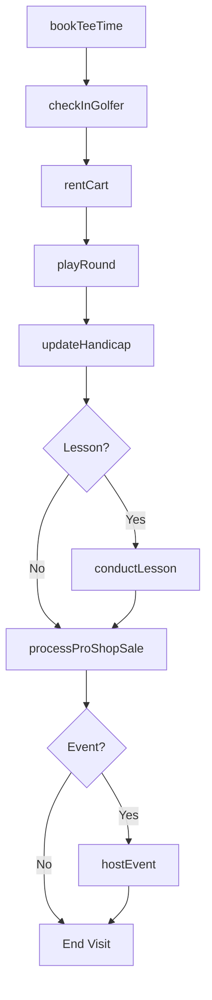
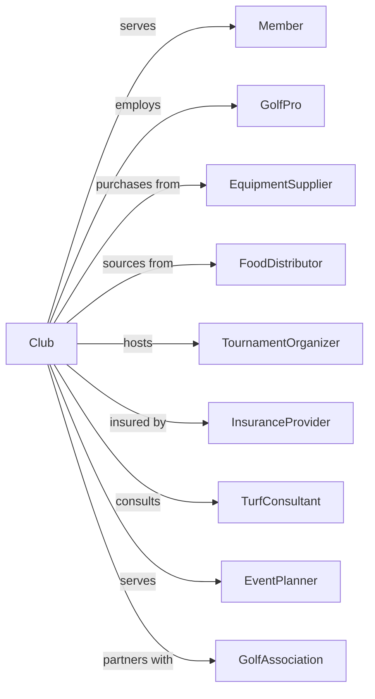

# Golf Courses and Country Clubs

> Business-as-Code definition for golf and country club operations. Models course management, membership services, and hospitality amenities.

## Overview

Golf courses and country clubs operate recreational facilities featuring golf courses along with dining, tennis, swimming, and other amenities. This definition exposes actions for tee time management, course maintenance, membership services, and event hosting, with events for workflow automation and searches for scheduling and member engagement.

## Actors

| Actor | Description |
|-------|-------------|
| Member | Enrolled participant with access privileges |
| GolfPro | Provides instruction and merchandise sales |
| EquipmentSupplier | Provides maintenance equipment and supplies |
| FoodDistributor | Supplies dining operations |
| TournamentOrganizer | Produces competitive golf events |
| InsuranceProvider | Covers liability for operations |
| TurfConsultant | Advises on course condition and maintenance |
| EventPlanner | Books weddings and corporate events |
| GolfAssociation | Governs handicap systems and rules |

## Roles

| Role | Description |
|------|-------------|
| ClubManager | Oversees overall facility operations |
| HeadPro | Manages golf operations and instruction |
| GroundsSuperintendent | Maintains course condition |
| FoodBeverageDirector | Oversees dining operations |
| MembershipDirector | Handles member recruitment and services |
| StarterMarshal | Manages pace of play and tee operations |
| GolfCartAttendant | Manages cart fleet, staging, and maintenance for player use |

## Entities

| Entity | Description |
|--------|-------------|
| Course | The golf playing area with holes |
| TeeTime | A reserved starting time for play |
| Membership | Enrolled access agreement |
| Tournament | A competitive golf event |
| Lesson | Golf instruction session |
| CartRental | Golf cart for course transportation |
| ProShopSale | Merchandise or equipment purchase |
| Event | Private gathering at the facility |
| Handicap | Adjusted scoring index for players |
| GreenFee | Non-member play charge |

## Actions

| Action | Description |
|--------|-------------|
| bookTeeTime | Reserve starting time for play |
| checkInGolfer | Process arrival for reserved play |
| rentCart | Provide golf cart for round |
| maintainCourse | Execute turf and grounds care |
| conductLesson | Deliver golf instruction |
| hostTournament | Produce competitive golf event |
| enrollMember | Process membership application |
| renewMembership | Extend member agreement |
| hostEvent | Produce private gathering |
| processProShopSale | Complete merchandise transaction |
| updateHandicap | Adjust player scoring index |
| manageWaitlist | Handle demand for tee times |

## Events

| Event | Description |
|-------|-------------|
| teeTimeBooked | Starting time reserved |
| golferCheckedIn | Player processed for play |
| cartRented | Golf cart provided |
| courseMaintained | Grounds care completed |
| lessonConducted | Instruction delivered |
| tournamentHosted | Competition completed |
| memberEnrolled | New membership processed |
| membershipRenewed | Agreement extended |
| eventHosted | Private gathering completed |
| proShopSaleProcessed | Merchandise sold |
| handicapUpdated | Scoring index adjusted |

## Searches

| Search | Description |
|--------|-------------|
| getTeeTimes | List available and booked times |
| getMembers | Retrieve membership roster |
| getCourseConditions | Check playing conditions |
| getTournaments | List scheduled competitions |
| getLessons | Find available instruction times |
| getEvents | Retrieve booked private gatherings |
| getHandicaps | Access player scoring indexes |

## Workflow



## Actor Relationships



## Usage

### Calling Actions

```typescript
import { recreateGolf } from '@headlessly/recreate-golf'

const club = recreateGolf()

// Check course conditions
const conditions = await club.getCourseConditions({ date: new Date() })

// View available tee times
const available = await club.getTeeTimes({ date: new Date(), holes: 18 })

// Book a tee time
const teeTime = await club.bookTeeTime({
  date: '2024-07-20',
  time: '08:30',
  players: ['member-123', 'guest-456', 'guest-789'],
  carts: 2,
  memberType: 'full'
})

// Enroll a new member
const member = await club.enrollMember({
  name: 'John Smith',
  membershipType: 'full-family',
  initiation: 25000,
  monthlyDues: 850,
  familyMembers: ['spouse', 'child-1', 'child-2'],
  locker: 'request'
})

// Host a tournament
const tournament = await club.hostTournament({
  name: 'Member-Guest Championship',
  format: 'better-ball',
  dates: ['2024-08-15', '2024-08-16'],
  field: 72,
  entryFee: 250,
  purse: 'merchandise-credits'
})
```

### Event-Driven Automation

```typescript
// Auto-update handicaps after rounds
club.golferCheckedIn(async ({ memberId, scorePosted }) => {
  if (scorePosted) {
    await club.updateHandicap({
      memberId,
      recalculate: true,
      source: 'posted-score'
    })
  }
})

// Manage membership renewals
club.membershipRenewed(async ({ memberId, renewalDate }) => {
  const member = await club.getMembers({ id: memberId })

  await sendRenewalConfirmation({
    memberId,
    membershipType: member.type,
    newExpiration: getNextYear(renewalDate)
  })

  if (member.yearsActive >= 10) {
    await recognizeMilestone({
      memberId,
      years: member.yearsActive,
      recognition: 'decade-member'
    })
  }
})
```
