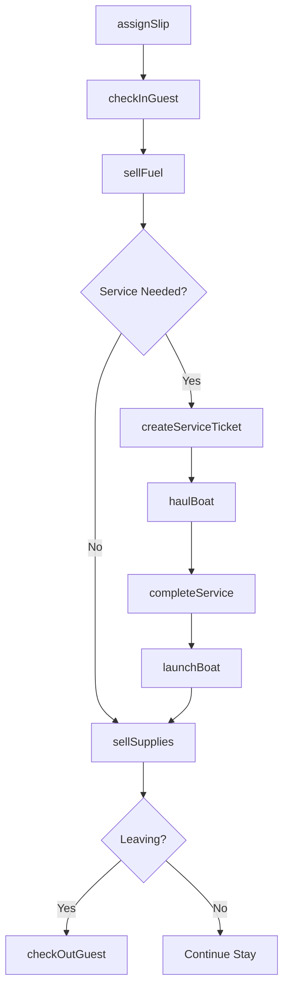
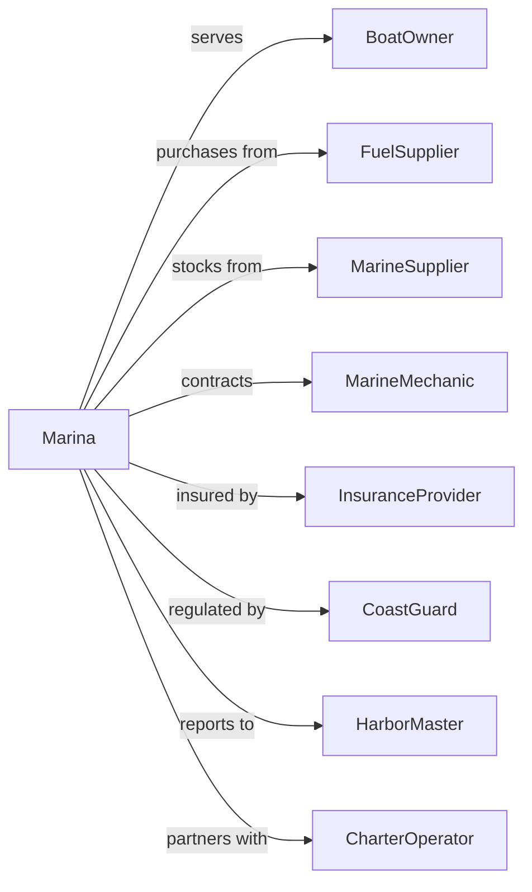

# Marinas

> Business-as-Code definition for marina operations. Models boat storage, docking services, fuel sales, and boating amenities.

## Overview

Marinas operate docking and storage facilities for pleasure craft along with fuel sales, maintenance services, and boat rentals. This definition exposes actions for slip management, fuel operations, maintenance services, and guest amenities, with events for workflow automation and searches for occupancy and service tracking.

## Actors

| Actor | Description |
|-------|-------------|
| BoatOwner | Rents slip space for vessel storage |
| FuelSupplier | Provides marine fuel for sales |
| MarineSupplier | Provides parts, supplies, and merchandise |
| MarineMechanic | Performs boat maintenance and repairs |
| InsuranceProvider | Covers liability for operations |
| CoastGuard | Enforces safety regulations and inspections |
| HarborMaster | Manages waterway traffic and regulations |
| BoatDealer | Sells new and used vessels |
| CharterOperator | Rents boats for guest use |

## Roles

| Role | Description |
|------|-------------|
| MarinaManager | Oversees overall facility operations |
| Dockmaster | Manages slip assignments and dock operations |
| FuelAttendant | Operates fuel dock and pump sales |
| ServiceTechnician | Performs maintenance and repairs |
| ShipStore | Manages retail and supply sales |
| ReservationsAgent | Handles transient slip bookings |

## Entities

| Entity | Description |
|--------|-------------|
| Slip | A designated docking space for a vessel |
| Vessel | A boat stored or serviced at the marina |
| FuelSale | A marine fuel transaction |
| LeaseAgreement | Contract for long-term slip rental |
| TransientReservation | Short-term docking booking |
| ServiceTicket | Work order for maintenance or repairs |
| DryStorage | Land-based boat storage facility |
| Launch | Boat put-in or take-out service |
| Amenity | Facilities like showers, laundry, and wifi |
| Haul | Boat lift from water for service |

## Actions

| Action | Description |
|--------|-------------|
| assignSlip | Allocate docking space to vessel |
| renewLease | Extend slip rental agreement |
| bookTransient | Reserve short-term docking |
| sellFuel | Process marine fuel purchase |
| launchBoat | Put vessel in water from storage |
| haulBoat | Remove vessel from water for service |
| createServiceTicket | Open work order for maintenance |
| completeService | Finish and bill maintenance work |
| sellSupplies | Process ship store purchase |
| rentBoat | Charter vessel to guest |
| checkInGuest | Process arrival for docking |
| monitorWeather | Track conditions for operations |

## Events

| Event | Description |
|-------|-------------|
| slipAssigned | Docking space allocated |
| leaseRenewed | Rental agreement extended |
| transientBooked | Short-term docking reserved |
| fuelSold | Marine fuel purchased |
| boatLaunched | Vessel put in water |
| boatHauled | Vessel removed from water |
| serviceTicketCreated | Work order opened |
| serviceCompleted | Maintenance finished |
| suppliesSold | Ship store purchase completed |
| boatRented | Vessel chartered to guest |
| guestCheckedIn | Arrival processed |
| weatherAlert | Conditions notification issued |

## Searches

| Search | Description |
|--------|-------------|
| getSlips | List docking spaces with occupancy |
| getVessels | Retrieve boats with status and owner |
| getTransients | Check short-term availability |
| getFuelSales | Access fuel revenue by period |
| getServiceTickets | List open work orders |
| getLeases | Review rental agreements |
| getWeather | Check marine conditions |

## Workflow



## Actor Relationships



## Usage

### Calling Actions

```typescript
import { dockBoats } from '@headlessly/dock-boats'

const marina = dockBoats()

// Assign a slip
const lease = await marina.assignSlip({
  slipId: 'slip-A15',
  vesselId: 'vessel-123',
  ownerId: 'owner-456',
  leaseType: 'annual',
  rate: 450,
  utilities: ['electric-30amp', 'water'],
  startDate: '2024-04-01'
})

// Book transient docking
const transient = await marina.bookTransient({
  vesselName: 'Sea Breeze',
  length: 35,
  beam: 12,
  draft: 4,
  arrivalDate: '2024-07-15',
  nights: 3,
  services: ['pumpout', 'fuel']
})

// Create service ticket
await marina.createServiceTicket({
  vesselId: 'vessel-123',
  services: [
    { type: 'bottom-paint', estimate: 1200 },
    { type: 'oil-change', estimate: 150 }
  ],
  priority: 'routine',
  targetCompletion: '2024-04-15'
})
```

### Event-Driven Automation

```typescript
// Auto-notify when weather alerts issued
marina.weatherAlert(async ({ severity, forecast, duration }) => {
  const vessels = await marina.getVessels({ status: 'docked' })

  if (severity === 'storm-warning') {
    for (const vessel of vessels) {
      await notifyOwner({
        vesselId: vessel.id,
        ownerId: vessel.ownerId,
        message: `Storm warning: ${forecast}. Secure your vessel.`,
        urgency: 'high'
      })
    }
  }
})

// Manage lease renewals
marina.leaseRenewed(async ({ slipId, vesselId, newExpiration }) => {
  await sendRenewalConfirmation({
    slipId,
    vesselId,
    expiration: newExpiration,
    newRate: calculateNewRate(slipId)
  })

  await marina.assignSlip({
    slipId,
    vesselId,
    renew: true
  })
})
```
