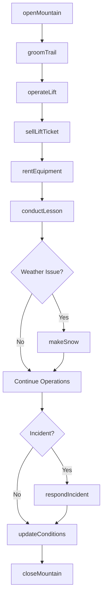
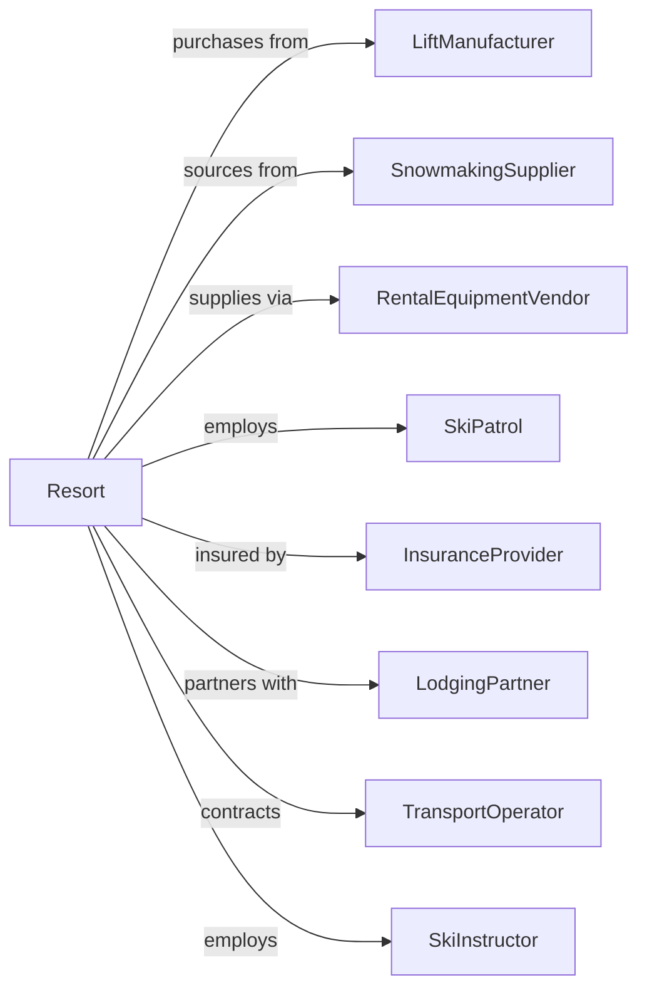

# Skiing Facilities

> Business-as-Code definition for ski resort operations. Models lift operations, slope management, equipment rentals, and guest services.

## Overview

Skiing facilities operate downhill, cross-country, and related winter sports areas including ski lifts, terrain parks, and rental services. This definition exposes actions for lift operations, snow management, equipment services, and guest experience, with events for workflow automation and searches for conditions and operational tracking.

## Actors

| Actor | Description |
|-------|-------------|
| LiftManufacturer | Supplies and maintains lift equipment |
| SnowmakingSupplier | Provides snowmaking systems and parts |
| RentalEquipmentVendor | Supplies skis, boots, and accessories |
| SkiPatrol | Provides mountain safety and rescue services |
| InsuranceProvider | Covers liability for operations |
| LodgingPartner | Provides accommodations for guests |
| TransportOperator | Provides shuttle services |
| SkiInstructor | Delivers lessons and certification programs |
| WeatherService | Provides forecasting for operations |

## Roles

| Role | Description |
|------|-------------|
| ResortManager | Oversees overall mountain operations |
| LiftOperator | Runs chairlifts and gondolas |
| SnowmakingCrew | Operates snowmaking equipment |
| SkiPatroller | Ensures mountain safety and responds to incidents |
| RentalTechnician | Fits and services rental equipment |
| GroomingOperator | Maintains slope conditions |

## Entities

| Entity | Description |
|--------|-------------|
| Lift | A chairlift, gondola, or surface lift |
| Trail | A designated skiing route on the mountain |
| TerrainPark | Area with jumps and features for freestyle |
| LiftTicket | Access pass for lifts and terrain |
| SeasonPass | Multi-day or full season access |
| Rental | Equipment hired for guest use |
| Lesson | Instruction session for skill development |
| Snowmaking | Artificial snow production operations |
| Grooming | Trail maintenance and conditioning |
| Incident | Safety event requiring patrol response |

## Actions

| Action | Description |
|--------|-------------|
| openMountain | Begin daily ski operations |
| operateLift | Run chairlift or gondola |
| sellLiftTicket | Process day pass purchase |
| sellSeasonPass | Process multi-day access |
| rentEquipment | Provide skis and gear to guest |
| conductLesson | Deliver ski or snowboard instruction |
| groomTrail | Prepare slope surface conditions |
| makeSnow | Operate snowmaking systems |
| respondIncident | Handle safety events on mountain |
| closeTrail | Restrict access to terrain |
| updateConditions | Post current snow and trail status |
| closeMountain | End daily operations |

## Events

| Event | Description |
|-------|-------------|
| mountainOpened | Daily operations began |
| liftOperated | Chairlift or gondola running |
| liftTicketSold | Day pass purchased |
| seasonPassSold | Multi-day access sold |
| equipmentRented | Gear provided to guest |
| lessonConducted | Instruction completed |
| trailGroomed | Slope conditions prepared |
| snowMade | Artificial snow produced |
| incidentResponded | Safety event handled |
| trailClosed | Terrain access restricted |
| conditionsUpdated | Status report published |
| mountainClosed | Daily operations ended |

## Searches

| Search | Description |
|--------|-------------|
| getLifts | List lifts with status and wait times |
| getTrails | Retrieve terrain with conditions |
| getConditions | Access snow depth and weather |
| getRentals | Check equipment availability |
| getLessons | Find available instruction times |
| getIncidents | Review safety events |
| getTicketSales | Access revenue by category |

## Workflow



## Actor Relationships



## Usage

### Calling Actions

```typescript
import { recreateSkiing } from '@headlessly/recreate-skiing'

const resort = recreateSkiing()

// Check snow conditions and weather
const conditions = await resort.getConditions({ date: new Date() })

// View lift status and wait times
const lifts = await resort.getLifts({ status: 'operating' })

// Open the mountain
await resort.openMountain({
  date: '2024-01-15',
  liftsOpen: ['gondola-1', 'chair-2', 'chair-3'],
  trailsOpen: ['green-1', 'blue-1', 'blue-2', 'black-1'],
  terrainPark: 'open',
  conditions: { base: 48, surface: 'packed-powder' }
})

// Sell lift tickets
const ticket = await resort.sellLiftTicket({
  type: 'adult-full-day',
  date: '2024-01-15',
  guestId: 'guest-123',
  price: 149,
  addons: ['equipment-rental', 'lesson']
})

// Rent equipment
await resort.rentEquipment({
  ticketId: ticket.id,
  equipment: {
    skis: { size: 170, type: 'intermediate' },
    boots: { size: 10, flex: 'medium' },
    poles: { size: 120 }
  },
  duration: 'full-day'
})
```

### Event-Driven Automation

```typescript
// Auto-update conditions when snow made
resort.snowMade(async ({ location, depth, hours }) => {
  await resort.updateConditions({
    trailId: location,
    newSnow: depth,
    surface: 'machine-groomed',
    timestamp: new Date()
  })
})

// Coordinate incident response
resort.incidentResponded(async ({ incidentId, severity, location }) => {
  if (severity === 'major') {
    await resort.closeTrail({
      trailId: location,
      reason: 'incident-investigation',
      estimatedReopening: 'tbd'
    })

    await notifyManagement({
      incidentId,
      severity,
      location,
      action: 'trail-closed-pending-investigation'
    })
  }
})
```
