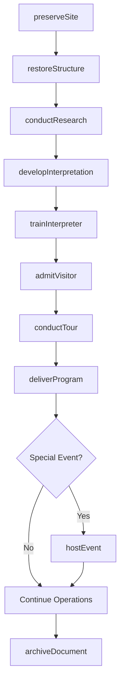
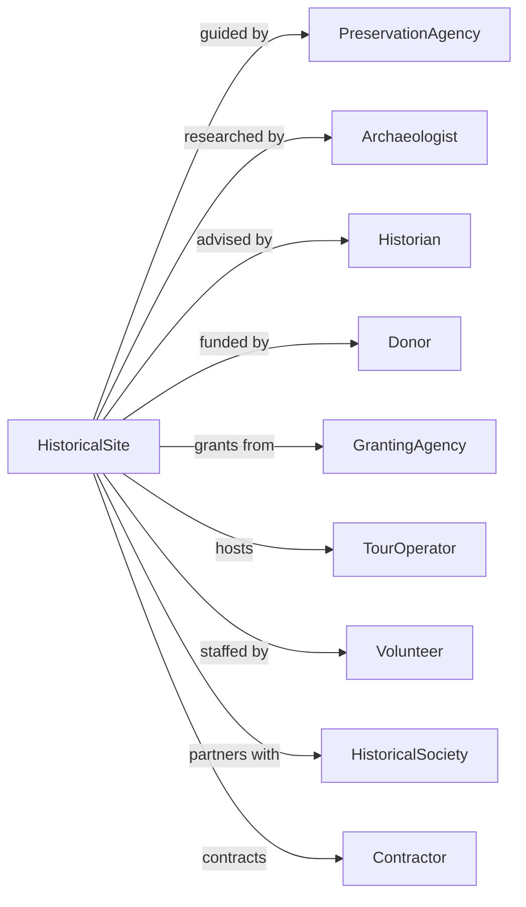

# Historical Sites

> Business-as-Code definition for historical site operations. Models preservation, interpretation, and visitor engagement at battlefields, historic buildings, and heritage locations.

## Overview

Historical sites preserve and exhibit locations, buildings, and communities of particular historical interest including battlefields, forts, archaeological sites, and pioneer villages. This definition exposes actions for preservation, interpretation, visitor services, and site management, with events for workflow automation and searches for programming and operational tracking.

## Actors

| Actor | Description |
|-------|-------------|
| PreservationAgency | Provides guidelines and funding for site conservation |
| Archaeologist | Conducts research and excavation activities |
| Historian | Provides expertise on site interpretation |
| Donor | Contributes funding or artifacts |
| GrantingAgency | Awards funding for preservation and programs |
| TourOperator | Brings group visitors to the site |
| Volunteer | Provides unpaid interpretation and support services |
| HistoricalSociety | Partners on research and programming |
| Contractor | Performs restoration and maintenance work |

## Roles

| Role | Description |
|------|-------------|
| SiteDirector | Oversees overall operations and strategy |
| Interpreter | Delivers educational programs and tours |
| PreservationManager | Manages conservation and restoration projects |
| VisitorServices | Handles admissions and guest experience |
| VolunteerCoordinator | Recruits and manages unpaid staff |
| GiftShopManager | Operates retail and merchandise sales |
| HistoricalReenactor | Portrays historical figures or periods for immersive visitor education |

## Entities

| Entity | Description |
|--------|-------------|
| Site | The preserved location and its structures |
| Structure | A building or physical element of historical significance |
| Artifact | An object associated with the site's history |
| Interpretation | Educational content explaining site significance |
| Restoration | A project to preserve or reconstruct elements |
| Program | Scheduled educational or commemorative activity |
| Tour | A guided visitor experience of the site |
| Event | A special commemorative or public gathering |
| Archive | Historical documents and research materials |
| Permit | Authorization for research or special activities |

## Actions

| Action | Description |
|--------|-------------|
| preserveSite | Execute conservation and maintenance activities |
| restoreStructure | Reconstruct or repair historical buildings |
| conductResearch | Perform archaeological or historical investigations |
| developInterpretation | Create educational content about the site |
| admitVisitor | Process guest admission and ticketing |
| conductTour | Lead guided experience of the site |
| deliverProgram | Execute educational or commemorative activities |
| hostEvent | Produce special public gatherings |
| trainInterpreter | Prepare staff for visitor engagement |
| issuePermit | Authorize research or special activities |
| acquireArtifact | Add historical objects to site collection |
| archiveDocument | Preserve historical records and research |

## Events

| Event | Description |
|-------|-------------|
| sitePreserved | Conservation work completed |
| structureRestored | Building reconstruction finished |
| researchCompleted | Investigation findings documented |
| interpretationDeveloped | Educational content created |
| visitorAdmitted | Guest processed for entry |
| tourCompleted | Guided experience finished |
| programDelivered | Educational activity completed |
| eventHosted | Special gathering concluded |
| interpreterTrained | Staff preparation completed |
| permitIssued | Research authorization granted |
| artifactAcquired | Historical object added to collection |

## Searches

| Search | Description |
|--------|-------------|
| getSiteStatus | Check preservation condition and projects |
| getStructures | List buildings with condition and history |
| getPrograms | Retrieve scheduled educational activities |
| getTours | List available tour times and capacity |
| getVisitorStats | Access attendance data by period |
| getResearch | Find completed investigations and reports |
| getArtifacts | Search site collection by criteria |

## Workflow



## Actor Relationships



## Usage

### Calling Actions

```typescript
import { preserveHeritage } from '@headlessly/preserve-heritage'

const site = preserveHeritage()

// Check site preservation condition
const status = await site.getSiteStatus({ siteId: 'colonial-williamsburg' })

// View available tour times and capacity
const tours = await site.getTours({ date: new Date() })

// Preserve site elements
const preservation = await site.preserveSite({
  area: 'north-fortification',
  activities: [
    { type: 'stabilization', structure: 'earthwork-wall' },
    { type: 'vegetation-management', area: 'battlefield-clearing' }
  ],
  budget: 75000,
  contractor: 'contractor-123'
})

// Develop interpretation
const interpretation = await site.developInterpretation({
  topic: 'Battle of 1862',
  format: 'guided-tour-script',
  audience: 'general-public',
  duration: 45,
  stops: [
    { location: 'visitor-center', content: 'historical-context' },
    { location: 'north-hill', content: 'troop-movements' },
    { location: 'monument', content: 'commemoration' }
  ]
})

// Host a commemorative event
await site.hostEvent({
  name: 'Anniversary Commemoration',
  date: '2024-07-04',
  type: 'ceremony',
  activities: [
    { time: '10:00', activity: 'wreath-laying' },
    { time: '11:00', activity: 'keynote-address' },
    { time: '12:00', activity: 'living-history-demonstration' }
  ],
  expectedAttendance: 500
})
```

### Event-Driven Automation

```typescript
// Auto-schedule maintenance after visitor seasons
site.eventHosted(async ({ eventId, attendance }) => {
  if (attendance > 1000) {
    await site.preserveSite({
      area: 'high-traffic-paths',
      activities: [
        { type: 'path-restoration', priority: 'routine' }
      ],
      reason: 'post-event-maintenance'
    })
  }
})

// Track research and update interpretation
site.researchCompleted(async ({ researchId, findings }) => {
  const research = await site.getResearch({ id: researchId })

  if (findings.significance === 'major') {
    await site.developInterpretation({
      topic: research.topic,
      format: 'update-existing',
      newFindings: findings.summary,
      affectedTours: await getAffectedTours(research.topic)
    })

    await site.trainInterpreter({
      topic: research.topic,
      staff: 'all-interpreters',
      urgency: 'before-next-tour'
    })
  }
})
```
