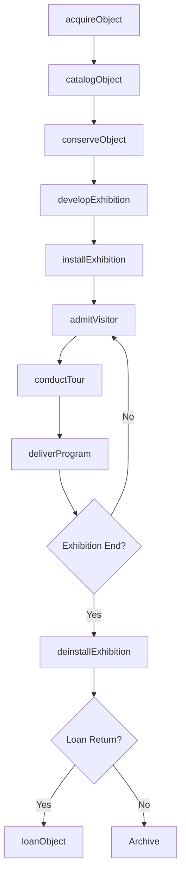
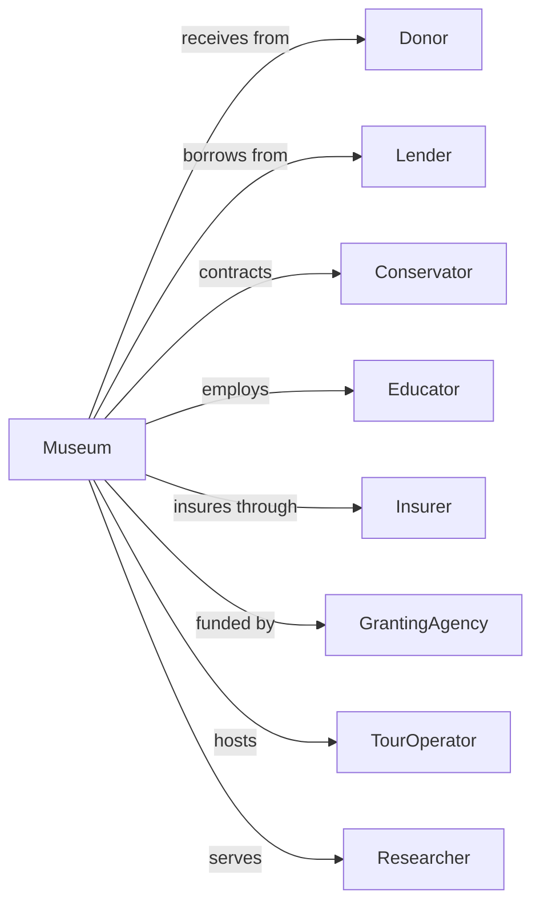

# Museums

> Business-as-Code definition for museum operations. Models the complete lifecycle from collection management through exhibition, visitor engagement, and institutional development.

## Overview

Museums preserve and exhibit objects of historical, cultural, and educational value including art museums, science centers, planetariums, and halls of fame. This definition exposes actions for collection management, exhibition development, visitor services, and institutional operations, with events for workflow automation and searches for collection and operational tracking.

## Actors

| Actor | Description |
|-------|-------------|
| Donor | Provides objects, funding, or endowments |
| Lender | Loans objects for temporary exhibitions |
| Conservator | Provides restoration and preservation services |
| Educator | Develops and delivers educational programming |
| Insurer | Provides coverage for collections and operations |
| Granting Agency | Awards funding for programs and acquisitions |
| TourOperator | Brings group visitors to the institution |
| Researcher | Accesses collections for scholarly work |
| Sponsor | Funds exhibitions or programs for recognition |

## Roles

| Role | Description |
|------|-------------|
| Director | Leads overall institutional strategy and operations |
| Curator | Manages collections and develops exhibitions |
| Registrar | Documents and tracks collection objects |
| Educator | Creates and delivers visitor programs |
| DevelopmentOfficer | Raises funds from donors and sponsors |
| VisitorServices | Manages admissions, tours, and guest experience |
| Conservator | Restores and preserves collection objects using specialized techniques |
| Archivist | Catalogs, preserves, and provides access to institutional records and documents |

## Entities

| Entity | Description |
|--------|-------------|
| Object | An item in the permanent collection |
| Collection | A group of related objects |
| Exhibition | A curated display of objects for visitors |
| Loan | A temporary arrangement for borrowed objects |
| Acquisition | Addition of an object to the collection |
| Program | Educational or public engagement activity |
| Membership | Visitor subscription with benefits |
| Grant | Funding awarded for specific purposes |
| Catalog | Documented record of collection objects |
| Gallery | Physical space for displaying exhibitions |

## Actions

| Action | Description |
|--------|-------------|
| acquireObject | Add an object to the permanent collection |
| catalogObject | Document and record object details |
| conserveObject | Preserve or restore an object |
| developExhibition | Plan and create a new exhibition |
| installExhibition | Set up an exhibition in gallery space |
| loanObject | Send or receive objects for temporary display |
| admitVisitor | Process guest admission and ticketing |
| conductTour | Lead guided visitor experience |
| deliverProgram | Execute educational or public programming |
| enrollMember | Process membership subscription |
| solicitDonation | Request funding or object gifts |
| applyForGrant | Submit funding proposal to granting agency |
| deaccessionObject | Remove an object from the collection |

## Events

| Event | Description |
|-------|-------------|
| objectAcquired | New object added to collection |
| objectCataloged | Documentation completed for object |
| objectConserved | Preservation treatment completed |
| exhibitionDeveloped | New exhibition planned and designed |
| exhibitionOpened | Exhibition available to visitors |
| objectLoaned | Object sent or received for temporary display |
| visitorAdmitted | Guest processed for entry |
| tourCompleted | Guided experience finished |
| programDelivered | Educational activity completed |
| memberEnrolled | Membership subscription processed |
| donationReceived | Funding or object gift accepted |
| grantAwarded | Funding proposal approved |

## Searches

| Search | Description |
|--------|-------------|
| searchCollection | Find objects by criteria or keyword |
| getExhibitions | List current and upcoming displays |
| getLoans | Track incoming and outgoing object loans |
| getVisitorStats | Access attendance and demographic data |
| getMembers | List active memberships with details |
| findDonors | Search donor records and history |
| getGrants | Review active and pending funding |

## Workflow



## Actor Relationships



## Usage

### Calling Actions

```typescript
import { exhibitCollections } from '@headlessly/exhibit-collections'

const museum = exhibitCollections()

// Acquire a new object
const acquisition = await museum.acquireObject({
  type: 'painting',
  artist: 'Claude Monet',
  title: 'Water Lilies Study',
  year: 1906,
  source: 'donation',
  donorId: 'donor-123',
  estimatedValue: 2500000
})

// Catalog the object
await museum.catalogObject({
  objectId: acquisition.id,
  accessionNumber: '2024.15.1',
  dimensions: { height: 24, width: 36, unit: 'inches' },
  medium: 'oil-on-canvas',
  provenance: ['Private Collection, Paris', 'Gallery XYZ, New York'],
  condition: 'excellent',
  location: 'vault-a-shelf-12'
})

// Develop an exhibition
const exhibition = await museum.developExhibition({
  title: 'Impressionism in Focus',
  curator: 'curator-456',
  galleries: ['gallery-west-1', 'gallery-west-2'],
  dates: { open: '2024-10-01', close: '2025-02-15' },
  objects: [acquisition.id, 'object-789', 'object-012'],
  loans: [{ lenderId: 'partner-museum', objectIds: ['external-123'] }]
})
```

### Event-Driven Automation

```typescript
// Auto-schedule conservation assessment for new acquisitions
museum.objectAcquired(async ({ objectId, condition }) => {
  if (condition !== 'excellent') {
    await museum.conserveObject({
      objectId,
      assessmentType: 'condition-report',
      priority: condition === 'poor' ? 'urgent' : 'routine',
      conservatorId: await getAvailableConservator()
    })
  }
})

// Track visitor engagement and report
museum.visitorAdmitted(async ({ visitorType, admissionType }) => {
  await updateDailyStats({
    type: visitorType,
    admission: admissionType,
    timestamp: new Date()
  })

  const stats = await museum.getVisitorStats({ period: 'today' })

  if (stats.total % 1000 === 0) {
    await celebrateMilestone({
      count: stats.total,
      notification: 'all-staff'
    })
  }
})
```
