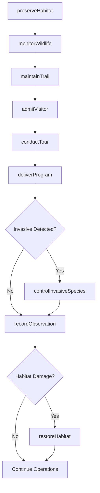
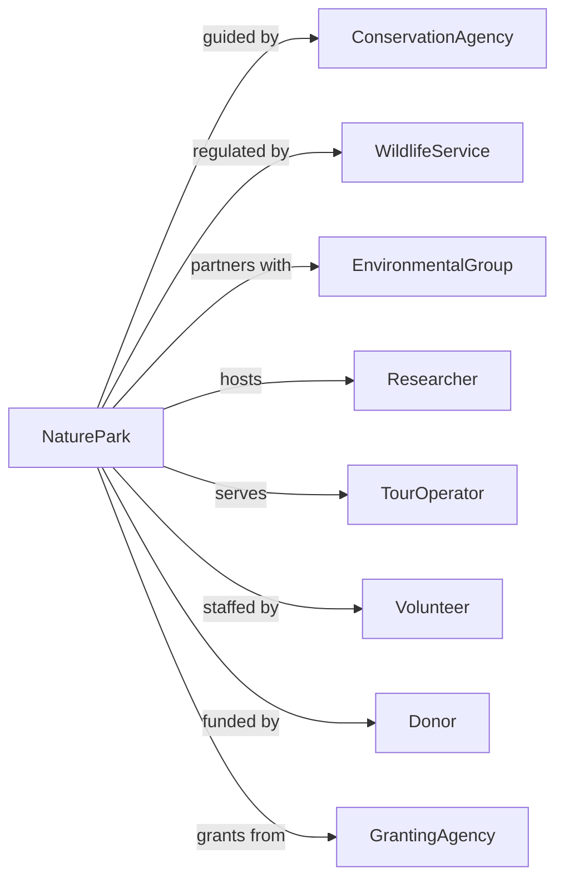

# Nature Parks and Other Similar Institutions

> Business-as-Code definition for nature park and conservation area operations. Models natural area preservation, visitor services, and environmental education programs.

## Overview

Nature parks preserve and exhibit natural areas including wildlife sanctuaries, conservation areas, nature centers, and natural wonder attractions like caves and waterfalls. This definition exposes actions for conservation management, trail operations, educational programming, and visitor services, with events for workflow automation and searches for environmental and operational tracking.

## Actors

| Actor | Description |
|-------|-------------|
| ConservationAgency | Provides guidelines and funding for habitat protection |
| WildlifeService | Regulates and monitors protected species |
| EnvironmentalGroup | Partners on conservation initiatives |
| Researcher | Conducts ecological studies on site |
| TourOperator | Brings group visitors to the park |
| Volunteer | Provides unpaid conservation and education services |
| Donor | Contributes funding for preservation programs |
| GrantingAgency | Awards funding for conservation projects |
| Outfitter | Provides equipment rentals for visitors |

## Roles

| Role | Description |
|------|-------------|
| ParkDirector | Oversees overall operations and strategy |
| Naturalist | Leads educational programs and interpretation |
| Ranger | Patrols grounds and manages visitor safety |
| TrailCrew | Maintains paths and infrastructure |
| WildlifeBiologist | Monitors and manages species populations |
| VisitorServices | Handles admissions and guest experience |

## Entities

| Entity | Description |
|--------|-------------|
| Park | The preserved natural area and facilities |
| Habitat | A distinct ecological zone within the park |
| Trail | A marked path for visitor access |
| Species | Wildlife or plant populations in the park |
| ConservationProject | Initiative for habitat or species protection |
| Program | Educational or interpretive activity |
| Permit | Authorization for research or special access |
| Facility | Buildings and infrastructure for visitors |
| Observation | Recorded wildlife or environmental data |
| Event | Scheduled public activity or gathering |

## Actions

| Action | Description |
|--------|-------------|
| preserveHabitat | Execute conservation and restoration activities |
| monitorWildlife | Track species populations and behavior |
| maintainTrail | Repair and improve visitor paths |
| admitVisitor | Process guest admission and permits |
| conductTour | Lead guided nature experiences |
| deliverProgram | Execute educational activities |
| issuePermit | Authorize research or special access |
| respondEmergency | Handle visitor safety incidents |
| restoreHabitat | Rehabilitate damaged natural areas |
| controlInvasiveSpecies | Remove non-native threats |
| recordObservation | Document wildlife and environmental data |
| hostEvent | Produce public activities and gatherings |

## Events

| Event | Description |
|-------|-------------|
| habitatPreserved | Conservation work completed |
| wildlifeMonitored | Species observation recorded |
| trailMaintained | Path improvements completed |
| visitorAdmitted | Guest processed for entry |
| tourCompleted | Guided experience finished |
| programDelivered | Educational activity completed |
| permitIssued | Research authorization granted |
| emergencyResponded | Safety incident handled |
| habitatRestored | Rehabilitation completed |
| invasiveControlled | Non-native species removed |
| observationRecorded | Environmental data documented |

## Searches

| Search | Description |
|--------|-------------|
| getHabitats | List ecological zones with status |
| getTrails | Retrieve path conditions and access |
| getWildlife | Access species observations and trends |
| getVisitorStats | Review attendance and demographics |
| getConservationProjects | List active preservation initiatives |
| getPermits | Check issued authorizations |
| getPrograms | Find scheduled educational activities |

## Workflow



## Actor Relationships



## Usage

### Calling Actions

```typescript
import { conserveWildlife } from '@headlessly/conserve-wildlife'

const park = conserveWildlife()

// Preserve habitat
const project = await park.preserveHabitat({
  area: 'wetland-north',
  activities: [
    { type: 'invasive-removal', species: 'phragmites' },
    { type: 'native-planting', species: ['spartina', 'juncus'] },
    { type: 'water-management', action: 'restore-hydrology' }
  ],
  budget: 50000,
  timeline: { start: '2024-03-01', end: '2024-09-30' }
})

// Monitor wildlife
await park.monitorWildlife({
  species: 'spotted-salamander',
  method: 'cover-board-survey',
  location: 'vernal-pool-area',
  frequency: 'bi-weekly',
  season: 'spring-breeding'
})

// Deliver an educational program
await park.deliverProgram({
  name: 'Night Hike',
  type: 'guided-experience',
  date: '2024-06-15',
  time: '20:00',
  duration: 120,
  capacity: 20,
  topics: ['nocturnal-wildlife', 'astronomy', 'ecology'],
  equipment: ['headlamps', 'field-guides']
})
```

### Event-Driven Automation

```typescript
// Auto-respond to wildlife observations
park.wildlifeMonitored(async ({ speciesId, count, location }) => {
  const species = await park.getWildlife({ id: speciesId })

  if (species.conservationStatus === 'threatened') {
    await park.preserveHabitat({
      area: location,
      activities: [{ type: 'buffer-zone', priority: 'high' }],
      reason: 'species-protection'
    })

    await notifyWildlifeService({
      species: species.name,
      count,
      location,
      significance: 'threatened-species-observation'
    })
  }
})

// Manage trail conditions after weather events
park.emergencyResponded(async ({ type, location }) => {
  if (type === 'storm-damage') {
    await park.maintainTrail({
      trailId: location,
      activities: [
        { type: 'debris-removal' },
        { type: 'erosion-assessment' }
      ],
      priority: 'urgent',
      closeTrail: true
    })
  }
})
```
