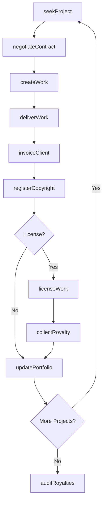
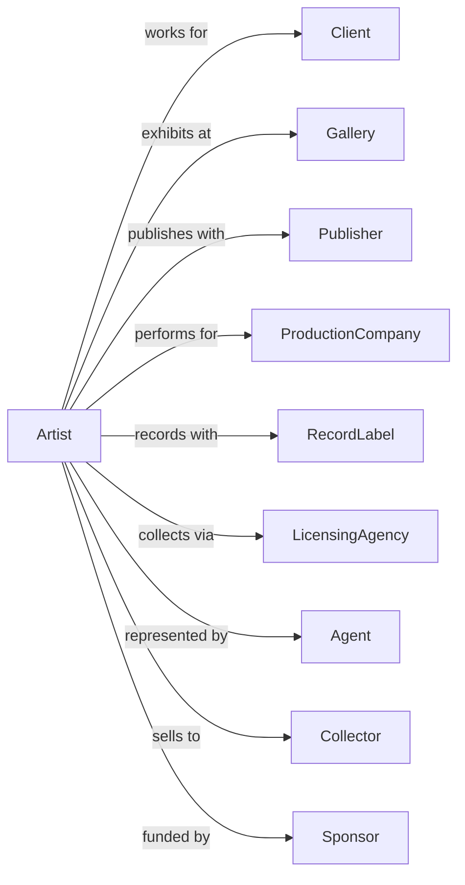

# Independent Artists, Writers, and Performers

> Business-as-Code definition for freelance creative professionals. Models independent actors, artists, writers, and performers from project acquisition through creation, licensing, and income management.

## Overview

Independent artists, writers, and performers work as freelancers creating artistic works, performing in productions, or providing technical expertise. This definition exposes actions for project sourcing, creative production, rights licensing, and financial management, with events for workflow automation and searches for opportunity tracking and income reporting.

## Actors

| Actor | Description |
|-------|-------------|
| Client | Commissions work or hires for productions |
| Gallery | Exhibits and sells visual artwork |
| Publisher | Licenses written works for distribution |
| ProductionCompany | Hires talent for film, television, or stage |
| RecordLabel | Produces and distributes recorded performances |
| LicensingAgency | Collects royalties for creative works |
| Agent | Represents the artist for business opportunities |
| Collector | Purchases original artwork or commissions |
| Sponsor | Provides funding for endorsements or appearances |

## Roles

| Role | Description |
|------|-------------|
| VisualArtist | Creates paintings, sculptures, and visual works |
| Writer | Authors books, scripts, articles, and content |
| Actor | Performs in film, television, or stage productions |
| Musician | Performs or composes musical works |
| Photographer | Creates photographic works |
| TechnicalSpecialist | Provides production expertise for creative projects |

## Entities

| Entity | Description |
|--------|-------------|
| Work | A created artistic piece or performance |
| Commission | A contracted creative project |
| License | Rights granted for use of creative work |
| Royalty | Ongoing income from licensed work |
| Portfolio | Collection of completed works |
| Contract | Agreement for work or licensing |
| Invoice | Bill for services rendered or work delivered |
| Appearance | Paid public engagement or endorsement |
| Copyright | Legal ownership of creative work |
| Residual | Ongoing payment for repeat use of performance |

## Actions

| Action | Description |
|--------|-------------|
| seekProject | Identify and pursue creative opportunities |
| negotiateContract | Establish terms for work or licensing |
| createWork | Execute the creative production process |
| deliverWork | Submit completed work to client |
| registerCopyright | Establish legal ownership of creative work |
| licenseWork | Grant usage rights to third parties |
| collectRoyalty | Receive ongoing income from licensed work |
| invoiceClient | Bill for services or deliverables |
| fulfillAppearance | Complete paid public engagement |
| updatePortfolio | Add recent work to professional collection |
| auditRoyalties | Verify accuracy of ongoing payments |
| renewLicense | Extend rights agreement with licensee |

## Events

| Event | Description |
|-------|-------------|
| projectFound | Creative opportunity identified |
| contractSigned | Work or licensing agreement executed |
| workCreated | Creative production completed |
| workDelivered | Completed piece submitted to client |
| copyrightRegistered | Legal ownership established |
| workLicensed | Usage rights granted to third party |
| royaltyCollected | Ongoing payment received |
| invoiceSent | Bill submitted to client |
| paymentReceived | Client payment processed |
| appearanceCompleted | Public engagement fulfilled |
| portfolioUpdated | Professional collection refreshed |
| licenseRenewed | Rights agreement extended |

## Searches

| Search | Description |
|--------|-------------|
| findOpportunities | List available projects and auditions |
| getContracts | Retrieve active agreements and terms |
| getRoyalties | Access ongoing income by work or source |
| getInvoices | List submitted bills and payment status |
| getPortfolio | View completed works and achievements |
| getLicenses | Check active rights agreements |
| getAppearances | List upcoming paid engagements |

## Workflow



## Actor Relationships



## Usage

### Calling Actions

```typescript
import { createArt } from '@headlessly/create-art'

const artist = createArt()

// Browse available projects and auditions
const opportunities = await artist.findOpportunities({ type: 'commission', medium: 'sculpture' })

// Check royalty income from licensed works
const royalties = await artist.getRoyalties({ year: 2024 })

// Negotiate a commission
const contract = await artist.negotiateContract({
  clientId: 'client-123',
  projectType: 'portrait-commission',
  deliverables: ['24x36-oil-painting'],
  fee: 5000,
  timeline: {
    start: '2024-03-01',
    delivery: '2024-05-15'
  },
  rights: 'client-personal-use'
})

// Create and deliver work
await artist.createWork({
  contractId: contract.id,
  medium: 'oil-on-canvas',
  dimensions: { width: 24, height: 36, unit: 'inches' },
  progressMilestones: ['sketch', 'underpainting', 'final']
})

await artist.deliverWork({
  contractId: contract.id,
  deliveryMethod: 'shipping',
  insurance: true,
  tracking: 'signature-required'
})

// License existing work
const license = await artist.licenseWork({
  workId: 'painting-456',
  licenseeId: 'publisher-789',
  usage: 'book-cover',
  territory: 'north-america',
  duration: 24,
  fee: 2500,
  royaltyRate: 0.05
})
```

### Event-Driven Automation

```typescript
// Auto-invoice when work delivered
artist.workDelivered(async ({ contractId, workId }) => {
  const contract = await artist.getContracts({ id: contractId })

  await artist.invoiceClient({
    clientId: contract.clientId,
    amount: contract.fee,
    workId,
    terms: 'net-30',
    paymentMethods: ['check', 'wire', 'card']
  })
})

// Track royalties and audit quarterly
artist.royaltyCollected(async ({ licenseId, amount, period }) => {
  const license = await artist.getLicenses({ id: licenseId })

  if (isQuarterEnd(period)) {
    await artist.auditRoyalties({
      licenseId,
      period: getCurrentQuarter(),
      expectedMinimum: license.minimumRoyalty
    })
  }
})
```
