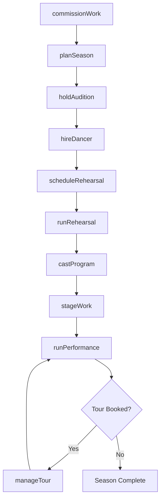
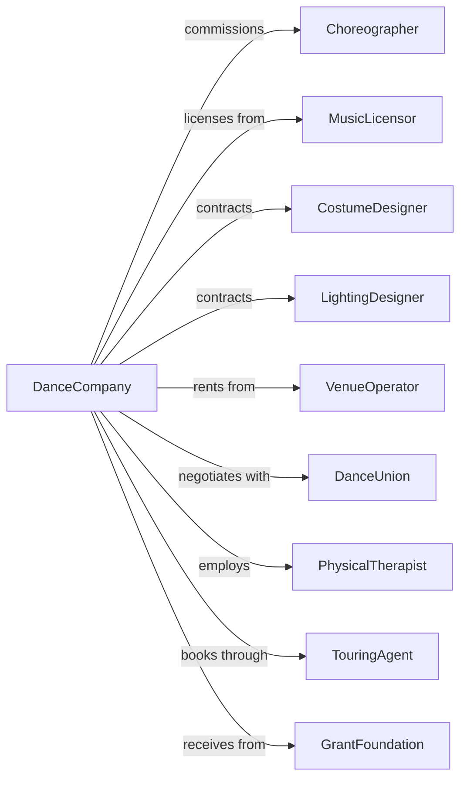

# Dance Companies

> Business-as-Code definition for professional dance company operations. Models the complete lifecycle from choreographic creation through performance and touring.

## Overview

Dance companies produce live theatrical dance presentations including ballet, contemporary, folk, and modern dance. This definition exposes actions for repertoire development, dancer management, rehearsal scheduling, and performance operations, with events for workflow automation and searches for company operations and audience engagement.

## Actors

| Actor | Description |
|-------|-------------|
| Choreographer | Creates original dance works or licenses existing pieces |
| MusicLicensor | Provides rights for musical compositions used in performances |
| CostumeDesigner | Designs and creates performance attire and accessories |
| LightingDesigner | Creates lighting designs for productions |
| VenueOperator | Manages performance spaces for rentals and residencies |
| DanceUnion | Represents dancers through AGMA or similar organizations |
| PhysicalTherapist | Provides injury prevention and rehabilitation services |
| TouringAgent | Books performances at venues across regions |
| GrantFoundation | Provides funding for artistic programs and operations |

## Roles

| Role | Description |
|------|-------------|
| ArtisticDirector | Sets creative vision and selects repertoire |
| ExecutiveDirector | Manages organizational operations and fundraising |
| BalletMaster | Teaches technique and maintains repertoire standards |
| Dancer | Performs in productions as company or guest artist |
| RehearsalDirector | Runs daily rehearsals and coaches performers |
| CompanyManager | Coordinates schedules, travel, and dancer logistics |
| Choreographer | Creates original dance works and stages existing repertoire |

## Entities

| Entity | Description |
|--------|-------------|
| Work | A choreographed dance piece in the repertoire |
| Repertoire | The collection of works available for performance |
| Season | A scheduled series of performances over a time period |
| Rehearsal | A practice session for dancers and production team |
| Performance | A single presentation of one or more works |
| Program | The combination of works presented in a performance |
| Dancer | A performing artist in the company roster |
| Tour | A series of performances at multiple venues |
| Contract | Employment agreement with dancer or creative team |
| Injury | A physical condition affecting a dancer's availability |

## Actions

| Action | Description |
|--------|-------------|
| commissionWork | Contract a choreographer to create a new piece |
| acquireRights | License an existing work for performance |
| planSeason | Schedule programs, dates, and venue bookings |
| holdAudition | Conduct evaluations for company positions |
| hireDancer | Execute employment contracts for dancers |
| scheduleRehearsal | Book studio time and assign dancers to sessions |
| runRehearsal | Conduct practice sessions with notes and corrections |
| castProgram | Assign dancers to roles in upcoming performances |
| stageWork | Prepare a piece for performance with all elements |
| runPerformance | Execute a live dance performance |
| bookTour | Arrange performances at external venues |
| manageTour | Coordinate travel, lodging, and logistics for touring |
| reportInjury | Document dancer injury and initiate care protocol |
| renewContract | Extend dancer employment for additional seasons |

## Events

| Event | Description |
|-------|-------------|
| workCommissioned | New choreographic creation contracted |
| rightsAcquired | Licensing secured for an existing work |
| seasonAnnounced | Upcoming programs made public |
| dancerHired | New company member contracted |
| rehearsalCompleted | A practice session finished |
| programCast | Dancer assignments finalized for performances |
| workStaged | Piece ready for performance with all elements |
| performanceCompleted | A live show finished |
| tourBooked | External venue performances confirmed |
| injuryReported | Dancer physical condition documented |
| contractRenewed | Dancer employment extended |
| grantAwarded | Foundation funding received |

## Searches

| Search | Description |
|--------|-------------|
| findWorks | List repertoire with filters for choreographer or style |
| getDancers | Retrieve company roster with availability and roles |
| getRehearsalSchedule | List upcoming rehearsals by work or dancer |
| findPerformances | Get scheduled shows with venue and program details |
| checkCasting | Retrieve dancer assignments for a program |
| getTourSchedule | List tour dates, venues, and logistics |
| getInjuryStatus | Check dancer health and availability status |

## Workflow



## Actor Relationships



## Usage

### Calling Actions

```typescript
import { performDance } from '@headlessly/perform-dance'

const company = performDance()

// Check dancer roster and availability
const dancers = await company.getDancers({ status: 'active' })

// Review injury status for casting decisions
const injuries = await company.getInjuryStatus({ severity: 'any' })

// Commission a new work
const work = await company.commissionWork({
  choreographerId: 'choreographer-123',
  title: 'Ephemeral Light',
  duration: 25,
  dancerCount: 12,
  premiereDate: '2024-10-15',
  fee: 45000
})

// Plan the season
const season = await company.planSeason({
  name: 'Spring 2024',
  programs: [
    {
      name: 'New Works',
      works: ['ephemeral-light', 'existing-piece-456'],
      dates: ['2024-04-12', '2024-04-13', '2024-04-14']
    }
  ],
  venue: 'main-theater'
})

// Cast a program
await company.castProgram({
  programId: 'new-works-spring-2024',
  assignments: [
    { workId: 'ephemeral-light', role: 'Principal', dancerId: 'dancer-001' },
    { workId: 'ephemeral-light', role: 'Soloist', dancerId: 'dancer-002' }
  ]
})
```

### Event-Driven Automation

```typescript
// Handle injury reports automatically
company.injuryReported(async ({ dancerId, severity, workIds }) => {
  const dancer = await company.getDancers({ id: dancerId })

  if (severity === 'severe') {
    // Find understudy for affected works
    for (const workId of workIds) {
      const casting = await company.checkCasting({ workId })
      const understudy = casting.find(c => c.role === 'Understudy')

      if (understudy) {
        await company.castProgram({
          workId,
          assignments: [{ role: dancer.role, dancerId: understudy.dancerId }]
        })
      }
    }
  }
})

// Notify management after each performance
company.performanceCompleted(async ({ performanceId, attendance }) => {
  const performance = await company.findPerformances({ id: performanceId })

  await sendReport({
    to: 'executive-director@company.org',
    subject: `Performance Report: ${performance.date}`,
    data: {
      attendance,
      capacity: performance.venue.capacity,
      percentFull: (attendance / performance.venue.capacity) * 100
    }
  })
})
```
