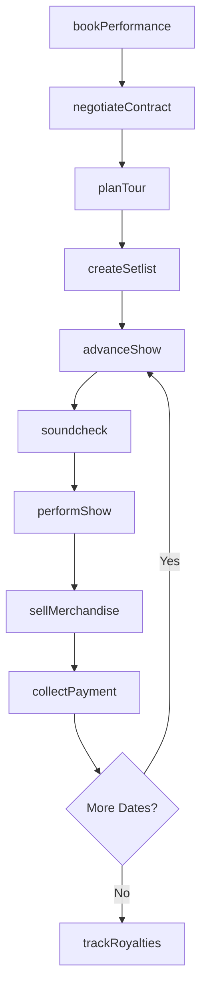
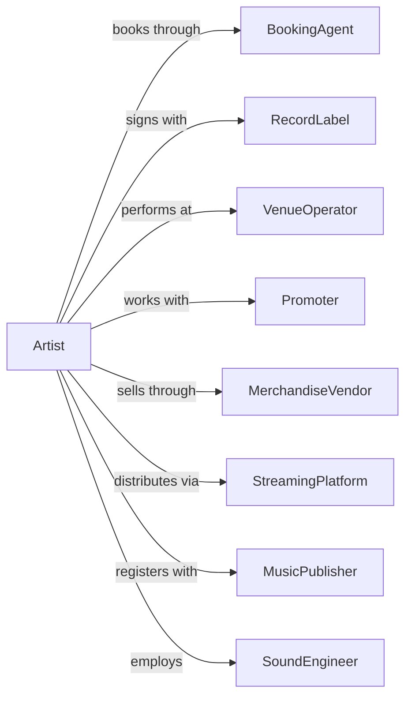

# Musical Groups and Artists

> Business-as-Code definition for musical performance operations. Models the complete lifecycle from booking through performance, recording, and merchandise.

## Overview

Musical groups and artists produce live musical entertainment including bands, orchestras, soloists, and ensembles. This definition exposes actions for booking management, tour coordination, performance execution, and revenue tracking, with events for workflow automation and searches for scheduling and business operations.

## Actors

| Actor | Description |
|-------|-------------|
| BookingAgent | Secures performance opportunities at venues and festivals |
| RecordLabel | Produces, distributes, and markets recorded music |
| VenueOperator | Manages performance spaces for concerts and events |
| Promoter | Markets and produces live music events |
| MerchandiseVendor | Produces and sells artist-branded products |
| StreamingPlatform | Distributes digital music to listeners |
| MusicPublisher | Manages composition rights and royalty collection |
| SoundEngineer | Provides live sound reinforcement services |
| TourManager | Coordinates logistics for multi-date performances |

## Roles

| Role | Description |
|------|-------------|
| Musician | Performs music as part of the group or as soloist |
| BandLeader | Directs musical performances and business decisions |
| Manager | Oversees career development and business relationships |
| Roadie | Handles equipment setup, transport, and maintenance |
| MerchandiseManager | Manages product inventory and sales at events |
| SocialMediaManager | Maintains online presence and fan engagement |
| SoundEngineer | Mixes live audio and manages stage monitor systems during performances |

## Entities

| Entity | Description |
|--------|-------------|
| Performance | A live musical show at a venue or event |
| Tour | A series of performances across multiple venues |
| Setlist | The ordered list of songs for a performance |
| Booking | A confirmed engagement at a venue or event |
| Rider | Technical and hospitality requirements for performances |
| Merchandise | Products sold under the artist brand |
| Recording | A produced audio or video work |
| Royalty | Income from music rights and licensing |
| Contract | Agreement with venues, labels, or other parties |
| Equipment | Instruments, amplifiers, and technical gear |

## Actions

| Action | Description |
|--------|-------------|
| bookPerformance | Secure and contract a performance engagement |
| negotiateContract | Establish terms for bookings, recordings, or licensing |
| planTour | Schedule a series of performances across dates and venues |
| createSetlist | Build the song order for an upcoming performance |
| advanceShow | Coordinate technical and logistical details with venue |
| soundcheck | Test and adjust audio levels before performance |
| performShow | Execute a live musical performance |
| sellMerchandise | Process merchandise sales at events or online |
| collectPayment | Receive performance fees and settle accounts |
| trackRoyalties | Monitor and reconcile streaming and licensing income |
| releaseRecording | Publish new music through distribution channels |
| updateRider | Modify technical or hospitality requirements |
| scheduleRehearsal | Book practice sessions for the group |

## Events

| Event | Description |
|-------|-------------|
| performanceBooked | Engagement confirmed with venue or promoter |
| contractSigned | Agreement executed with business partner |
| tourAnnounced | Performance schedule made public |
| setlistCreated | Song order finalized for performance |
| showAdvanced | Pre-production coordination completed |
| soundcheckCompleted | Audio levels set and tested |
| performanceCompleted | Live show finished |
| merchandiseSold | Product transaction completed |
| paymentReceived | Performance fee or royalty collected |
| recordingReleased | New music published to platforms |
| royaltyPaid | Streaming or licensing income received |

## Searches

| Search | Description |
|--------|-------------|
| findBookings | List confirmed engagements with dates and venues |
| getTourSchedule | Retrieve upcoming tour dates and logistics |
| getSetlists | Access historical and planned song orders |
| checkInventory | Review merchandise stock levels and sales |
| getRoyalties | Retrieve streaming and licensing income reports |
| findVenues | Search available performance spaces by location or capacity |
| getPayments | List received and pending performance fees |

## Workflow



## Actor Relationships



## Usage

### Calling Actions

```typescript
import { performLiveMusic } from '@headlessly/perform-live-music'

const artist = performLiveMusic()

// Check upcoming tour schedule
const tourDates = await artist.getTourSchedule({ year: 2024 })

// Search available venues by capacity and location
const venues = await artist.findVenues({ city: 'nashville', minCapacity: 500 })

// Book a performance
const booking = await artist.bookPerformance({
  venue: 'venue-456',
  date: '2024-07-15',
  type: 'headliner',
  guarantee: 5000,
  doorSplit: 0.8,
  capacity: 500
})

// Plan a tour
const tour = await artist.planTour({
  name: 'Summer 2024 Tour',
  dates: [
    { venueId: 'venue-001', date: '2024-07-10' },
    { venueId: 'venue-002', date: '2024-07-12' },
    { venueId: 'venue-003', date: '2024-07-15' }
  ],
  routing: 'optimized'
})

// Create setlist
await artist.createSetlist({
  performanceId: booking.id,
  songs: [
    { title: 'Opening Number', duration: 240 },
    { title: 'Hit Single', duration: 210 },
    { title: 'New Release', duration: 195 }
  ],
  encores: ['Classic Track']
})
```

### Event-Driven Automation

```typescript
// Auto-post to social media when tour dates announced
artist.tourAnnounced(async ({ tourId, name, dates }) => {
  await postToSocial({
    platforms: ['instagram', 'twitter', 'facebook'],
    content: `${name} dates announced! ${dates.length} shows coming your way.`,
    link: `https://artist.com/tour/${tourId}`
  })
})

// Track merchandise sales after each show
artist.performanceCompleted(async ({ performanceId, venueId }) => {
  const sales = await artist.checkInventory({
    performanceId,
    type: 'sales-report'
  })

  if (sales.totalRevenue > 2000) {
    await sendAlert({
      to: 'manager',
      message: `Strong merch night at ${venueId}: $${sales.totalRevenue}`
    })
  }

  // Reorder low stock items
  for (const item of sales.items) {
    if (item.remaining < 10) {
      await reorderMerchandise(item.productId, 50)
    }
  }
})
```
