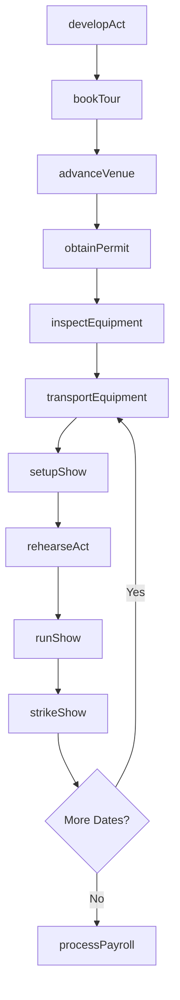
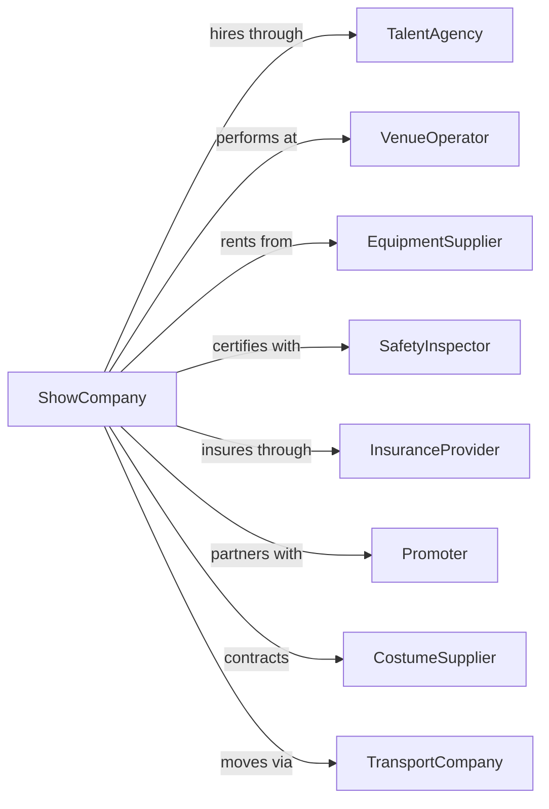

# Other Performing Arts Companies

> Business-as-Code definition for specialty performing arts operations. Models circuses, magic shows, ice skating productions, and carnival entertainment from booking through performance.

## Overview

Other performing arts companies produce live theatrical presentations outside traditional theater, dance, and music, including circuses, magic shows, ice skating productions, and carnival traveling shows. This definition exposes actions for act development, tour logistics, venue coordination, and performance operations, with events for workflow automation and searches for scheduling and operations.

## Actors

| Actor | Description |
|-------|-------------|
| TalentAgency | Represents specialty performers for bookings |
| VenueOperator | Manages arenas, fairgrounds, and performance spaces |
| EquipmentSupplier | Provides rigging, staging, and specialty apparatus |
| SafetyInspector | Certifies equipment and performance safety compliance |
| InsuranceProvider | Covers liability for performances and equipment |
| Promoter | Markets and produces specialty entertainment events |
| CostumeSupplier | Provides specialized performance attire |
| AnimalHandler | Manages trained animals for applicable acts |
| TransportCompany | Provides trucking and logistics for touring |

## Roles

| Role | Description |
|------|-------------|
| ShowDirector | Creates and oversees the overall production |
| Performer | Executes specialty acts in the production |
| Ringmaster | Hosts and narrates the show for audiences |
| TechnicalDirector | Manages rigging, lighting, and staging |
| TourManager | Coordinates logistics across performance locations |
| SafetyCoordinator | Ensures all acts meet safety standards |

## Entities

| Entity | Description |
|--------|-------------|
| Show | The complete production with all acts |
| Act | A distinct performance segment within the show |
| Tour | A series of performances across multiple locations |
| Venue | The location where performances take place |
| Apparatus | Specialized equipment used in performances |
| Permit | Authorization required for performances or animals |
| Contract | Agreement with venues, performers, or suppliers |
| SafetyCertificate | Documentation of equipment inspection and approval |
| Ticket | Admission pass for a specific performance |
| Trailer | Mobile unit for equipment or performer housing |

## Actions

| Action | Description |
|--------|-------------|
| developAct | Create and rehearse a new specialty performance |
| bookTour | Secure performance dates at multiple venues |
| advanceVenue | Coordinate logistics and requirements with each location |
| obtainPermit | Secure required authorizations for performance activities |
| inspectEquipment | Verify safety compliance of apparatus and rigging |
| setupShow | Install staging, rigging, and equipment at venue |
| rehearseAct | Practice performance with safety checks |
| runShow | Execute the complete performance for audience |
| sellTicket | Process admission sales for performances |
| strikeShow | Remove equipment and prepare for next location |
| transportEquipment | Move gear and apparatus between venues |
| processPayroll | Pay performers and crew for engagement |
| renewCertification | Update safety certifications and permits |

## Events

| Event | Description |
|-------|-------------|
| actDeveloped | New performance segment ready for inclusion |
| tourBooked | Performance dates confirmed at venues |
| venueAdvanced | Pre-production coordination completed |
| permitObtained | Required authorizations secured |
| equipmentInspected | Safety compliance verified |
| showSetup | Installation completed at venue |
| rehearsalCompleted | Practice session finished with safety clearance |
| showCompleted | Performance finished for audience |
| ticketSold | Admission purchase processed |
| showStruck | Equipment removed from venue |
| tourCompleted | All scheduled dates finished |

## Searches

| Search | Description |
|--------|-------------|
| findShows | List productions with status and tour information |
| getTourSchedule | Retrieve upcoming dates, venues, and logistics |
| getActs | List performance segments with performers and requirements |
| checkPermits | Review permit status by location and activity |
| getEquipmentStatus | Check apparatus certification and maintenance records |
| findVenues | Search available locations by capacity and requirements |
| getBoxOffice | Retrieve ticket sales by date and location |

## Workflow



## Actor Relationships



## Usage

### Calling Actions

```typescript
import { performShows } from '@headlessly/perform-shows'

const company = performShows()

// View upcoming tour schedule and logistics
const schedule = await company.getTourSchedule({ year: 2024 })

// Check equipment certification and maintenance records
const gear = await company.getEquipmentStatus({ type: 'aerial-rigging' })

// Develop a new act
const act = await company.developAct({
  name: 'Aerial Silk Trio',
  type: 'aerial',
  performers: ['performer-001', 'performer-002', 'performer-003'],
  duration: 8,
  requirements: {
    rigging: 'triple-point-aerial',
    height: 40,
    safetyNet: true
  }
})

// Book a tour
const tour = await company.bookTour({
  showId: 'main-show-2024',
  dates: [
    { venueId: 'arena-001', date: '2024-06-15', performances: 2 },
    { venueId: 'fairground-002', date: '2024-06-22', performances: 3 }
  ],
  transportMode: 'truck-convoy'
})

// Advance a venue
await company.advanceVenue({
  tourDateId: tour.dates[0].id,
  technicalSpecs: {
    riggingPoints: 12,
    powerRequirements: '400A-3phase',
    loadInTime: '06:00'
  },
  contacts: {
    venueManager: 'contact-123',
    localPromoter: 'contact-456'
  }
})
```

### Event-Driven Automation

```typescript
// Auto-schedule equipment inspection before each venue
company.showSetup(async ({ tourDateId, venueId }) => {
  const apparatus = await company.getEquipmentStatus({
    tourDateId,
    needsInspection: true
  })

  for (const item of apparatus) {
    await company.inspectEquipment({
      apparatusId: item.id,
      inspector: 'safety-team',
      venueId
    })
  }
})

// Coordinate transport after show strike
company.showStruck(async ({ tourDateId, nextDateId }) => {
  if (nextDateId) {
    const route = await getOptimalRoute(tourDateId, nextDateId)

    await company.transportEquipment({
      from: tourDateId,
      to: nextDateId,
      trailers: route.requiredTrailers,
      departureTime: route.optimalDeparture
    })
  }
})
```
