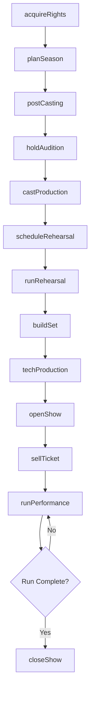
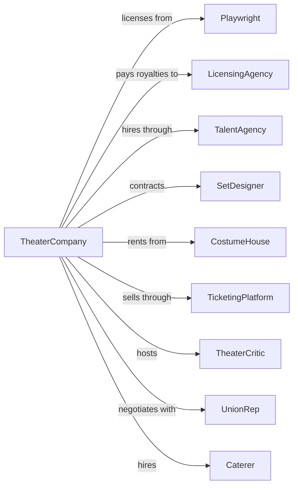

# Theater Companies and Dinner Theaters

> Business-as-Code definition for theater production operations. Models the complete lifecycle from script acquisition through performance run and audience engagement.

## Overview

Theater companies and dinner theaters produce live theatrical presentations including musicals, operas, plays, and specialty shows. This definition exposes actions for production planning, casting, rehearsal management, and performance operations, with events for workflow automation and searches for scheduling, talent, and revenue tracking.

## Actors

| Actor | Description |
|-------|-------------|
| Playwright | Creates original scripts or licenses existing works for production |
| LicensingAgency | Manages performance rights for copyrighted theatrical works |
| TalentAgency | Represents actors, directors, and theatrical professionals |
| SetDesigner | Designs and builds stage scenery and environments |
| CostumeHouse | Provides costume design, construction, and rental services |
| TicketingPlatform | Processes ticket sales and manages box office operations |
| TheaterCritic | Reviews productions for media outlets |
| Caterer | Supplies food and beverage for dinner theater operations |
| UnionRep | Represents Actors Equity, IATSE, and other theatrical unions |

## Roles

| Role | Description |
|------|-------------|
| ArtisticDirector | Selects productions and sets creative vision for seasons |
| ProducingDirector | Manages budgets, fundraising, and business operations |
| StageManager | Coordinates rehearsals, calls cues, and manages backstage |
| TechnicalDirector | Oversees lighting, sound, and technical production elements |
| BoxOfficeManager | Manages ticket sales, subscriptions, and front-of-house |
| CastMember | Performs roles in theatrical productions |

## Entities

| Entity | Description |
|--------|-------------|
| Production | A specific theatrical work being staged |
| Script | The written text and stage directions for a show |
| Season | A scheduled series of productions over a time period |
| Audition | A talent evaluation session for casting decisions |
| Rehearsal | A practice session for performers and crew |
| Performance | A single showing of a production |
| Ticket | An admission pass for a specific performance |
| Subscription | A season package of multiple show tickets |
| Venue | The theater space where productions are staged |
| CallSheet | Daily schedule of cast and crew requirements |

## Actions

| Action | Description |
|--------|-------------|
| acquireRights | Secure licensing and performance rights for a script |
| planSeason | Schedule productions, dates, and budget allocations for a season |
| postCasting | Announce audition opportunities for a production |
| holdAudition | Conduct talent evaluations for specific roles |
| castProduction | Assign performers to roles in a production |
| scheduleRehearsal | Book rehearsal sessions with cast and creative team |
| runRehearsal | Conduct and track progress of rehearsal sessions |
| buildSet | Construct and install scenery for a production |
| techProduction | Execute technical rehearsals for lighting, sound, and effects |
| openShow | Launch a production for public performances |
| sellTicket | Process ticket purchase for a specific performance |
| runPerformance | Execute a live performance with all elements |
| processComps | Issue complimentary tickets for press, donors, or promotions |
| closeShow | End a production run and strike the set |

## Events

| Event | Description |
|-------|-------------|
| rightsAcquired | Licensing secured for a theatrical work |
| seasonAnnounced | Upcoming productions made public |
| auditionsPosted | Casting calls published for talent |
| auditionCompleted | Talent evaluations finished for a production |
| productionCast | All roles assigned for a show |
| rehearsalScheduled | Practice sessions booked and communicated |
| rehearsalCompleted | A scheduled rehearsal session finished |
| setCompleted | Scenery construction and installation finished |
| techCompleted | Technical rehearsals finished and show ready |
| showOpened | Production launched for public audiences |
| ticketSold | A ticket purchase completed |
| performanceCompleted | A single show finished |
| showClosed | Production run ended |

## Searches

| Search | Description |
|--------|-------------|
| findProductions | List productions with filters for status, dates, or genre |
| getPerformances | Retrieve scheduled performances for a production |
| checkAvailability | Get available seats for a specific performance |
| findSubscribers | List season subscribers with package and contact details |
| getBoxOffice | Retrieve ticket sales and revenue by production or date |
| findTalent | Search cast and crew database by skill or availability |
| getRehearsalSchedule | Retrieve upcoming rehearsals by production or person |

## Workflow



## Actor Relationships



## Usage

### Calling Actions

```typescript
import { performLiveTheater } from '@headlessly/perform-live-theater'

const theater = performLiveTheater()

// Search available talent for upcoming auditions
const talent = await theater.findTalent({ skill: 'musical-theater', availability: 'fall-2024' })

// Check box office performance for current run
const revenue = await theater.getBoxOffice({ production: 'current' })

// Plan the upcoming season
const season = await theater.planSeason({
  name: '2024-2025 Season',
  startDate: '2024-09-01',
  productions: [
    { title: 'Hamlet', dates: { start: '2024-09-15', end: '2024-10-20' } },
    { title: 'Chicago', dates: { start: '2024-11-01', end: '2024-12-22' } }
  ],
  budget: 450000
})

// Cast a production
const casting = await theater.castProduction({
  productionId: 'hamlet-2024',
  roles: [
    { role: 'Hamlet', actorId: 'actor-123', contract: 'equity' },
    { role: 'Ophelia', actorId: 'actor-456', contract: 'equity' }
  ]
})

// Sell tickets
await theater.sellTicket({
  performanceId: 'hamlet-2024-opening',
  seats: ['A101', 'A102'],
  customerId: 'patron-789',
  paymentMethod: 'card'
})
```

### Event-Driven Automation

```typescript
// Auto-notify subscribers when tickets go on sale
theater.showOpened(async ({ productionId, title }) => {
  const subscribers = await theater.findSubscribers({
    hasPackage: true,
    notifiedRecently: false
  })

  for (const subscriber of subscribers) {
    await sendEmail({
      to: subscriber.email,
      subject: `${title} Now Open - Book Your Seats`,
      template: 'show-opening',
      data: { productionId, subscriberName: subscriber.name }
    })
  }
})

// Track box office performance after each show
theater.performanceCompleted(async ({ performanceId, productionId }) => {
  const sales = await theater.getBoxOffice({ performanceId })

  if (sales.percentSold < 0.5) {
    await theater.processComps({
      performanceId: getNextPerformance(productionId),
      quantity: 20,
      reason: 'papering-house'
    })
  }
})
```
