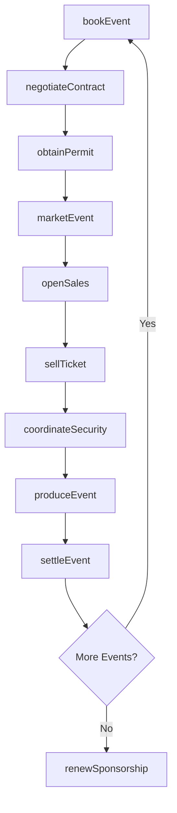
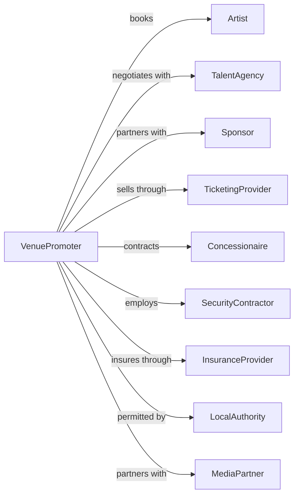

# Promoters of Performing Arts, Sports, and Similar Events with Facilities

> Business-as-Code definition for venue-based event promotion operations. Models the complete lifecycle from event booking through production, marketing, and facility management.

## Overview

Event promoters with facilities organize, promote, and manage live events at venues they operate, including concerts, sports events, fairs, and festivals. This definition exposes actions for event booking, facility management, ticket sales, and production operations, with events for workflow automation and searches for scheduling and revenue tracking.

## Actors

| Actor | Description |
|-------|-------------|
| Artist | Performs at the venue under booking agreement |
| TalentAgency | Represents performers for booking negotiations |
| Sponsor | Provides event funding in exchange for brand exposure |
| TicketingProvider | Processes ticket sales and distribution |
| Concessionaire | Operates food, beverage, and merchandise sales |
| SecurityContractor | Provides event security and crowd management |
| InsuranceProvider | Covers liability for events and facility operations |
| LocalAuthority | Issues permits and enforces regulations |
| MediaPartner | Promotes events through advertising channels |

## Roles

| Role | Description |
|------|-------------|
| VenueManager | Oversees facility operations and staff |
| EventPromoter | Books talent and produces events |
| BoxOfficeManager | Manages ticket sales and customer service |
| ProductionManager | Coordinates technical and staging requirements |
| MarketingDirector | Develops promotional campaigns for events |
| OperationsManager | Handles logistics, security, and guest services |

## Entities

| Entity | Description |
|--------|-------------|
| Venue | The facility where events are held |
| Event | A scheduled performance, game, or gathering |
| Booking | A confirmed agreement with talent or organization |
| Ticket | Admission pass for a specific event |
| Contract | Agreement with artists, sponsors, or vendors |
| Permit | Authorization required for event activities |
| Sponsorship | Paid partnership with corporate brand |
| Season | A series of related events over a time period |
| FacilityRental | Lease of venue space to external promoters |
| Production | Technical setup and staging for an event |

## Actions

| Action | Description |
|--------|-------------|
| bookEvent | Secure talent or organization for venue appearance |
| negotiateContract | Establish terms with artists, sponsors, or vendors |
| obtainPermit | Secure required authorizations for events |
| openSales | Launch ticket availability for an event |
| sellTicket | Process ticket purchase from patron |
| marketEvent | Execute promotional campaigns across channels |
| produceEvent | Manage technical setup and show execution |
| manageFacility | Oversee daily venue operations and maintenance |
| rentFacility | Lease venue space to external promoters |
| settleEvent | Reconcile revenues and expenses post-event |
| coordinateSecurity | Plan and deploy event security operations |
| processRefund | Handle ticket cancellations and returns |
| renewSponsorship | Extend corporate partnership agreements |

## Events

| Event | Description |
|-------|-------------|
| eventBooked | Talent or organization confirmed for venue |
| contractSigned | Agreement executed with party |
| permitObtained | Authorization secured for event |
| salesOpened | Tickets available for purchase |
| ticketSold | Admission purchase completed |
| eventMarketed | Promotional campaign launched |
| eventProduced | Show executed successfully |
| facilityRented | Venue leased to external party |
| eventSettled | Financial reconciliation completed |
| refundProcessed | Ticket return handled |
| sponsorshipRenewed | Partnership extended |

## Searches

| Search | Description |
|--------|-------------|
| getEventCalendar | List scheduled events with dates and details |
| checkAvailability | Review venue open dates for booking |
| getTicketSales | Retrieve sales data by event or period |
| findSponsors | List active and prospective partnerships |
| getSettlements | Access financial reconciliation reports |
| getCapacity | Check venue configuration and seating options |
| findVendors | Search available contractors and suppliers |

## Workflow



## Actor Relationships



## Usage

### Calling Actions

```typescript
import { promoteEvents } from '@headlessly/promote-events'

const venue = promoteEvents()

// Check venue availability for upcoming dates
const openDates = await venue.checkAvailability({ month: 9, year: 2024 })

// Review ticket sales for current events
const sales = await venue.getTicketSales({ period: 'current-month' })

// Book an event
const event = await venue.bookEvent({
  artistId: 'artist-123',
  date: '2024-09-15',
  type: 'concert',
  guarantee: 75000,
  percentageSplit: 0.85,
  ticketPrice: { min: 45, max: 150 }
})

// Open ticket sales
await venue.openSales({
  eventId: event.id,
  presaleDate: '2024-07-01',
  publicDate: '2024-07-05',
  channels: ['website', 'ticketing-partner', 'box-office']
})

// Rent facility to external promoter
const rental = await venue.rentFacility({
  promoterId: 'external-promoter-456',
  date: '2024-10-20',
  configuration: 'concert-seated',
  capacity: 5000,
  rentalFee: 25000,
  concessionSplit: 0.15
})
```

### Event-Driven Automation

```typescript
// Auto-scale marketing when sales lag
venue.ticketSold(async ({ eventId, totalSold, capacity }) => {
  const percentSold = totalSold / capacity
  const daysUntilEvent = getDaysUntil(eventId)

  if (percentSold < 0.5 && daysUntilEvent < 30) {
    await venue.marketEvent({
      eventId,
      campaign: 'urgency-boost',
      budget: 5000,
      channels: ['social', 'radio', 'email']
    })
  }
})

// Generate settlement after event completion
venue.eventProduced(async ({ eventId }) => {
  const sales = await venue.getTicketSales({ eventId })
  const expenses = await getEventExpenses(eventId)

  await venue.settleEvent({
    eventId,
    grossRevenue: sales.total,
    expenses: expenses.total,
    artistShare: calculateArtistShare(eventId, sales.total)
  })
})
```
