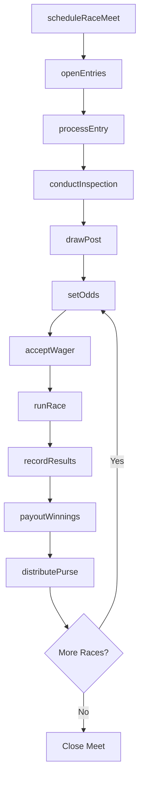
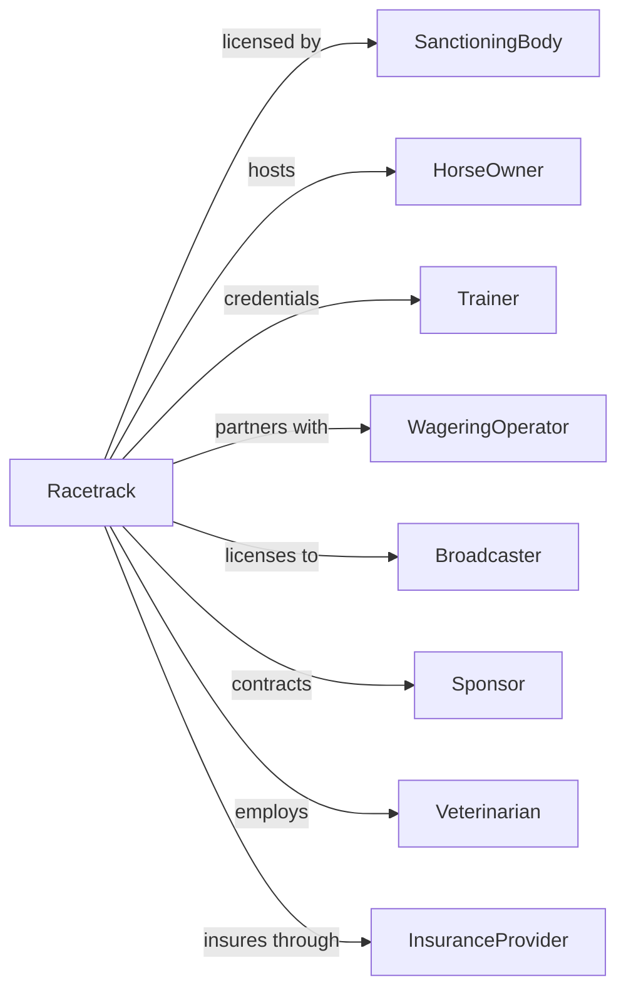

# Racetracks

> Business-as-Code definition for racetrack facility operations. Models the complete lifecycle from event scheduling through race day operations and wagering.

## Overview

Racetracks operate facilities for auto, horse, dog, and other competitive racing events. This definition exposes actions for event scheduling, participant management, wagering operations, and facility maintenance, with events for workflow automation and searches for scheduling and revenue tracking.

## Actors

| Actor | Description |
|-------|-------------|
| SanctioningBody | Governs racing rules, licensing, and safety standards |
| HorseOwner | Owns racing participants and enters them in events |
| Trainer | Prepares racing participants for competition |
| WageringOperator | Processes bets and manages pari-mutuel pools |
| Broadcaster | Distributes race coverage through media channels |
| Sponsor | Provides funding in exchange for brand exposure |
| Veterinarian | Ensures animal health and drug testing compliance |
| Jockey | Professional rider competing in horse races |
| InsuranceProvider | Covers liability for racing operations |

## Roles

| Role | Description |
|------|-------------|
| TrackOperator | Manages overall facility operations and scheduling |
| RacingSecretary | Schedules races and manages participant entries |
| Steward | Officiates races and enforces rules |
| MutuelsManager | Oversees wagering operations and payouts |
| TrackMaintenance | Prepares and maintains racing surfaces |
| GateStarter | Operates starting gate and ensures fair starts |

## Entities

| Entity | Description |
|--------|-------------|
| Race | A scheduled competitive event between participants |
| RaceMeet | A series of races over a defined period |
| Entry | A participant registered for a specific race |
| Wager | A bet placed on race outcomes |
| Purse | Prize money distributed to race winners |
| Track | The racing surface and facility |
| Gate | Starting mechanism for races |
| Results | Official finishing order and times |
| License | Authorization to operate or participate |
| Odds | Betting probabilities displayed for each entry |

## Actions

| Action | Description |
|--------|-------------|
| scheduleRaceMeet | Plan a series of races with dates and purses |
| openEntries | Accept participant registrations for races |
| processEntry | Register a participant for a specific race |
| drawPost | Assign starting positions through lottery |
| setOdds | Calculate and display betting probabilities |
| acceptWager | Process a bet from a patron |
| runRace | Execute the competitive event |
| recordResults | Document official finishing order and times |
| payoutWinnings | Distribute winnings to successful bettors |
| distributePurse | Pay prize money to owners and connections |
| conductInspection | Verify participant eligibility and condition |
| maintainTrack | Prepare racing surface for competition |
| simulcast | Broadcast races to off-track wagering locations |

## Events

| Event | Description |
|-------|-------------|
| raceMeetScheduled | Series of races planned and announced |
| entriesOpened | Registration period started for races |
| entryProcessed | Participant registered for race |
| postDrawn | Starting positions assigned |
| oddsPosted | Betting lines displayed to public |
| wagerAccepted | Bet successfully processed |
| raceStarted | Competition underway |
| raceCompleted | Event finished with official results |
| winningsPaid | Betting proceeds distributed |
| pursePaid | Prize money distributed to connections |
| inspectionCompleted | Participant eligibility verified |
| trackGroomed | Racing surface prepared |

## Searches

| Search | Description |
|--------|-------------|
| getRaceMeets | List scheduled series with dates and details |
| getEntries | Retrieve participants registered for races |
| getOdds | Check current betting lines for upcoming races |
| getResults | Access official results for completed races |
| getHandle | Retrieve wagering volume by race or period |
| findParticipants | Search licensed owners, trainers, and riders |
| getPayoutSchedule | View winning distributions for bet types |

## Workflow



## Actor Relationships



## Usage

### Calling Actions

```typescript
import { raceCompetitors } from '@headlessly/race-competitors'

const track = raceCompetitors()

// Get current odds for upcoming races
const odds = await track.getOdds({ meetId: 'summer-stakes-2024', race: 1 })

// Check wagering handle for current meet
const handle = await track.getHandle({ period: 'current-meet' })

// Schedule a race meet
const meet = await track.scheduleRaceMeet({
  name: 'Summer Stakes Meet',
  dates: {
    start: '2024-07-01',
    end: '2024-08-15'
  },
  racesPerDay: 10,
  totalPurse: 5000000
})

// Process an entry
await track.processEntry({
  raceId: 'race-456',
  horseName: 'Thunder Strike',
  ownerId: 'owner-123',
  trainerId: 'trainer-789',
  jockeyId: 'jockey-012',
  weight: 126
})

// Accept a wager
const ticket = await track.acceptWager({
  raceId: 'race-456',
  betType: 'exacta',
  selections: [3, 7],
  amount: 20,
  patronId: 'patron-555'
})
```

### Event-Driven Automation

```typescript
// Auto-update odds when wagers accepted
track.wagerAccepted(async ({ raceId, betType, amount }) => {
  const pool = await track.getHandle({ raceId, betType })

  await track.setOdds({
    raceId,
    recalculate: true,
    poolTotal: pool.total
  })
})

// Process payouts immediately after race completion
track.raceCompleted(async ({ raceId, results }) => {
  const wagers = await track.getWagers({ raceId, status: 'pending' })

  for (const wager of wagers) {
    const payout = calculatePayout(wager, results)

    if (payout > 0) {
      await track.payoutWinnings({
        wagerId: wager.id,
        amount: payout,
        method: wager.patronPreference
      })
    }
  }

  // Distribute purse to connections
  await track.distributePurse({
    raceId,
    results,
    purseAmount: getRacePurse(raceId)
  })
})
```
