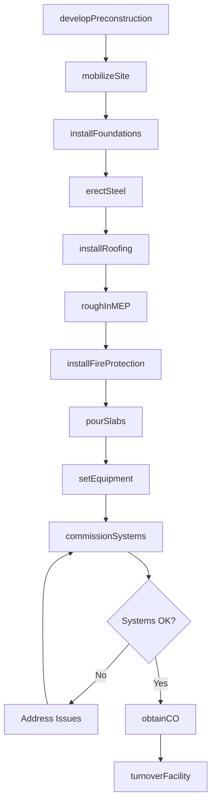
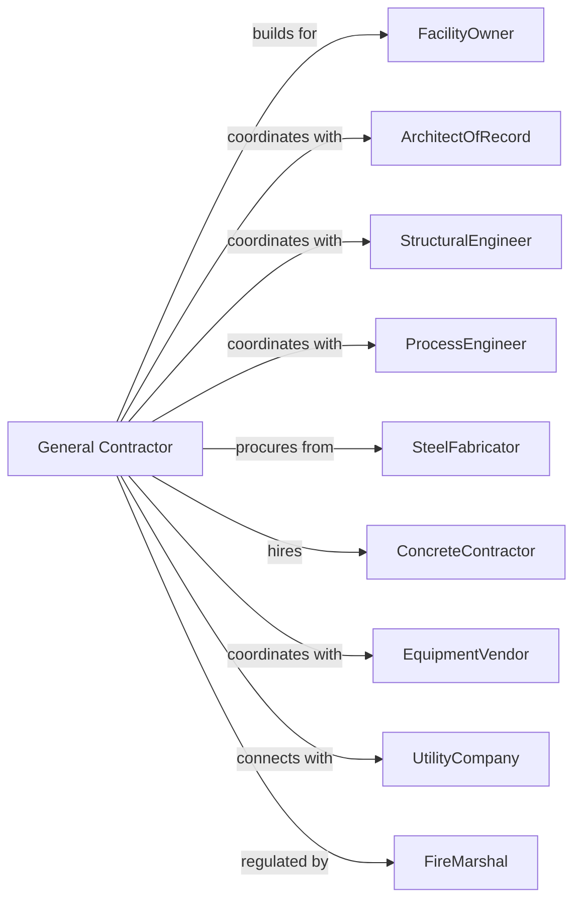

# Industrial Building Construction

> Business-as-Code definition for industrial building construction operations. Models the complete lifecycle from design-build through commissioning for manufacturing plants, warehouses, and processing facilities.

## Overview

Industrial building construction involves constructing manufacturing plants, distribution centers, data centers, and processing facilities. Projects often require specialized foundations, high-bay structures, heavy electrical service, and process equipment integration. This definition exposes actions for preconstruction planning, structural erection, MEP coordination, and equipment installation while managing complex owner requirements and operational timelines.

## Actors

| Actor | Description |
|-------|-------------|
| FacilityOwner | Company commissioning the industrial facility |
| ArchitectOfRecord | Licensed architect providing design documents |
| StructuralEngineer | Designs foundations, steel, and structural systems |
| ProcessEngineer | Specifies manufacturing equipment and layouts |
| SteelFabricator | Manufactures and delivers structural steel |
| ConcreteContractor | Installs foundations, slabs, and tilt-up panels |
| EquipmentVendor | Supplies and installs process equipment |
| UtilityCompany | Provides power, gas, and water connections |
| FireMarshal | Reviews and approves fire protection systems |

## Roles

| Role | Description |
|------|-------------|
| GeneralContractor | Holds prime contract and manages overall construction |
| ProjectExecutive | Senior leader responsible for project performance |
| ProjectManager | Manages schedule, budget, and subcontractor coordination |
| Superintendent | On-site leader for daily construction activities |
| MEPCoordinator | Manages mechanical, electrical, plumbing trades |
| SafetyDirector | Implements and enforces jobsite safety programs |

## Entities

| Entity | Description |
|--------|-------------|
| Project | The industrial building construction with scope and budget |
| Building | The physical structure with dimensions and specifications |
| Foundation | Concrete footings, piers, and slabs supporting the structure |
| SteelPackage | Structural steel components for the building frame |
| BayLayout | Configuration of structural bays and clear heights |
| CraneSystem | Overhead bridge cranes and support structures |
| ProcessArea | Zones designated for specific manufacturing operations |
| Submittal | Product data submitted for architect approval |
| Punchlist | Deficiency items requiring correction before completion |
| Commissioning | Testing and verification of building systems |

## Actions

| Action | Description |
|--------|-------------|
| developPreconstruction | Complete estimating, scheduling, and value engineering |
| mobilizeSite | Set up jobsite facilities and temporary utilities |
| installFoundations | Excavate and pour concrete foundations and piers |
| erectSteel | Assemble and connect structural steel frame |
| installRoofing | Complete roof deck, insulation, and membrane |
| constructTiltUp | Form, pour, and erect tilt-up concrete panels |
| roughInMEP | Install mechanical, electrical, and plumbing systems |
| installFireProtection | Complete sprinkler and fire alarm systems |
| pourSlabs | Install interior concrete floor slabs |
| setEquipment | Position and connect process equipment |
| commissionSystems | Test and verify all building systems |
| obtainCO | Secure certificate of occupancy from authority |
| turnoverFacility | Deliver completed building to owner |

## Events

| Event | Description |
|-------|-------------|
| preconstructionCompleted | Estimating and planning phase finished |
| siteMobilized | Jobsite setup complete and ready for construction |
| foundationsCompleted | All foundation work finished |
| steelErected | Structural steel frame completed |
| buildingDried | Building enclosed and weather-tight |
| roughInCompleted | MEP rough-in inspections passed |
| equipmentSet | Process equipment installed and positioned |
| systemsCommissioned | Building systems tested and verified |
| coIssued | Certificate of occupancy received |
| facilityTurnedOver | Building delivered to owner for operations |

## Searches

| Search | Description |
|--------|-------------|
| findProjects | List projects by status, owner, or location |
| getSchedule | Retrieve project schedule with milestones |
| getSubmittals | List submittals by status or trade |
| findRFIs | Retrieve requests for information |
| getPunchlist | Get deficiency items by area or trade |
| getDrawStatus | Check current payment application status |
| findChangeOrders | List change orders with approval status |

## Workflow



## Actor Relationships



## Usage

### Calling Actions

```typescript
import { buildIndustrialBuilding } from '@headlessly/build-industrial-building'

const builder = buildIndustrialBuilding()

// Start preconstruction phase
const precon = await builder.developPreconstruction({
  ownerId: 'mfg-corp-456',
  projectName: 'Midwest Distribution Center',
  squareFootage: 500000,
  clearHeight: 36,
  dockDoors: 80,
  targetBudget: 45000000
})

// Erect structural steel
await builder.erectSteel({
  projectId: precon.projectId,
  steelPackageId: 'sp-789',
  erectorId: 'ironworks-inc',
  startDate: '2024-06-15',
  sequenceAreas: ['north-bay', 'south-bay', 'office']
})

// Commission building systems
await builder.commissionSystems({
  projectId: precon.projectId,
  systems: ['hvac', 'electrical', 'fire-protection', 'dock-equipment'],
  commissioningAgent: 'cx-partners'
})
```

### Event-Driven Automation

```typescript
// Auto-schedule slab pour when steel erected
builder.steelErected(async ({ projectId }) => {
  await builder.pourSlabs({
    projectId,
    startDate: addDays(new Date(), 14),
    areas: ['warehouse', 'dock', 'office']
  })
})

// Notify owner when CO issued
builder.coIssued(async ({ projectId }) => {
  const project = await builder.findProjects({ id: projectId })

  await builder.turnoverFacility({
    projectId,
    turnoverDate: addDays(new Date(), 7),
    attendees: [project.ownerId, project.projectManagerId]
  })
})
```
