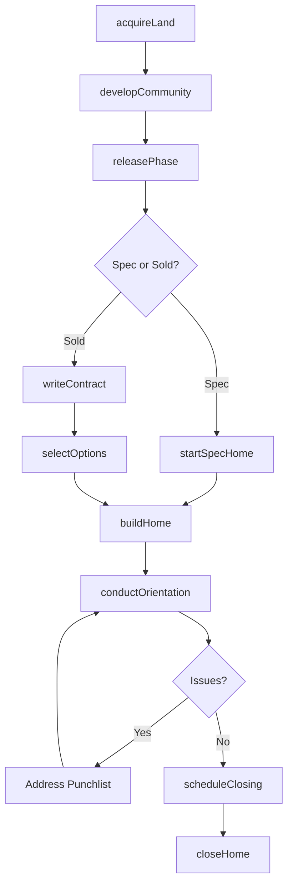
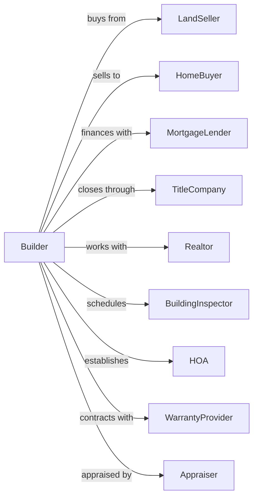

# New Housing For-Sale Builders

> Business-as-Code definition for production home building operations. Models the complete spec home lifecycle from land acquisition through home sale, where the builder owns the land and sells completed homes to buyers.

## Overview

Production home building involves purchasing land, developing subdivisions, and constructing homes for sale to buyers. Also known as merchant builders, these operations maintain inventory of lots and homes at various stages of completion. This definition exposes actions for land acquisition, community development, home construction, sales, and closing processes across multiple active communities.

## Actors

| Actor | Description |
|-------|-------------|
| LandSeller | Property owner or developer selling raw land or lots |
| HomeBuyer | Purchaser of completed or under-construction home |
| MortgageLender | Provides buyer financing and construction loans |
| TitleCompany | Handles escrow, title insurance, and closings |
| Realtor | Licensed agent representing buyers or the builder |
| Appraiser | Determines market value of completed homes |
| BuildingInspector | Municipal official verifying code compliance |
| HOA | Homeowners association managing community standards |
| WarrantyProvider | Third-party warranty company for structural coverage |

## Roles

| Role | Description |
|------|-------------|
| DivisionPresident | Executive responsible for regional operations and profitability |
| LandAcquisitionManager | Identifies and negotiates land purchases |
| CommunityManager | Oversees individual subdivision development |
| SalesManager | Manages model homes and sales consultants |
| ConstructionManager | Supervises all home construction within community |
| PurchasingManager | Negotiates supplier contracts and manages material costs |

## Entities

| Entity | Description |
|--------|-------------|
| Community | Subdivision or development with multiple lots |
| Lot | Individual parcel of land for home construction |
| FloorPlan | Standardized home design with options and upgrades |
| SpecHome | Home built without a contracted buyer |
| SoldHome | Home under contract with a buyer |
| OptionSelection | Buyer-selected upgrades and customizations |
| PurchaseAgreement | Contract between builder and buyer |
| Escrow | Funds held for closing and buyer deposits |
| ModelHome | Furnished display home for sales purposes |
| Warranty | Coverage for defects provided to buyer |

## Actions

| Action | Description |
|--------|-------------|
| acquireLand | Purchase raw land or finished lots for development |
| developCommunity | Install infrastructure, roads, and utilities |
| releasePhase | Open new lots for sale within a community |
| startSpecHome | Begin construction on a home without buyer |
| writeContract | Execute purchase agreement with buyer |
| selectOptions | Record buyer upgrade and customization choices |
| buildHome | Construct home through all phases to completion |
| scheduleClosing | Set date for ownership transfer |
| conductOrientation | Walk buyer through completed home features |
| closeHome | Transfer ownership and receive payment |
| processWarrantyClaim | Address post-closing defect reports |
| trackInventory | Monitor homes and lots at each stage |

## Events

| Event | Description |
|-------|-------------|
| landAcquired | Property purchase closed and recorded |
| communityOpened | First lots released for sale |
| phaseReleased | New group of lots available for purchase |
| specStarted | Construction began on inventory home |
| contractWritten | Buyer purchase agreement executed |
| optionsSelected | Buyer design choices finalized |
| homeCompleted | Construction finished and cleaned |
| orientationCompleted | Buyer walkthrough finished |
| homeClosed | Ownership transferred to buyer |
| warrantyClaimFiled | Buyer reported defect or issue |
| warrantyClaimResolved | Defect repaired and claim closed |

## Searches

| Search | Description |
|--------|-------------|
| findCommunities | List communities by status, location, or price range |
| getAvailableLots | Retrieve lots ready for sale in a community |
| findSpecHomes | List inventory homes by completion status |
| getSoldHomes | Retrieve homes under contract with closing dates |
| getOptionsPricing | Look up upgrade prices for a floor plan |
| findPendingClosings | List homes scheduled to close within date range |
| getWarrantyClaims | Retrieve open warranty claims by community |

## Workflow



## Actor Relationships



## Usage

### Calling Actions

```typescript
import { buildNewHousing } from '@headlessly/build-new-housing'

const builder = buildNewHousing()

// Acquire land for new community
const land = await builder.acquireLand({
  parcelId: 'APN-123-456',
  acres: 45,
  plannedLots: 120,
  purchasePrice: 3500000,
  closingDate: '2024-04-15'
})

// Write purchase contract with buyer
const contract = await builder.writeContract({
  communityId: 'sunset-ridge',
  lotNumber: 'A-15',
  floorPlan: 'The Aspen',
  buyerId: 'buyer-789',
  basePrice: 425000,
  earnestMoney: 10000
})

// Record buyer option selections
await builder.selectOptions({
  contractId: contract.id,
  options: [
    { code: 'GRN-001', name: 'Granite Countertops', price: 4500 },
    { code: 'HWD-002', name: 'Hardwood Flooring', price: 8200 },
    { code: 'FRP-003', name: 'Fireplace', price: 3500 }
  ]
})
```

### Event-Driven Automation

```typescript
// Auto-schedule orientation when home completes
builder.homeCompleted(async ({ contractId, lotNumber }) => {
  const contract = await builder.getSoldHomes({ id: contractId })

  await builder.conductOrientation({
    contractId,
    scheduledDate: addDays(new Date(), 5),
    attendees: [contract.buyerId, contract.salesConsultantId]
  })
})

// Auto-track inventory when spec home starts
builder.specStarted(async ({ communityId, lotNumber, floorPlan }) => {
  await builder.trackInventory({
    communityId,
    action: 'spec-start',
    lotNumber,
    floorPlan,
    estimatedCompletion: addMonths(new Date(), 4)
  })
})
```
