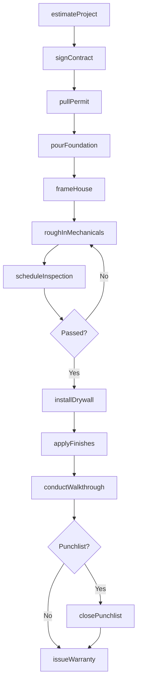
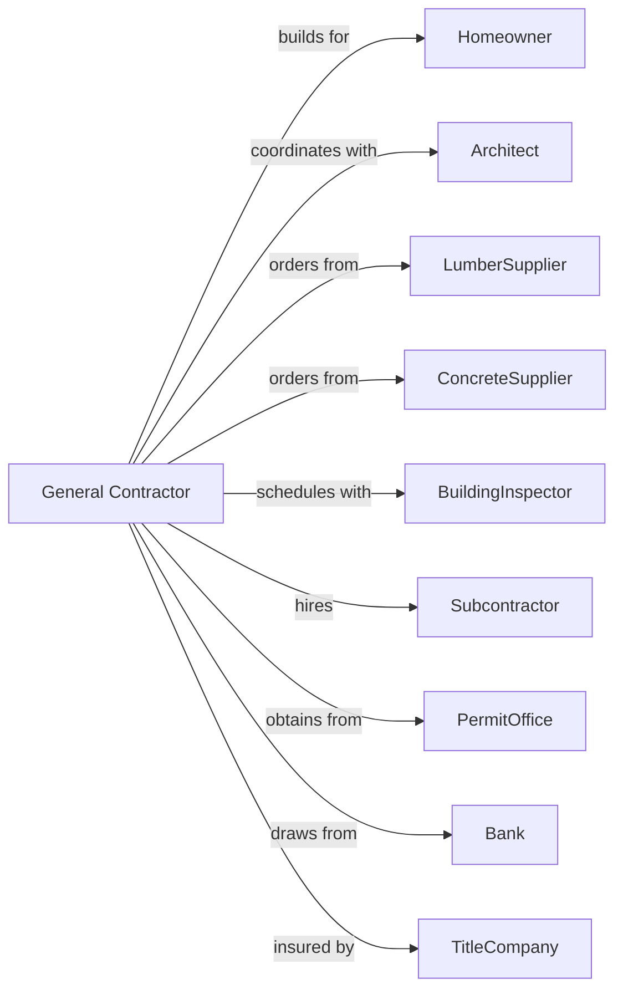

# New Single-Family Housing Construction (except For-Sale Builders)

> Business-as-Code definition for custom single-family home construction operations. Models the complete build lifecycle from contract signing through final walkthrough on owner-provided lots.

## Overview

Custom single-family home construction involves building detached houses, townhouses, and row houses on land owned by the client rather than the builder. This definition exposes actions for project estimation, permit acquisition, construction phases, and quality inspections. General contractors coordinate subcontractors and manage timelines while ensuring code compliance and client satisfaction.

## Actors

| Actor | Description |
|-------|-------------|
| Homeowner | Property owner commissioning the custom home build |
| Architect | Designs house plans and specifications |
| LumberSupplier | Provides framing lumber, trusses, and engineered wood products |
| ConcreteSupplier | Delivers ready-mix concrete for foundations and flatwork |
| BuildingInspector | Municipal official who verifies code compliance |
| Subcontractor | Specialty trade contractors for electrical, plumbing, HVAC |
| PermitOffice | Issues building permits and approvals |
| Bank | Provides construction loans and draws |
| TitleCompany | Handles liens, insurance, and closing documents |

## Roles

| Role | Description |
|------|-------------|
| GeneralContractor | Oversees entire project and coordinates all trades |
| ProjectManager | Manages daily schedules, budgets, and subcontractor coordination |
| SiteSuperintendent | On-site supervisor ensuring work quality and safety |
| Estimator | Prepares detailed cost estimates and material takeoffs |
| Bookkeeper | Manages accounts payable, draw requests, and lien waivers |

## Entities

| Entity | Description |
|--------|-------------|
| Project | The custom home build with budget, timeline, and specifications |
| Contract | Agreement between homeowner and builder with scope and price |
| Blueprint | Architectural and engineering drawings for the home |
| Permit | Government authorization to proceed with construction |
| ChangeOrder | Modifications to original scope, cost, or timeline |
| DrawRequest | Request for payment based on completed milestones |
| Inspection | Official verification of code compliance at key stages |
| Punchlist | List of items requiring completion or correction |
| LienWaiver | Document releasing mechanic's lien rights upon payment |
| Warranty | Coverage for defects in materials or workmanship |

## Actions

| Action | Description |
|--------|-------------|
| estimateProject | Calculate materials, labor, and overhead for proposed build |
| signContract | Execute construction agreement with homeowner |
| pullPermit | Obtain building permit from municipal authority |
| pourFoundation | Complete footings, foundation walls, and slab |
| framehouse | Erect structural framing, sheathing, and roof trusses |
| roughInMechanicals | Install electrical, plumbing, and HVAC before drywall |
| scheduleInspection | Request official inspection at required stages |
| installDrywall | Hang, tape, and finish interior wall surfaces |
| applyFinishes | Complete flooring, paint, trim, and cabinetry |
| processChangeOrder | Document and price scope modifications |
| requestDraw | Submit payment request for completed milestones |
| conductWalkthrough | Review completed work with homeowner |
| closePunchlist | Address and complete all correction items |
| issueWarranty | Provide warranty documentation to homeowner |

## Events

| Event | Description |
|-------|-------------|
| contractSigned | Construction agreement executed with homeowner |
| permitIssued | Building permit approved and received |
| foundationPoured | Concrete foundation completed and cured |
| frameCompleted | Structural framing and roof finished |
| roughInsPassed | Mechanical rough-in inspections approved |
| drywallInstalled | Interior walls finished and ready for paint |
| finishesApplied | All interior finishes completed |
| changeOrderApproved | Scope modification accepted by all parties |
| drawProcessed | Payment received for completed milestone |
| finalInspectionPassed | Certificate of occupancy issued |
| walkthroughCompleted | Homeowner accepted completed home |
| punchlistClosed | All correction items resolved |
| warrantyIssued | Warranty documents delivered to homeowner |

## Searches

| Search | Description |
|--------|-------------|
| findProjects | List projects filtered by status, phase, or client |
| getDrawSchedule | Retrieve payment milestones and amounts for a project |
| checkPermitStatus | Get current permit status and required inspections |
| findChangeOrders | List change orders by project with approval status |
| getInspectionHistory | Retrieve all inspections and results for a project |
| findPunchlistItems | List open correction items by trade or priority |
| getSubcontractorSchedule | View scheduled work for all subcontractors |

## Workflow



## Actor Relationships



## Usage

### Calling Actions

```typescript
import { buildNewSingleFamily } from '@headlessly/build-new-single-family'

const builder = buildNewSingleFamily()

// Create estimate for new project
const estimate = await builder.estimateProject({
  squareFootage: 2800,
  bedrooms: 4,
  bathrooms: 3,
  finishLevel: 'custom',
  lotAddress: '123 Oak Lane'
})

// Execute construction contract
const contract = await builder.signContract({
  homeownerId: 'ho-12345',
  estimateId: estimate.id,
  startDate: '2024-03-15',
  completionDate: '2024-10-15',
  contractPrice: estimate.total
})

// Pull building permit
const permit = await builder.pullPermit({
  projectId: contract.projectId,
  blueprintId: 'bp-789',
  permitType: 'new-construction'
})
```

### Event-Driven Automation

```typescript
// Auto-schedule inspection when rough-in complete
builder.roughInsPassed(async ({ projectId, tradeType }) => {
  if (tradeType === 'all') {
    await builder.scheduleInspection({
      projectId,
      inspectionType: 'insulation',
      preferredDate: getNextBusinessDay()
    })
  }
})

// Notify homeowner when final inspection passes
builder.finalInspectionPassed(async ({ projectId }) => {
  const project = await builder.findProjects({ id: projectId })

  await builder.conductWalkthrough({
    projectId,
    scheduledDate: addDays(new Date(), 3),
    attendees: [project.homeownerId, project.superintendentId]
  })
})
```
