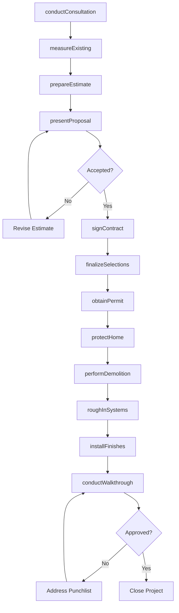
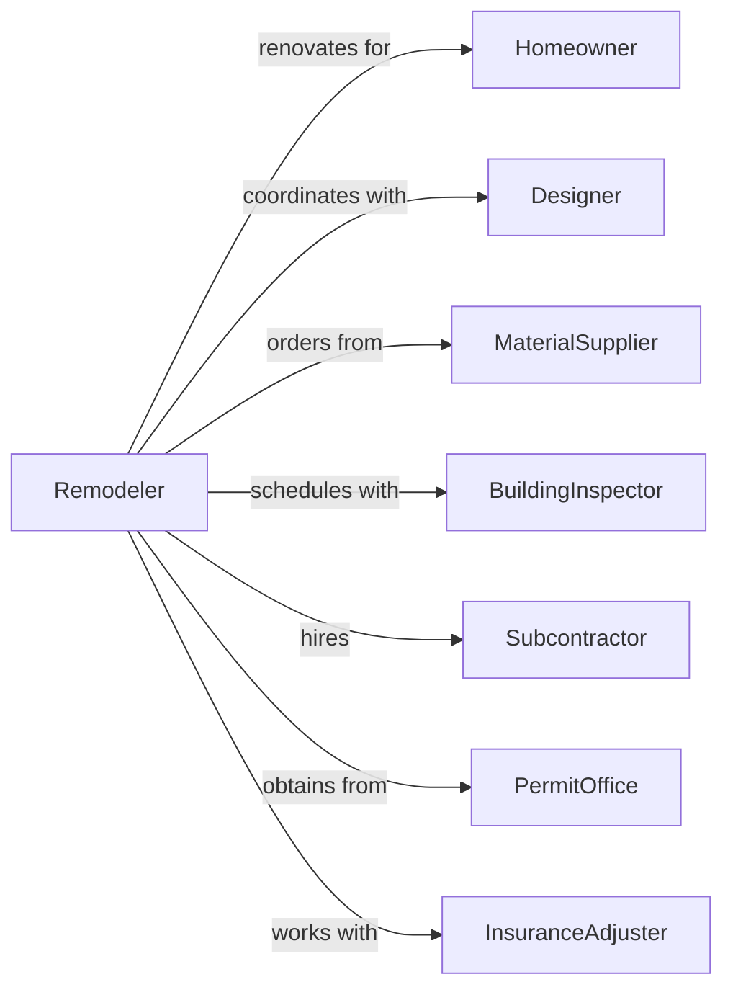

# Residential Remodelers

> Business-as-Code definition for residential remodeling operations. Models the complete renovation lifecycle from initial consultation through project completion for additions, alterations, and repairs to existing homes.

## Overview

Residential remodeling involves renovating, adding to, and repairing existing single-family and multifamily homes. This includes kitchen and bath renovations, room additions, basement finishing, and whole-house renovations. This definition exposes actions for design consultation, estimating, permitting, demolition, and finish work while managing homeowner expectations and occupied-home logistics.

## Actors

| Actor | Description |
|-------|-------------|
| Homeowner | Property owner commissioning renovation work |
| Designer | Creates renovation plans and selections |
| MaterialSupplier | Provides cabinets, fixtures, and finish materials |
| BuildingInspector | Municipal official verifying code compliance |
| Subcontractor | Specialty trades for electrical, plumbing, HVAC |
| PermitOffice | Issues renovation and building permits |
| InsuranceAdjuster | Handles claims for restoration projects |
| FinanceCompany | Provides home equity or renovation loans |

## Roles

| Role | Description |
|------|-------------|
| Owner | Business owner who manages operations and sales |
| ProjectManager | Oversees schedules, budgets, and client communication |
| LeadCarpenter | Senior tradesperson who leads on-site work |
| DesignConsultant | Helps clients with selections and design decisions |
| Estimator | Prepares detailed project estimates and proposals |
| ProductionManager | Coordinates multiple active projects and crews |

## Entities

| Entity | Description |
|--------|-------------|
| Project | Remodeling job with scope, budget, and timeline |
| Estimate | Detailed cost breakdown for proposed work |
| Contract | Agreement specifying scope, price, and terms |
| ChangeOrder | Modification to original scope during construction |
| Selection | Client choice for fixtures, finishes, and materials |
| Permit | Government authorization for renovation work |
| Punchlist | Items requiring completion or correction |
| Progress | Completion percentage for billing purposes |
| Warranty | Coverage for remodeling workmanship |
| Lead | Prospective client inquiry or referral |

## Actions

| Action | Description |
|--------|-------------|
| conductConsultation | Meet with homeowner to discuss project scope |
| measureExisting | Document current conditions and dimensions |
| prepareEstimate | Calculate costs for labor, materials, and overhead |
| presentProposal | Review estimate and contract terms with client |
| signContract | Execute renovation agreement with homeowner |
| finalizeSelections | Lock in all material and finish choices |
| obtainPermit | Secure required permits from municipality |
| protectHome | Install dust barriers and floor protection |
| performDemolition | Remove existing materials and structures |
| roughInSystems | Install framing, electrical, plumbing updates |
| installFinishes | Complete cabinets, counters, flooring, and trim |
| conductWalkthrough | Review completed work with homeowner |

## Events

| Event | Description |
|-------|-------------|
| consultationCompleted | Initial client meeting finished |
| estimatePrepared | Project cost estimate finalized |
| proposalPresented | Estimate reviewed with client |
| contractSigned | Renovation agreement executed |
| selectionsFinalized | All material choices confirmed |
| permitObtained | Building permit issued |
| demolitionComplete | Tear-out phase finished |
| roughInComplete | Framing and mechanical work finished |
| finishesInstalled | All finish work completed |
| walkthroughCompleted | Client review finished |
| punchlistClosed | All correction items resolved |
| projectCompleted | Final payment received and warranty issued |

## Searches

| Search | Description |
|--------|-------------|
| findProjects | List projects by status, type, or client |
| getSelections | Retrieve material selections for a project |
| checkPermitStatus | Get current permit and inspection status |
| findChangeOrders | List change orders with approval status |
| getProjectSchedule | View timeline and milestones for a project |
| findLeads | List prospective clients by source or status |
| getWarrantyItems | Retrieve warranty claims by project |

## Workflow



## Actor Relationships



## Usage

### Calling Actions

```typescript
import { buildResidentialRemodelers } from '@headlessly/build-residential-remodelers'

const remodeler = buildResidentialRemodelers()

// Initial client consultation
const consultation = await remodeler.conductConsultation({
  homeownerId: 'ho-123',
  projectType: 'kitchen-remodel',
  address: '456 Maple Street',
  notes: 'Complete kitchen renovation, island, new appliances'
})

// Prepare detailed estimate
const estimate = await remodeler.prepareEstimate({
  consultationId: consultation.id,
  lineItems: [
    { category: 'demolition', description: 'Remove existing cabinets', amount: 2500 },
    { category: 'cabinets', description: 'Custom maple cabinets', amount: 18000 },
    { category: 'countertops', description: 'Quartz countertops', amount: 6500 },
    { category: 'electrical', description: 'Updated circuits and lighting', amount: 4200 }
  ],
  overhead: 0.15,
  profit: 0.10
})

// Execute contract
await remodeler.signContract({
  estimateId: estimate.id,
  startDate: '2024-05-01',
  completionDate: '2024-06-15',
  paymentSchedule: ['deposit-30', 'rough-in-30', 'completion-40']
})
```

### Event-Driven Automation

```typescript
// Auto-order materials when selections finalized
remodeler.selectionsFinalized(async ({ projectId }) => {
  const selections = await remodeler.getSelections({ projectId })

  for (const selection of selections) {
    await remodeler.orderMaterial({
      projectId,
      supplierId: selection.supplierId,
      product: selection.productCode,
      quantity: selection.quantity
    })
  }
})

// Notify client when rough-in complete
remodeler.roughInComplete(async ({ projectId }) => {
  const project = await remodeler.findProjects({ id: projectId })

  await sendNotification({
    to: project.homeowner.email,
    subject: 'Rough-in Complete - Ready for Inspection',
    message: 'Your project has passed rough-in inspection. Finish work begins next week.'
  })
})
```
