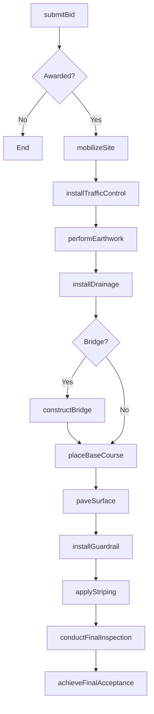
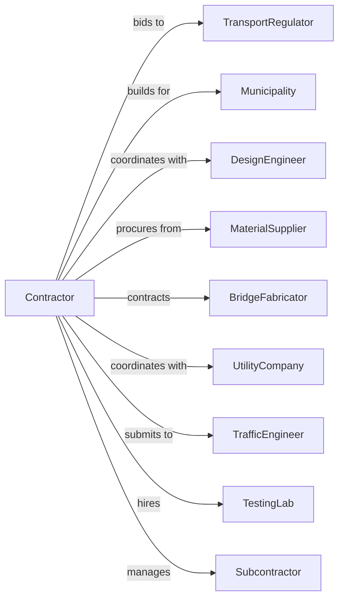

# Highway, Street, and Bridge Construction

> Business-as-Code definition for highway, street, and bridge construction operations. Models the complete lifecycle from bid procurement through final acceptance for roadways, bridges, runways, and related infrastructure.

## Overview

Highway and bridge construction involves building highways, streets, roads, airport runways, bridges, and overpasses. Projects require earthwork, paving, bridge construction, and traffic management across public right-of-way. This definition exposes actions for bidding, earthwork, paving, bridge erection, and traffic control while managing transportation department specifications and public safety requirements.

## Actors

| Actor | Description |
|-------|-------------|
| TransportRegulator | State or federal transportation department as owner |
| Municipality | City or county agency for local road projects |
| DesignEngineer | Provides roadway and bridge design documents |
| MaterialSupplier | Provides asphalt, concrete, and aggregates |
| BridgeFabricator | Manufactures structural steel and precast elements |
| UtilityCompany | Relocates or protects existing utilities |
| TrafficEngineer | Designs and approves traffic control plans |
| TestingLab | Performs material testing and quality assurance |
| Subcontractor | Specialty contractors for specific work items |

## Roles

| Role | Description |
|------|-------------|
| ProjectManager | Manages contract, budget, and owner coordination |
| Superintendent | On-site leader for daily operations |
| GradingForeman | Supervises earthwork and grading operations |
| PavingForeman | Leads asphalt or concrete paving crews |
| BridgeForeman | Manages bridge construction activities |
| ScreedOperator | Operates asphalt paver screed to control mat thickness and smoothness |
| TrafficControlSupervisor | Implements and monitors traffic control |

## Entities

| Entity | Description |
|--------|-------------|
| Project | The roadway or bridge construction contract |
| Roadway | Street or highway with alignment and cross-section |
| Bridge | Structure spanning waterway, roadway, or terrain |
| Pavement | Asphalt or concrete surface layer |
| Earthwork | Cut, fill, and grading operations |
| TrafficControl | Temporary signs, barriers, and detours |
| Guardrail | Safety barrier along roadway edges |
| DrainageStructure | Culverts, inlets, and storm pipes |
| StripingSigning | Pavement markings and traffic signs |
| PayItem | Contract bid item with quantity and price |

## Actions

| Action | Description |
|--------|-------------|
| submitBid | Prepare and submit competitive bid proposal |
| mobilizeSite | Set up field office and equipment staging |
| installTrafficControl | Implement lane closures and detours |
| performEarthwork | Execute cut, fill, and grading operations |
| installDrainage | Construct culverts, pipes, and inlets |
| constructBridge | Build bridge substructure and superstructure |
| erectBridgeSteel | Install structural steel girders and deck |
| placeBaseCourse | Install aggregate or treated base materials |
| paveSurface | Apply asphalt or concrete pavement |
| installGuardrail | Erect roadside safety barriers |
| applyStriping | Paint lane markings and install signs |
| conductFinalInspection | Complete owner walkthrough and punchlist |
| achieveFinalAcceptance | Obtain owner acceptance and warranty start |

## Events

| Event | Description |
|-------|-------------|
| bidAwarded | Contract awarded to contractor |
| siteMobilized | Field operations setup complete |
| trafficControlActivated | Lane closures and detours in place |
| earthworkCompleted | Grading finished to subgrade |
| drainageInstalled | Storm drainage systems complete |
| bridgeSubstructureCompleted | Foundations and piers finished |
| bridgeSuperstructureCompleted | Deck and barriers finished |
| baseCourseCompleted | Base materials installed |
| pavementCompleted | Final surface course placed |
| guardrailInstalled | Safety barriers in place |
| stripingCompleted | Markings and signs installed |
| finalInspectionPassed | Owner accepted completed work |
| finalAcceptanceIssued | Warranty period began |

## Searches

| Search | Description |
|--------|-------------|
| findProjects | List projects by status, owner, or location |
| getPayItemQuantities | Retrieve installed quantities by pay item |
| getTrafficControlPlan | View current lane closure configuration |
| getMaterialTestResults | Retrieve QA test reports |
| getBridgeProgress | Track bridge construction by element |
| getPayEstimate | Calculate current progress payment |
| findChangeOrders | List approved change orders |

## Workflow



## Actor Relationships



## Usage

### Calling Actions

```typescript
import { buildHighway } from '@headlessly/build-highway'

const contractor = buildHighway()

// Review active projects and pay estimates
const projects = await contractor.findProjects({ status: 'in-progress', owner: 'state-dot' })
const payEstimate = await contractor.getPayEstimate({ projectId: 'HWY-2024-0456' })

// Submit bid proposal
const bid = await contractor.submitBid({
  projectId: 'HWY-2024-0456',
  projectName: 'I-95 Widening MP 45-52',
  bidAmount: 42500000,
  bidBond: 4250000,
  completionDays: 540
})

// Perform earthwork operations
await contractor.performEarthwork({
  projectId: bid.projectId,
  station: '100+00-200+00',
  cutVolume: 125000,
  fillVolume: 98000,
  borrowSource: 'approved-pit-A'
})

// Pave asphalt surface
await contractor.paveSurface({
  projectId: bid.projectId,
  station: '100+00-150+00',
  material: 'SP-12.5',
  thickness: 2.0,
  width: 24,
  lanes: 2
})
```

### Event-Driven Automation

```typescript
// Auto-schedule paving when base complete
contractor.baseCourseCompleted(async ({ projectId, station }) => {
  await contractor.paveSurface({
    projectId,
    station,
    startDate: addDays(new Date(), 3)
  })
})

// Auto-request final inspection when striping complete
contractor.stripingCompleted(async ({ projectId }) => {
  await contractor.conductFinalInspection({
    projectId,
    requestedDate: addDays(new Date(), 7),
    inspectorType: 'resident-engineer'
  })
})
```
