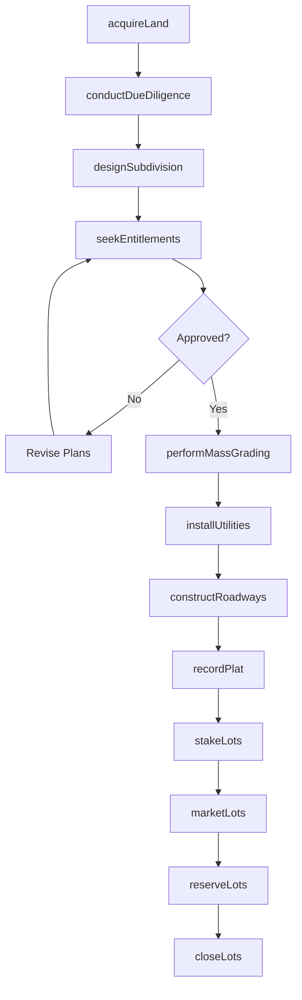
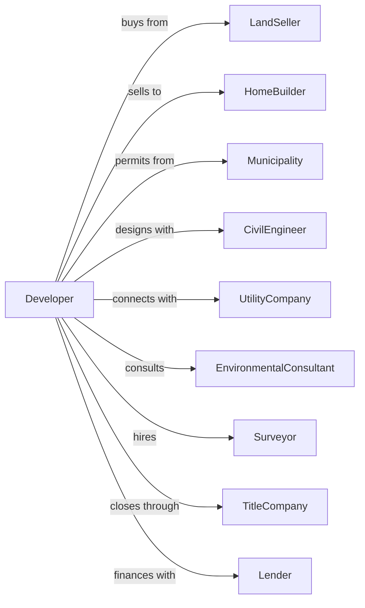

# Land Subdivision

> Business-as-Code definition for land subdivision and development operations. Models the complete lifecycle from raw land acquisition through lot sales, including entitlement, infrastructure installation, and lot delivery.

## Overview

Land subdivision involves acquiring raw land, obtaining entitlements, and developing parcels into buildable lots for sale to homebuilders or commercial developers. Projects require civil engineering, grading, utility installation, and regulatory compliance. This definition exposes actions for land planning, entitlement processing, mass grading, and infrastructure construction while managing municipal requirements and sales timelines.

## Actors

| Actor | Description |
|-------|-------------|
| LandSeller | Property owner selling raw land |
| HomeBuilder | Purchaser of finished residential lots |
| Municipality | City or county with jurisdiction over development |
| CivilEngineer | Designs grading, utilities, and roadways |
| UtilityCompany | Provides connections for water, sewer, power, gas |
| EnvironmentalConsultant | Manages permits and environmental compliance |
| Surveyor | Performs boundary surveys and lot staking |
| TitleCompany | Handles escrow and lot closings |
| Lender | Provides acquisition and development financing |

## Roles

| Role | Description |
|------|-------------|
| Developer | Principal responsible for project vision and financing |
| LandAcquisitionManager | Identifies and negotiates land purchases |
| EntitlementManager | Manages approvals and regulatory compliance |
| ProjectManager | Oversees construction budget and schedule |
| SalesManager | Markets lots and manages builder relationships |
| ConstructionManager | Supervises grading and infrastructure installation |

## Entities

| Entity | Description |
|--------|-------------|
| Project | The land development with budget and timeline |
| Parcel | Raw land tract being developed |
| Lot | Individual buildable parcel after subdivision |
| Phase | Development stage grouping multiple lots |
| Plat | Recorded map showing lot boundaries |
| Entitlement | Government approval for development |
| Infrastructure | Roads, utilities, and drainage serving lots |
| Easement | Right-of-way for utilities or access |
| Bond | Financial guarantee for public improvements |
| LotReservation | Builder commitment to purchase lots |

## Actions

| Action | Description |
|--------|-------------|
| acquireLand | Purchase raw land for development |
| conductDueDiligence | Perform title, environmental, and feasibility studies |
| designSubdivision | Create lot layout and infrastructure plans |
| seekEntitlements | Obtain zoning, plat, and permit approvals |
| performMassGrading | Shape terrain and prepare building pads |
| installUtilities | Construct water, sewer, and storm systems |
| constructRoadways | Build streets, curbs, and sidewalks |
| recordPlat | File subdivision plat with county recorder |
| stakeLots | Survey and mark lot corners |
| marketLots | Advertise and show lots to builders |
| reserveLots | Accept builder deposits and reservations |
| closeLots | Transfer lot ownership to buyers |
| bondImprovements | Post bonds for incomplete public improvements |

## Events

| Event | Description |
|-------|-------------|
| landAcquired | Property purchase closed |
| dueDiligenceComplete | Feasibility studies finished |
| subdivisionDesigned | Plans approved by civil engineer |
| entitlementsApproved | All government approvals received |
| massGradingComplete | Site grading finished |
| utilitiesInstalled | Water, sewer, and storm systems complete |
| roadwaysComplete | Streets and sidewalks finished |
| platRecorded | Subdivision plat filed with county |
| lotsStaked | Survey markers placed |
| lotReserved | Builder deposit received |
| lotClosed | Ownership transferred to buyer |
| phaseComplete | All lots in phase delivered |
| improvementsBonded | Performance bond posted |

## Searches

| Search | Description |
|--------|-------------|
| findProjects | List projects by status, location, or builder |
| getPhaseStatus | Retrieve lot status by phase |
| findAvailableLots | List lots ready for sale |
| getLotReservations | View builder reservations and deposits |
| getEntitlementStatus | Check permit and approval status |
| getInfrastructureProgress | View construction completion by system |
| getClosingSchedule | List upcoming lot closings |

## Workflow



## Actor Relationships



## Usage

### Calling Actions

```typescript
import { subdivideLand } from '@headlessly/subdivide-land'

const developer = subdivideLand()

// Acquire raw land
const land = await developer.acquireLand({
  parcelId: 'APN-789-012',
  acres: 120,
  purchasePrice: 8500000,
  closingDate: '2024-03-15',
  seller: 'ranch-holdings-llc'
})

// Seek entitlements for subdivision
const entitlement = await developer.seekEntitlements({
  projectId: land.projectId,
  lotCount: 245,
  density: 2.04,
  zoningRequest: 'R-3',
  applications: ['tentative-map', 'grading-permit', 'improvement-plans']
})

// Close lot sale to builder
await developer.closeLots({
  projectId: land.projectId,
  phase: 1,
  lots: ['101', '102', '103', '104', '105'],
  buyerId: 'national-builder-inc',
  pricePerLot: 125000,
  closingDate: '2024-10-01'
})
```

### Event-Driven Automation

```typescript
// Auto-record plat when roadways complete
developer.roadwaysComplete(async ({ projectId, phase }) => {
  await developer.recordPlat({
    projectId,
    phase,
    recorder: 'county-recorder',
    documentType: 'final-map'
  })
})

// Auto-market lots when staking complete
developer.lotsStaked(async ({ projectId, phase, lotCount }) => {
  await developer.marketLots({
    projectId,
    phase,
    availableLots: lotCount,
    targetBuilders: ['production', 'custom']
  })
})
```
