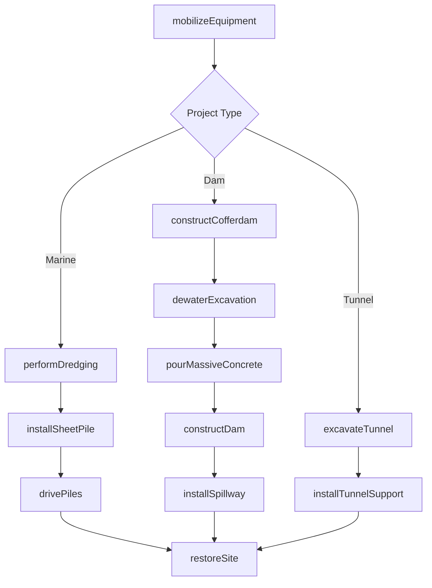
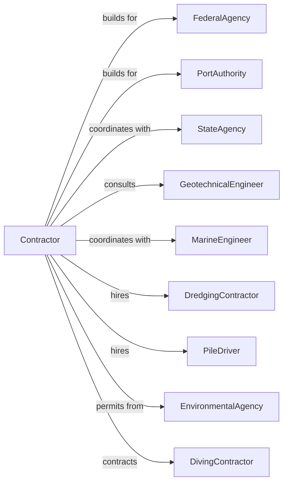

# Other Heavy and Civil Engineering Construction

> Business-as-Code definition for specialized heavy and civil engineering construction operations. Models the complete lifecycle for dams, levees, marine facilities, tunnels, and other specialized infrastructure projects.

## Overview

Other heavy civil construction encompasses dams, levees, marine facilities, docks, tunnels, and specialized infrastructure not classified elsewhere. Projects require specialized equipment, deep foundations, and complex engineering solutions. This definition exposes actions for marine construction, tunneling, dam building, and environmental restoration while managing water management and geotechnical challenges.

## Actors

| Actor | Description |
|-------|-------------|
| FederalAgency | Army Corps of Engineers, Bureau of Reclamation, or similar |
| PortAuthority | Manages marine terminals and waterfront facilities |
| StateAgency | State-level infrastructure owner |
| GeotechnicalEngineer | Provides subsurface investigation and recommendations |
| MarineEngineer | Designs docks, piers, and waterfront structures |
| DredgingContractor | Performs underwater excavation and sediment removal |
| PileDriver | Installs deep foundations and marine piles |
| EnvironmentalAgency | Oversees permits and environmental compliance |
| DivingContractor | Provides underwater inspection and construction |

## Roles

| Role | Description |
|------|-------------|
| ProjectManager | Manages contract, budget, and owner coordination |
| Superintendent | On-site leader for daily operations |
| MarineForeman | Supervises waterfront and marine construction |
| TunnelForeman | Manages tunnel excavation and support |
| SafetyManager | Implements confined space and water safety protocols |
| EnvironmentalCompliance | Monitors permits and environmental requirements |

## Entities

| Entity | Description |
|--------|-------------|
| Project | The heavy civil construction with specifications |
| Dam | Water impoundment structure with spillway |
| Levee | Flood control embankment structure |
| Pier | Marine structure extending into water |
| Bulkhead | Retaining wall for waterfront stabilization |
| Tunnel | Underground passage through earth or rock |
| Cofferdam | Temporary enclosure for underwater work |
| Dredge | Equipment for underwater excavation |
| SheetPile | Interlocking steel sections for earth retention |
| Dewatering | System for removing groundwater from excavations |

## Actions

| Action | Description |
|--------|-------------|
| mobilizeEquipment | Transport and stage specialized heavy equipment |
| performDredging | Excavate and remove underwater sediments |
| installSheetPile | Drive interlocking steel sheets for retention |
| constructCofferdam | Build temporary water exclusion structure |
| dewaterExcavation | Remove groundwater from work area |
| drivePiles | Install timber, steel, or concrete piles |
| pourMassiveConcrete | Place large-volume concrete with temperature control |
| excavateTunnel | Advance tunnel excavation by TBM or drill-blast |
| installTunnelSupport | Erect initial support and final lining |
| constructDam | Build embankment or concrete dam structure |
| installSpillway | Construct overflow and energy dissipation |
| performUnderwaterRepair | Complete diving and underwater construction |
| restoreSite | Complete environmental restoration and closeout |

## Events

| Event | Description |
|-------|-------------|
| equipmentMobilized | Specialized equipment on site and operational |
| dredgingComplete | Underwater excavation finished |
| sheetPileInstalled | Retention wall complete |
| cofferdamDewatered | Work area dry and accessible |
| pilesComplete | Foundation piles installed |
| concretePoursComplete | Mass concrete placement finished |
| tunnelBreakthrough | Tunnel excavation reached destination |
| tunnelLinedComplete | Final lining installed |
| damComplete | Dam structure finished |
| spillwayOperational | Overflow structure tested |
| underwaterWorkComplete | Diving operations finished |
| siteRestored | Environmental restoration complete |

## Searches

| Search | Description |
|--------|-------------|
| findProjects | List projects by status, owner, or type |
| getEquipmentStatus | Track specialized equipment utilization |
| getDredgingVolumes | Retrieve excavation quantities |
| getTunnelProgress | Track tunnel advancement by station |
| getConcreteRecords | View mass concrete placement logs |
| getEnvironmentalReports | Retrieve compliance documentation |
| getPayEstimate | Calculate current progress payment |

## Workflow



## Actor Relationships



## Usage

### Calling Actions

```typescript
import { buildHeavyCivil } from '@headlessly/build-heavy-civil'

const contractor = buildHeavyCivil()

// Check equipment availability for upcoming work
const equipment = await contractor.getEquipmentStatus({ projectId: 'port-expansion-123' })

// Review dredging progress
const dredging = await contractor.getDredgingVolumes({ projectId: 'port-expansion-123' })

// Mobilize marine equipment
await contractor.mobilizeEquipment({
  projectId: 'port-expansion-123',
  equipment: ['crawler-crane-300T', 'barge-derrick', 'pile-driver'],
  mobilizationDate: '2024-04-01'
})

// Install sheet pile bulkhead
await contractor.installSheetPile({
  projectId: 'port-expansion-123',
  section: 'berth-3-bulkhead',
  sheetType: 'AZ-26',
  length: 65,
  drivingMethod: 'vibratory',
  linearFeet: 800
})

// Excavate tunnel section
await contractor.excavateTunnel({
  projectId: 'transit-tunnel-456',
  station: '50+00-75+00',
  method: 'TBM',
  diameter: 21,
  geology: 'soft-ground',
  advanceRate: 40
})
```

### Event-Driven Automation

```typescript
// Auto-drive piles when sheet pile complete
contractor.sheetPileInstalled(async ({ projectId, section }) => {
  await contractor.drivePiles({
    projectId,
    section,
    pileType: 'steel-H',
    pileSize: 'HP14x117',
    embedment: 'to-refusal'
  })
})

// Auto-restore site when dam complete
contractor.damComplete(async ({ projectId }) => {
  await contractor.restoreSite({
    projectId,
    restorationItems: ['revegetation', 'access-roads', 'staging-areas'],
    monitoringPeriod: 24
  })
})
```
