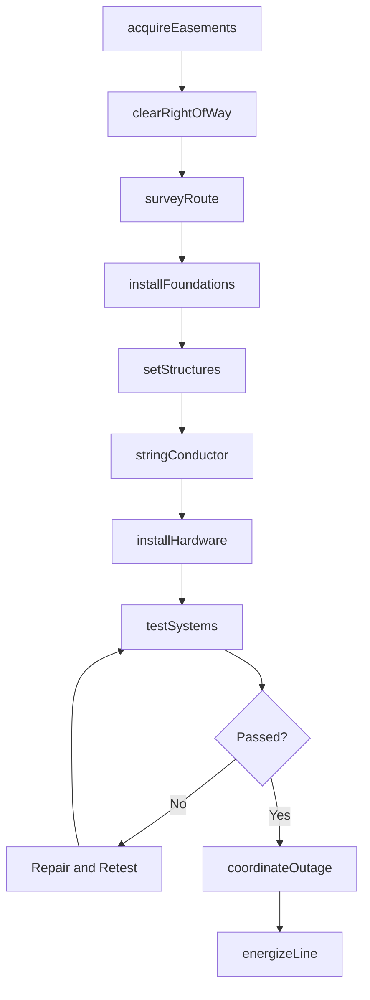
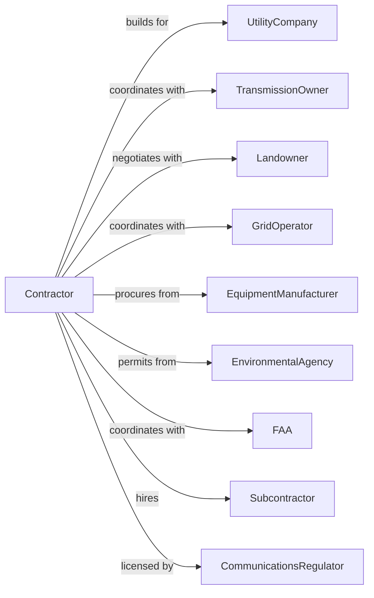

# Power and Communication Line and Related Structures Construction

> Business-as-Code definition for power and communication line construction operations. Models the complete lifecycle from engineering through energization for transmission lines, distribution networks, substations, and telecommunications infrastructure.

## Overview

Power and communication line construction involves installing electrical transmission lines, distribution networks, substations, telecommunication towers, and fiber optic systems. Projects require specialized equipment for pole setting, conductor stringing, and tower erection across varied terrain. This definition exposes actions for right-of-way clearing, structure installation, wire stringing, and system testing while managing outage coordination and safety protocols.

## Actors

| Actor | Description |
|-------|-------------|
| UtilityCompany | Electric or telecom utility commissioning the infrastructure |
| TransmissionOwner | Entity owning high-voltage transmission assets |
| Landowner | Property owner providing easements or access |
| GridOperator | Regional transmission organization managing grid |
| EquipmentManufacturer | Supplies poles, towers, transformers, and conductors |
| EnvironmentalAgency | Oversees permits and environmental compliance |
| FAA | Regulates tower heights near airports |
| CommunicationsRegulator | Oversees telecommunications licensing |
| Subcontractor | Specialty crews for specific work scopes |

## Roles

| Role | Description |
|------|-------------|
| ProjectManager | Manages contract, budget, and stakeholder coordination |
| LineSuperintendent | Oversees line construction operations |
| StructureForeman | Leads pole and tower installation crews |
| StringingForeman | Supervises conductor stringing operations |
| Lineman | Climbs poles and towers to install conductors and hardware |
| CableJointer | Splices and terminates high-voltage underground cables |
| SafetyManager | Implements electrical safety and grounding protocols |
| OutageCoordinator | Manages system outages and switching |

## Entities

| Entity | Description |
|--------|-------------|
| Project | The power/telecom construction with specifications |
| TransmissionLine | High-voltage line with voltage class and conductor type |
| DistributionLine | Medium-voltage line serving local customers |
| Structure | Pole, tower, or monopole supporting conductors |
| Conductor | Wire carrying electrical current or signals |
| Substation | Facility transforming voltage levels |
| Tower | Lattice or monopole structure for transmission |
| FiberCable | Optical fiber for telecommunications |
| RightOfWay | Easement corridor for line installation |
| Outage | Planned de-energization for construction work |

## Actions

| Action | Description |
|--------|-------------|
| acquireEasements | Secure right-of-way access from landowners |
| clearRightOfWay | Clear vegetation and prepare access roads |
| surveyRoute | Stake structure locations and conductor sag points |
| installFoundations | Pour concrete for tower and equipment foundations |
| setStructures | Install poles, towers, or monopoles |
| stringConductor | Pull and sag electrical conductors |
| installHardware | Attach insulators, dampers, and fittings |
| buildSubstation | Construct substation with transformers and switchgear |
| installFiber | Place fiber optic cable on poles or underground |
| testSystems | Verify electrical continuity and insulation |
| coordinateOutage | Schedule and manage system de-energization |
| energizeLine | Complete switching and bring line into service |
| commissionSubstation | Test and energize substation equipment |

## Events

| Event | Description |
|-------|-------------|
| easementsAcquired | All right-of-way access secured |
| rightOfWayCleared | Vegetation cleared and access established |
| routeSurveyed | Structure locations and sag points staked |
| foundationsCompleted | All foundations poured and cured |
| structuresSet | Poles or towers installed |
| conductorStrung | Conductors pulled and sagged |
| hardwareInstalled | All attachments and fittings complete |
| substationBuilt | Substation construction complete |
| fiberInstalled | Fiber optic cable placed and spliced |
| systemsTested | Electrical testing passed |
| outageCompleted | Tie-in work finished during outage |
| lineEnergized | Transmission or distribution line in service |
| substationCommissioned | Substation operational |

## Searches

| Search | Description |
|--------|-------------|
| findProjects | List projects by status, utility, or type |
| getStructureStatus | Retrieve installation progress by structure |
| getOutageSchedule | View planned outages and durations |
| findOpenSpans | List spans awaiting conductor installation |
| getTestResults | Retrieve electrical test documentation |
| getEasementStatus | Check right-of-way acquisition progress |
| getMaterialDeliveries | View scheduled equipment deliveries |

## Workflow



## Actor Relationships



## Usage

### Calling Actions

```typescript
import { installPowerCommunicationLines } from '@headlessly/install-power-communication-lines'

const contractor = installPowerCommunicationLines()

// Check structure installation progress
const structures = await contractor.getStructureStatus({ projectId: 'tx-line-789' })

// Review planned outage windows
const outages = await contractor.getOutageSchedule({ projectId: 'tx-line-789' })

// Set transmission structures
await contractor.setStructures({
  projectId: 'tx-line-789',
  segment: 'structure-001-025',
  structureType: 'steel-monopole',
  height: 120,
  lineVoltage: 345000
})

// String conductor on completed structures
await contractor.stringConductor({
  projectId: 'tx-line-789',
  span: 'structure-010-015',
  conductorType: 'ACSR-795',
  phases: 3,
  groundWires: 2,
  tensioningMethod: 'tension-stringing'
})

// Coordinate system outage for tie-in
const outage = await contractor.coordinateOutage({
  projectId: 'tx-line-789',
  substationId: 'sub-123',
  requestedDate: '2024-09-15',
  duration: 8,
  workDescription: 'Energize new 345kV line'
})
```

### Event-Driven Automation

```typescript
// Auto-string conductor when structures set
contractor.structuresSet(async ({ projectId, segment }) => {
  await contractor.stringConductor({
    projectId,
    span: segment,
    tensioningMethod: 'tension-stringing'
  })
})

// Auto-energize when tests pass
contractor.systemsTested(async ({ projectId }) => {
  await contractor.coordinateOutage({
    projectId,
    requestedDate: getNextWeekday(),
    duration: 4,
    workDescription: 'Final energization and switching'
  })
})
```
