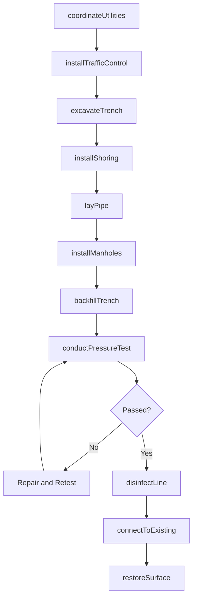
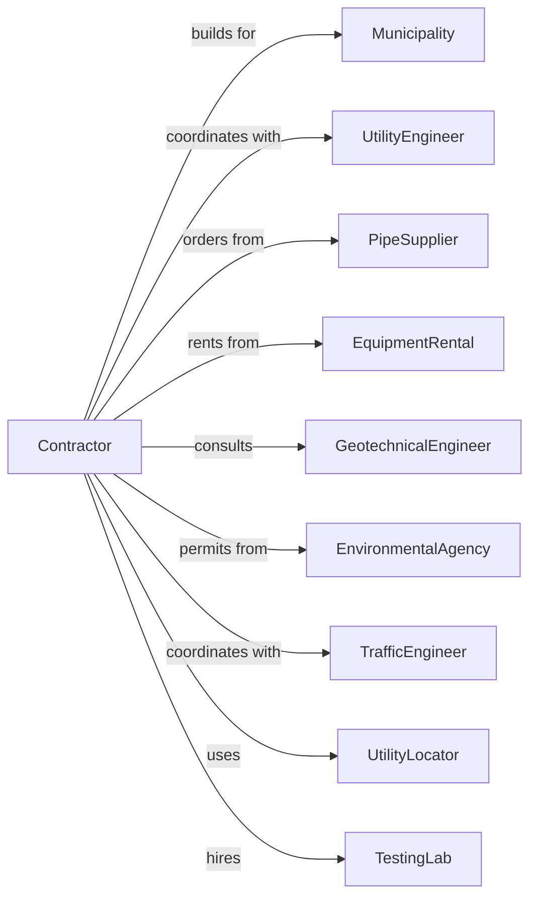

# Water and Sewer Line and Related Structures Construction

> Business-as-Code definition for water and sewer infrastructure construction operations. Models the complete lifecycle from design coordination through system commissioning for pipelines, pumping stations, and treatment facilities.

## Overview

Water and sewer construction involves installing municipal water mains, sanitary sewers, storm drainage, pumping stations, and treatment plants. Projects require deep excavation, pipe installation, and system testing while maintaining existing utility services. This definition exposes actions for utility coordination, trenching, pipe laying, and hydrostatic testing while managing traffic control and environmental compliance.

## Actors

| Actor | Description |
|-------|-------------|
| Municipality | City or county agency commissioning the infrastructure |
| UtilityEngineer | Designs water and sewer systems |
| PipeSupplier | Provides ductile iron, PVC, and HDPE pipe |
| EquipmentRental | Supplies excavators, loaders, and shoring |
| GeotechnicalEngineer | Provides soil reports and recommendations |
| EnvironmentalAgency | Oversees permits and environmental compliance |
| TrafficEngineer | Manages traffic control plans |
| UtilityLocator | Marks existing underground utilities |
| TestingLab | Performs soil compaction and material testing |

## Roles

| Role | Description |
|------|-------------|
| ProjectManager | Manages contract, budget, and owner coordination |
| Superintendent | On-site leader for daily operations |
| PipeCrewForeman | Leads pipe installation crew |
| EquipmentOperator | Operates excavators and pipe-laying equipment |
| GradeChecker | Verifies pipe alignment and elevation |
| PipeFuser | Operates HDPE butt fusion and electrofusion pipe joining equipment |
| SafetyManager | Implements trench safety and traffic control |

## Entities

| Entity | Description |
|--------|-------------|
| Project | The water/sewer construction with specifications |
| Pipeline | Linear infrastructure with pipe size and material |
| Manhole | Access structure at pipeline junctions |
| PumpStation | Facility housing pumps and controls |
| TreatmentPlant | Water or wastewater treatment facility |
| TrenchBox | Safety equipment for excavation shoring |
| Hydrant | Fire hydrant assembly with valves |
| Fitting | Pipe connections, bends, and reducers |
| Backfill | Compacted material around installed pipe |
| TestReport | Documentation of pressure and leak tests |

## Actions

| Action | Description |
|--------|-------------|
| coordinateUtilities | Locate and protect existing underground utilities |
| installTrafficControl | Set up lane closures and detours |
| excavateTrench | Dig trench to specified depth and width |
| installShoring | Place trench boxes and shoring systems |
| layPipe | Install pipe sections at proper grade |
| installManholes | Set manhole structures and adjust rims |
| installHydrants | Connect fire hydrants to water mains |
| backfillTrench | Compact backfill material in lifts |
| conductPressureTest | Perform hydrostatic testing of water lines |
| conductMandrelTest | Verify sewer line deflection compliance |
| disinfectLine | Chlorinate and flush new water mains |
| connectToExisting | Tie new lines to existing system |
| restoreSurface | Repair pavement and landscaping |

## Events

| Event | Description |
|-------|-------------|
| utilitiesLocated | Existing utilities marked and protected |
| trafficControlSet | Lane closures and detours in place |
| trenchExcavated | Excavation complete to grade |
| shoringInstalled | Trench safety systems in place |
| pipeLaid | Pipe sections installed and connected |
| manholesSet | Manhole structures installed |
| hydrantsInstalled | Fire hydrants connected and operational |
| trenchBackfilled | Backfill compacted and tested |
| pressureTestPassed | Water line tested and approved |
| mandrelTestPassed | Sewer line deflection verified |
| lineDisinfected | Water main chlorinated and sampled |
| systemConnected | New lines tied to existing system |
| surfaceRestored | Pavement and landscaping complete |

## Searches

| Search | Description |
|--------|-------------|
| findProjects | List projects by status, municipality, or type |
| getPipelineStatus | Retrieve installation progress by segment |
| getTestResults | View test reports for completed sections |
| findOpenExcavations | List active trench locations |
| getTrafficControlPlan | Retrieve current traffic control setup |
| getMaterialDeliveries | Check scheduled pipe deliveries |
| getInspectionSchedule | View upcoming inspection dates |

## Workflow



## Actor Relationships



## Usage

### Calling Actions

```typescript
import { installWaterSewer } from '@headlessly/install-water-sewer'

const contractor = installWaterSewer()

// Coordinate utility locations
const utilities = await contractor.coordinateUtilities({
  projectId: 'ws-project-123',
  segment: 'Main-St-100-400',
  utilityTypes: ['gas', 'electric', 'telecom', 'fiber'],
  requestDate: '2024-04-01'
})

// Lay pipe in prepared trench
await contractor.layPipe({
  projectId: 'ws-project-123',
  segment: 'Main-St-100-200',
  pipeType: 'ductile-iron',
  diameter: 12,
  length: 300,
  joints: 'push-on'
})

// Conduct hydrostatic pressure test
const testResult = await contractor.conductPressureTest({
  projectId: 'ws-project-123',
  segment: 'Main-St-100-400',
  testPressure: 200,
  duration: 2,
  allowableLeakage: 0.5
})
```

### Event-Driven Automation

```typescript
// Auto-schedule backfill when pipe laid
contractor.pipeLaid(async ({ projectId, segment }) => {
  await contractor.backfillTrench({
    projectId,
    segment,
    material: 'crusite-backfill',
    compactionRequirement: 95
  })
})

// Auto-restore surface when test passes
contractor.pressureTestPassed(async ({ projectId, segment }) => {
  await contractor.restoreSurface({
    projectId,
    segment,
    surfaceType: 'asphalt',
    patchDepth: 4
  })
})
```
