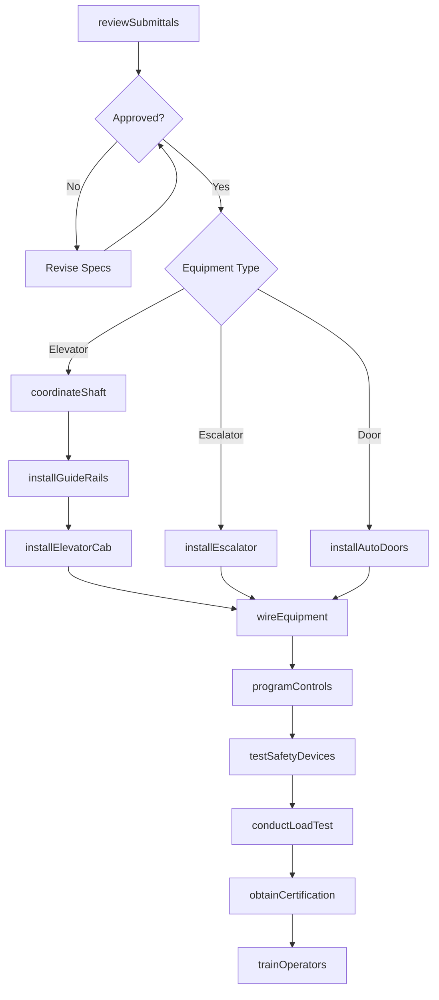
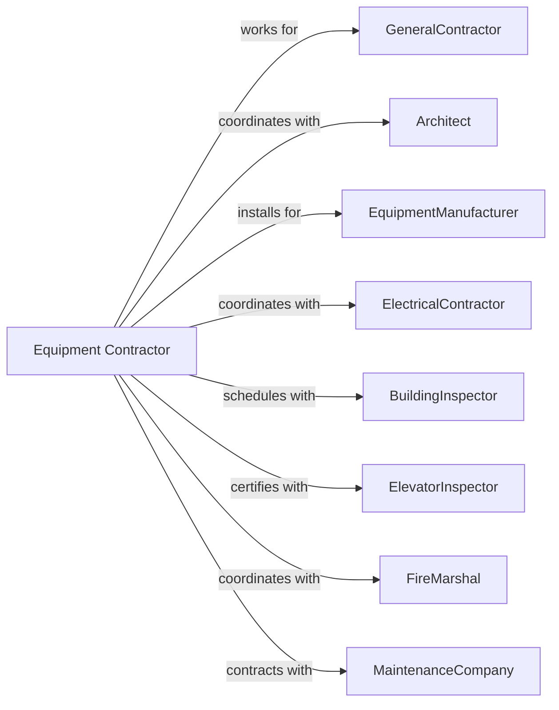

# Other Building Equipment Contractors

> Business-as-Code definition for specialized building equipment contracting operations. Models the complete lifecycle from specification through commissioning for elevators, escalators, automated doors, and specialty equipment systems.

## Overview

Other building equipment contractors specialize in installing elevators, escalators, automated doors, commercial kitchen equipment, and other specialty building systems. Work includes equipment placement, electrical connections, and system programming. This definition exposes actions for equipment coordination, installation, testing, and certification while managing manufacturer specifications and code compliance requirements.

## Actors

| Actor | Description |
|-------|-------------|
| GeneralContractor | Prime contractor managing overall construction |
| Architect | Specifies equipment locations and finishes |
| EquipmentManufacturer | Produces elevators, escalators, and specialty items |
| ElectricalContractor | Provides power connections to equipment |
| BuildingInspector | Verifies code compliance |
| ElevatorInspector | State inspector certifying elevator safety |
| FireMarshal | Reviews integration with fire systems |
| MaintenanceCompany | Provides ongoing service contracts |

## Roles

| Role | Description |
|------|-------------|
| EquipmentContractor | Business owner managing operations |
| ProjectManager | Coordinates schedule and submittals |
| InstallationSupervisor | Oversees equipment installation |
| ElevatorMechanic | Skilled tradesperson installing elevators |
| ControlsTechnician | Programs and configures equipment |
| ServiceTechnician | Performs testing and adjustments |

## Entities

| Entity | Description |
|--------|-------------|
| Project | The equipment scope with specifications |
| Elevator | Vertical transportation system |
| Escalator | Moving stairway system |
| AutomaticDoor | Powered door operator and sensors |
| CommercialKitchen | Food service equipment package |
| LightningProtection | Grounding and protection system |
| LoadingDock | Levelers, doors, and seals |
| Conveyor | Material handling system |
| MaintenanceContract | Ongoing service agreement |
| Certificate | State certification for elevator operation |

## Actions

| Action | Description |
|--------|-------------|
| reviewSubmittals | Coordinate equipment specifications |
| coordinateShaft | Verify elevator hoistway dimensions |
| installGuideRails | Mount elevator guide rails in shaft |
| installElevatorCab | Set car, counterweight, and machine |
| installEscalator | Erect escalator truss and steps |
| installAutoDoors | Mount operators, sensors, and doors |
| installKitchenEquipment | Set and connect food service equipment |
| wireEquipment | Connect electrical power and controls |
| programControls | Configure operating parameters |
| testSafetyDevices | Verify safety functions operate correctly |
| conductLoadTest | Test elevator with rated load |
| obtainCertification | Secure state elevator certificate |
| trainOperators | Instruct building staff on operation |

## Events

| Event | Description |
|-------|-------------|
| submittalsApproved | Equipment specifications accepted |
| shaftPrepared | Hoistway prepared for installation |
| guideRailsInstalled | Elevator rails mounted and aligned |
| elevatorCabSet | Car and machine installed |
| escalatorInstalled | Escalator truss and steps complete |
| autoDoorsInstalled | Automatic doors operational |
| kitchenEquipmentSet | Food service equipment placed |
| equipmentWired | Electrical connections complete |
| controlsProgrammed | Operating parameters configured |
| safetyDevicesTested | Safety functions verified |
| loadTestPassed | Elevator rated load test successful |
| certificationObtained | State certificate issued |
| operatorsTrained | Building staff instructed |

## Searches

| Search | Description |
|--------|-------------|
| findProjects | List projects by status or GC |
| getEquipmentSchedule | View installation timeline |
| getSubmittalStatus | Track specification approvals |
| getCertificationStatus | Check elevator certification progress |
| getMaintenanceContracts | View service agreements |
| getTestReports | Retrieve safety test documentation |
| getTrainingRecords | View operator training completion |

## Workflow



## Actor Relationships



## Usage

### Calling Actions

```typescript
import { installBuildingEquipment } from '@headlessly/install-building-equipment'

const contractor = installBuildingEquipment()

// Review submittal approval status
const submittals = await contractor.getSubmittalStatus({ projectId: 'high-rise-456' })

// Check equipment installation schedule
const schedule = await contractor.getEquipmentSchedule({ projectId: 'high-rise-456' })

// Install elevator system
await contractor.installElevatorCab({
  projectId: 'high-rise-456',
  elevatorId: 'elev-1',
  type: 'traction',
  capacity: 4000,
  speed: 500,
  stops: 15,
  cabFinish: 'stainless-steel'
})

// Install automatic doors
await contractor.installAutoDoors({
  projectId: 'retail-center-789',
  location: 'main-entrance',
  doorType: 'sliding',
  width: 72,
  operator: 'Besam',
  sensors: ['motion', 'presence', 'safety']
})

// Obtain elevator certification
await contractor.obtainCertification({
  projectId: 'high-rise-456',
  elevatorId: 'elev-1',
  inspectionDate: '2024-08-15',
  inspectorId: 'state-inspector-123',
  certificateType: 'annual'
})
```

### Event-Driven Automation

```typescript
// Auto-wire when elevator cab set
contractor.elevatorCabSet(async ({ projectId, elevatorId }) => {
  await contractor.wireEquipment({
    projectId,
    elevatorId,
    startDate: addDays(new Date(), 1)
  })
})

// Auto-schedule certification when load test passes
contractor.loadTestPassed(async ({ projectId, elevatorId }) => {
  await contractor.obtainCertification({
    projectId,
    elevatorId,
    requestedDate: addDays(new Date(), 5)
  })
})
```
