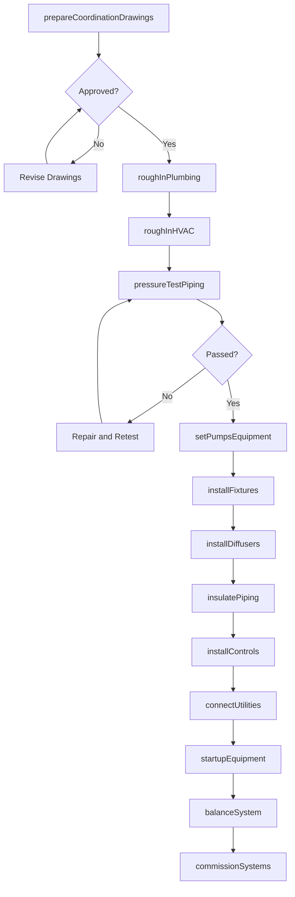
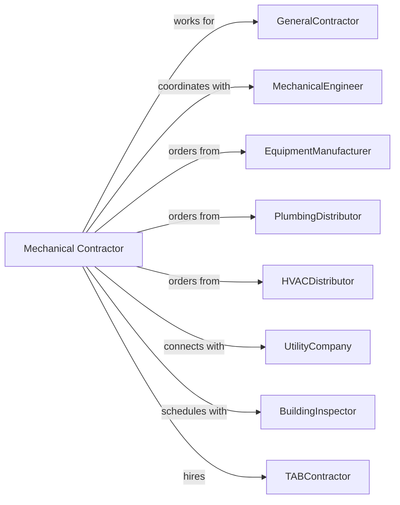

# Plumbing, Heating, and Air-Conditioning Contractors

> Business-as-Code definition for plumbing, heating, and air-conditioning contracting operations. Models the complete lifecycle from design coordination through commissioning for water supply, drainage, HVAC, and piping systems.

## Overview

Plumbing and HVAC contractors specialize in installing water supply, sanitary drainage, storm drainage, heating, ventilation, and air conditioning systems. Work includes pipe installation, fixture setting, equipment placement, and system balancing. This definition exposes actions for coordination drawings, rough-in piping, equipment installation, and system startup while managing code compliance, pressure testing, and commissioning requirements.

## Actors

| Actor | Description |
|-------|-------------|
| GeneralContractor | Prime contractor managing overall construction |
| MechanicalEngineer | Designs plumbing and HVAC systems |
| EquipmentManufacturer | Provides HVAC units, boilers, and chillers |
| PlumbingDistributor | Supplies pipe, fittings, and fixtures |
| HVACDistributor | Provides ductwork, controls, and accessories |
| UtilityCompany | Provides gas and water service connections |
| BuildingInspector | Verifies code compliance |
| TABContractor | Performs testing, adjusting, and balancing |

## Roles

| Role | Description |
|------|-------------|
| MechanicalContractor | Business owner managing operations |
| ProjectManager | Coordinates schedule, budget, and submittals |
| PlumbingForeman | Leads plumbing installation crew |
| HVACForeman | Leads HVAC installation crew |
| Pipefitter | Skilled tradesperson installing piping |
| SheetMetalWorker | Fabricates and installs ductwork |
| ServiceTechnician | Performs startup and commissioning |

## Entities

| Entity | Description |
|--------|-------------|
| Project | The mechanical scope with specifications |
| Estimate | Cost proposal with labor and materials |
| WaterSupply | Domestic water piping system |
| SanitaryDrainage | Waste and vent piping system |
| HVACSystem | Heating, ventilation, and cooling equipment |
| Ductwork | Air distribution system |
| AirHandler | Fan coil or air handling unit |
| Boiler | Heating equipment using gas or oil |
| Chiller | Cooling equipment producing chilled water |
| Fixture | Plumbing fixture such as sink or toilet |
| Thermostat | HVAC control device |

## Actions

| Action | Description |
|--------|-------------|
| prepareCoordinationDrawings | Create MEP coordination drawings |
| roughInPlumbing | Install water and drain piping before walls close |
| roughInHVAC | Install ductwork and refrigerant lines |
| setPumpsEquipment | Install boilers, chillers, and air handlers |
| installFixtures | Mount plumbing fixtures and connect piping |
| installDiffusers | Mount supply and return air devices |
| pressureTestPiping | Verify piping integrity under pressure |
| insulatePiping | Apply insulation to pipes and ductwork |
| installControls | Mount thermostats and control devices |
| connectUtilities | Coordinate gas and water service |
| startupEquipment | Perform initial equipment operation |
| balanceSystem | Test, adjust, and balance air and water |
| commissionSystems | Verify performance meets specifications |

## Events

| Event | Description |
|-------|-------------|
| coordinationCompleted | Drawings approved by all trades |
| plumbingRoughInCompleted | Water and drain rough-in passed inspection |
| hvacRoughInCompleted | Ductwork and piping installed |
| equipmentSet | Major mechanical equipment installed |
| fixturesInstalled | Plumbing fixtures connected |
| diffusersInstalled | Air devices mounted |
| pressureTestPassed | Piping holds test pressure |
| insulationCompleted | Piping and ductwork insulated |
| controlsInstalled | Thermostats and controls mounted |
| utilitiesConnected | Gas and water service available |
| equipmentStarted | Mechanical equipment operating |
| systemBalanced | Air and water flows adjusted |
| systemsCommissioned | Performance verified and accepted |

## Searches

| Search | Description |
|--------|-------------|
| findProjects | List projects by status or GC |
| getEquipmentSchedule | View scheduled equipment by type |
| getInspectionStatus | Check rough-in inspection results |
| getMaterialOrders | Track mechanical material deliveries |
| getCrewSchedule | View pipefitter and sheet metal assignments |
| getStartupLog | Retrieve equipment startup records |
| getTABReport | View testing and balancing results |

## Workflow



## Actor Relationships



## Usage

### Calling Actions

```typescript
import { installPlumbingHVACSystems } from '@headlessly/install-plumbing-hvac-systems'

const mechContractor = installPlumbingHVACSystems()

// Review equipment schedule for the project
const equipment = await mechContractor.getEquipmentSchedule({ projectId: 'school-building-789' })

// Check rough-in inspection status
const inspections = await mechContractor.getInspectionStatus({ projectId: 'school-building-789' })

// Rough-in plumbing
await mechContractor.roughInPlumbing({
  projectId: 'school-building-789',
  area: 'restroom-wing',
  waterPipeType: 'copper-type-L',
  drainPipeType: 'cast-iron',
  fixtures: ['toilets-24', 'lavatories-20', 'urinals-8']
})

// Install HVAC equipment
await mechContractor.setPumpsEquipment({
  projectId: 'school-building-789',
  equipment: [
    { type: 'rooftop-unit', model: 'RTU-20T', quantity: 4 },
    { type: 'boiler', model: 'gas-2000MBH', quantity: 2 },
    { type: 'pump', model: 'HWP-50GPM', quantity: 4 }
  ]
})

// Commission mechanical systems
await mechContractor.commissionSystems({
  projectId: 'school-building-789',
  systems: ['hvac', 'plumbing', 'fire-protection'],
  commissioningAgent: 'cx-group-inc',
  seasonalTesting: ['heating', 'cooling']
})
```

### Event-Driven Automation

```typescript
// Auto-insulate when pressure test passes
mechContractor.pressureTestPassed(async ({ projectId, system }) => {
  await mechContractor.insulatePiping({
    projectId,
    system,
    insulationType: 'fiberglass',
    startDate: addDays(new Date(), 1)
  })
})

// Auto-balance when equipment started
mechContractor.equipmentStarted(async ({ projectId }) => {
  await mechContractor.balanceSystem({
    projectId,
    tabContractor: 'precision-balance-inc',
    startDate: addDays(new Date(), 7)
  })
})
```
