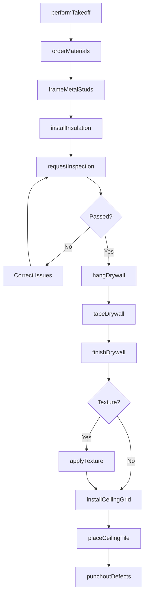
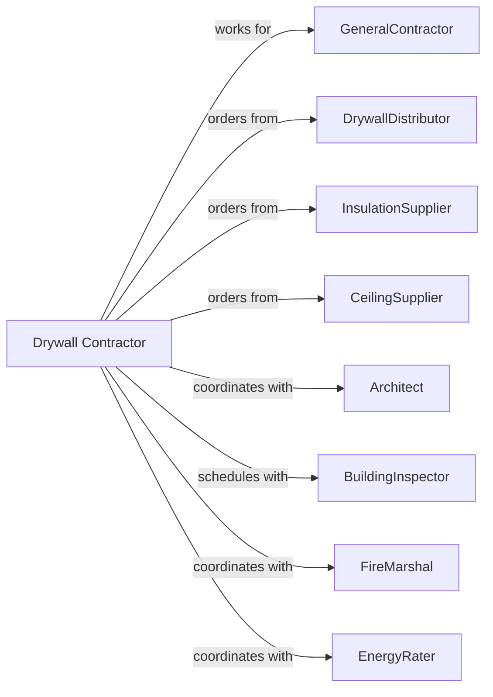

# Drywall and Insulation Contractors

> Business-as-Code definition for drywall and insulation contracting operations. Models the complete lifecycle from estimating through finishing for gypsum board installation, insulation, and acoustical ceiling systems.

## Overview

Drywall and insulation contractors specialize in installing gypsum board, building insulation, acoustical ceilings, and plaster systems. Work includes metal framing, board hanging, taping, finishing, and texture application. This definition exposes actions for material takeoff, installation sequencing, and quality finishing while managing moisture control, fire ratings, and acoustic requirements.

## Actors

| Actor | Description |
|-------|-------------|
| GeneralContractor | Prime contractor managing overall construction |
| DrywallDistributor | Supplies gypsum board, metal studs, and compounds |
| InsulationSupplier | Provides batt, blown, and spray foam insulation |
| CeilingSupplier | Provides acoustical tiles and grid systems |
| Architect | Specifies assemblies and fire ratings |
| BuildingInspector | Verifies insulation and fire-stopping compliance |
| FireMarshal | Reviews fire-rated assemblies |
| EnergyRater | Verifies insulation compliance with code |

## Roles

| Role | Description |
|------|-------------|
| DrywallContractor | Business owner managing operations |
| ProjectManager | Coordinates schedule, budget, and materials |
| Foreman | Leads installation crew on site |
| MetalFramer | Installs metal stud framing |
| Hanger | Installs gypsum board on framing |
| Taper | Applies tape and compound to joints |
| Finisher | Applies final coats and texture |
| SprayFoamApplicator | Applies closed-cell or open-cell spray foam insulation |

## Entities

| Entity | Description |
|--------|-------------|
| Project | The drywall scope with specifications |
| Estimate | Cost proposal with labor and materials |
| MetalStud | Light-gauge steel framing member |
| GypsumBoard | Drywall panel with various types and ratings |
| Insulation | Thermal and acoustic insulation material |
| JointCompound | Material for finishing joints and surfaces |
| AcousticalCeiling | Suspended ceiling tile and grid system |
| FireRating | Assembly fire resistance requirement |
| SoundRating | Acoustic performance requirement |
| Texture | Applied surface pattern or finish |

## Actions

| Action | Description |
|--------|-------------|
| performTakeoff | Calculate materials from plans |
| orderMaterials | Purchase drywall, metal, and insulation |
| frameMetalStuds | Install wall and ceiling metal framing |
| installInsulation | Place batt or spray foam insulation |
| hangDrywall | Attach gypsum board to framing |
| tapeDrywall | Apply tape and first coat compound |
| finishDrywall | Apply second and third coats |
| applyTexture | Apply spray or hand texture to surfaces |
| installCeilingGrid | Erect suspended ceiling framework |
| placeCeilingTile | Install acoustical tiles in grid |
| punchoutDefects | Correct imperfections and touch-up |
| requestInspection | Schedule insulation inspection |
| installFirestopping | Seal penetrations in fire-rated walls |

## Events

| Event | Description |
|-------|-------------|
| takeoffComplete | Material quantities calculated |
| materialsDelivered | Drywall and insulation on site |
| metalFramingComplete | Stud walls and ceilings framed |
| insulationInstalled | Insulation placed and inspected |
| drywallHung | Gypsum board attached |
| tapingComplete | First coat finished |
| finishingComplete | Final coats applied |
| textureApplied | Surface texture complete |
| ceilingGridInstalled | Suspension system complete |
| ceilingTilePlaced | Acoustical tiles installed |
| inspectionPassed | Building official approved |
| firestoppingComplete | Penetrations sealed |
| defectsCorrected | Punchlist items resolved |

## Searches

| Search | Description |
|--------|-------------|
| findProjects | List projects by status or GC |
| getMaterialNeeds | View outstanding material requirements |
| getCrewSchedule | Check crew assignments by project |
| getInspectionStatus | View inspection requests and results |
| getFireRatings | List required fire-rated assemblies |
| getTextureSchedule | View texture application schedule |
| getPunchlist | List defects requiring correction |

## Workflow



## Actor Relationships



## Usage

### Calling Actions

```typescript
import { finishDrywallInsulation } from '@headlessly/finish-drywall-insulation'

const contractor = finishDrywallInsulation()

// Install metal stud framing
await contractor.frameMetalStuds({
  projectId: 'office-tenant-123',
  area: 'suite-200',
  studSize: '3-5/8-inch-25-gauge',
  spacing: 16,
  ceilingHeight: 9,
  linearFeet: 1200
})

// Install insulation
await contractor.installInsulation({
  projectId: 'office-tenant-123',
  area: 'suite-200',
  insulationType: 'fiberglass-batt',
  rValue: 13,
  squareFeet: 3500,
  vaporBarrier: true
})

// Finish drywall to Level 4
await contractor.finishDrywall({
  projectId: 'office-tenant-123',
  area: 'suite-200',
  finishLevel: 4,
  coats: 3,
  sandingRequired: true
})
```

### Event-Driven Automation

```typescript
// Auto-hang drywall when insulation passes inspection
contractor.insulationInstalled(async ({ projectId, area }) => {
  await contractor.hangDrywall({
    projectId,
    area,
    startDate: addDays(new Date(), 1)
  })
})

// Auto-apply texture when finishing complete
contractor.finishingComplete(async ({ projectId, area }) => {
  await contractor.applyTexture({
    projectId,
    area,
    textureType: 'orange-peel',
    applicationDate: addDays(new Date(), 2)
  })
})
```
