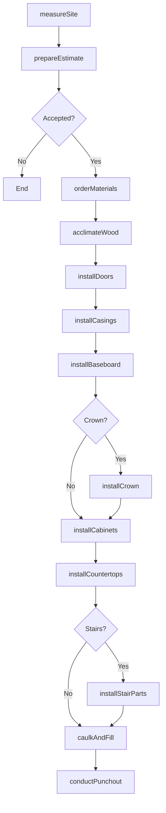
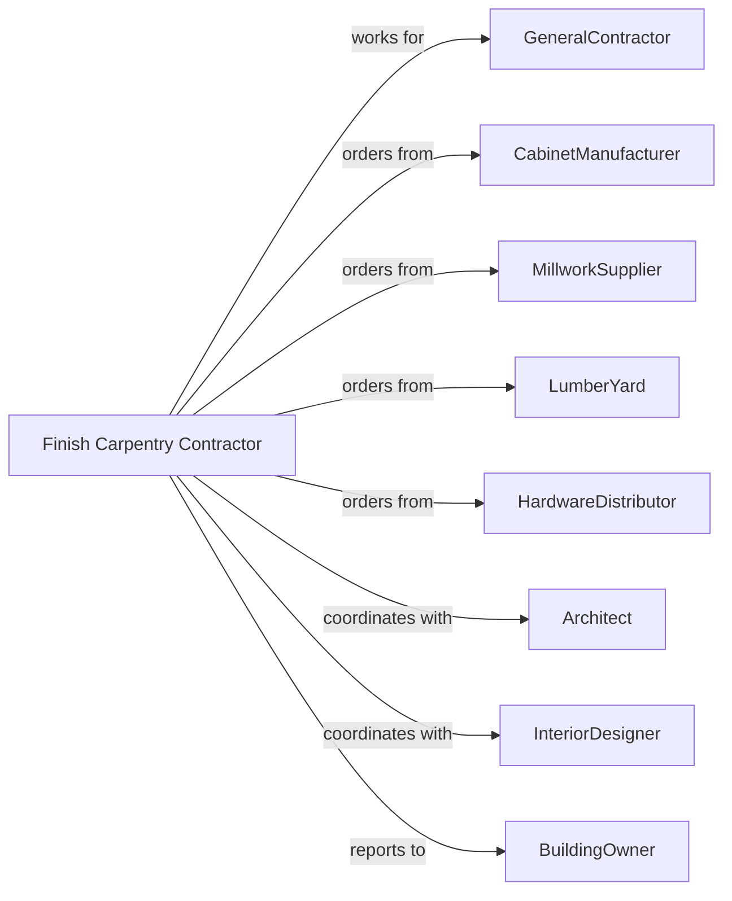

# Finish Carpentry Contractors

> Business-as-Code definition for finish carpentry contracting operations. Models the complete lifecycle from field measurement through installation for trim, molding, cabinetry, doors, and millwork.

## Overview

Finish carpentry contractors specialize in installing interior and exterior wood trim, moldings, cabinetry, doors, windows, and decorative woodwork. Work includes precise measurement, cutting, fitting, and fastening of finish materials. This definition exposes actions for layout planning, material preparation, and installation while managing wood movement, alignment tolerances, and aesthetic detailing.

## Actors

| Actor | Description |
|-------|-------------|
| GeneralContractor | Prime contractor managing overall construction |
| CabinetManufacturer | Produces custom and stock cabinetry |
| MillworkSupplier | Provides doors, trim, and molding profiles |
| LumberYard | Supplies finish lumber and sheet goods |
| HardwareDistributor | Provides hinges, pulls, and door hardware |
| Architect | Specifies millwork profiles and details |
| InteriorDesigner | Selects finishes and hardware styles |
| BuildingOwner | Approves material selections and changes |

## Roles

| Role | Description |
|------|-------------|
| FinishCarpentryContractor | Business owner managing operations |
| Estimator | Measures and prepares proposals |
| ProjectManager | Coordinates materials and schedules |
| LeadCarpenter | Oversees installation crew |
| FinishCarpenter | Skilled tradesperson installing trim and millwork |
| CabinetInstaller | Specializes in cabinet installation |

## Entities

| Entity | Description |
|--------|-------------|
| Project | The carpentry scope with specifications |
| Estimate | Cost proposal with labor and materials |
| Trim | Baseboard, casing, and crown molding |
| Cabinet | Built-in or modular storage unit |
| Door | Interior or exterior door with hardware |
| Window | Frame with casing and extension jambs |
| Millwork | Custom-milled wood components |
| Hardware | Hinges, knobs, and functional components |
| Countertop | Horizontal work surface |
| Staircase | Treads, risers, handrail, and balusters |

## Actions

| Action | Description |
|--------|-------------|
| measureSite | Field verify dimensions for millwork |
| prepareEstimate | Calculate materials and labor costs |
| orderMaterials | Purchase trim, cabinets, and hardware |
| acclimateWood | Allow materials to adjust to environment |
| installDoors | Hang and adjust interior doors |
| installCasings | Apply trim around doors and windows |
| installBaseboard | Install base molding along floors |
| installCrown | Apply crown molding at ceiling line |
| installCabinets | Mount and level cabinetry |
| installCountertops | Set and secure countertop surfaces |
| installStairParts | Assemble treads, risers, and railings |
| installPaneling | Apply wall paneling and wainscoting |
| installClosets | Build out shelving and organizer systems |
| caulkAndFill | Fill nail holes and seal gaps |
| conductPunchout | Review and correct deficiencies |

## Events

| Event | Description |
|-------|-------------|
| siteMeasured | Dimensions verified and recorded |
| estimatePresented | Proposal delivered to customer |
| materialsOrdered | Trim and cabinetry purchased |
| materialsAcclimated | Wood adjusted to site conditions |
| doorsInstalled | Interior doors hung and adjusted |
| casingsInstalled | Door and window trim applied |
| baseboardInstalled | Base molding complete |
| crownInstalled | Crown molding complete |
| cabinetsInstalled | Cabinetry mounted and leveled |
| countertopsInstalled | Work surfaces secured |
| stairsCompleted | Staircase assembly complete |
| panelingInstalled | Wall treatments complete |
| closetsBuilt | Organizers and shelving complete |
| punchoutComplete | Deficiencies corrected |
| installationComplete | All finish carpentry finished |

## Searches

| Search | Description |
|--------|-------------|
| findProjects | List projects by status or GC |
| getMillworkSchedule | View trim and door specifications |
| getCabinetStatus | Track cabinet order and delivery |
| getHardwareSchedule | View hardware specifications by room |
| getCrewSchedule | Check carpenter assignments |
| getPunchlist | List items requiring correction |
| getMeasurements | Retrieve field dimensions |

## Workflow



## Actor Relationships



## Usage

### Calling Actions

```typescript
import { finishFinishCarpentry } from '@headlessly/finish-finish-carpentry'

const carpenter = finishFinishCarpentry()

// Check cabinet order and delivery status
const cabinets = await carpenter.getCabinetStatus({ projectId: 'custom-home-456' })

// Review millwork schedule
const millwork = await carpenter.getMillworkSchedule({ projectId: 'custom-home-456' })

// Install kitchen cabinets
await carpenter.installCabinets({
  projectId: 'custom-home-456',
  room: 'kitchen',
  cabinetLine: 'KraftMaid',
  upperCount: 12,
  baseCount: 16,
  tallCount: 2,
  islandIncluded: true
})

// Install crown molding throughout
await carpenter.installCrown({
  projectId: 'custom-home-456',
  areas: ['living-room', 'dining-room', 'master-bedroom'],
  profile: '5-1/4-inch-colonial',
  material: 'poplar',
  linearFeet: 280
})

// Install stair components
await carpenter.installStairParts({
  projectId: 'custom-home-456',
  location: 'main-stair',
  treadMaterial: 'red-oak',
  risers: 14,
  railStyle: 'craftsman',
  balusterType: 'square-painted'
})
```

### Event-Driven Automation

```typescript
// Auto-install casings when doors hung
carpenter.doorsInstalled(async ({ projectId, room }) => {
  await carpenter.installCasings({
    projectId,
    room,
    profile: 'colonial',
    startDate: addDays(new Date(), 1)
  })
})

// Auto-schedule punchout when all trim complete
carpenter.crownInstalled(async ({ projectId }) => {
  await carpenter.conductPunchout({
    projectId,
    punchoutDate: addDays(new Date(), 3)
  })
})
```
