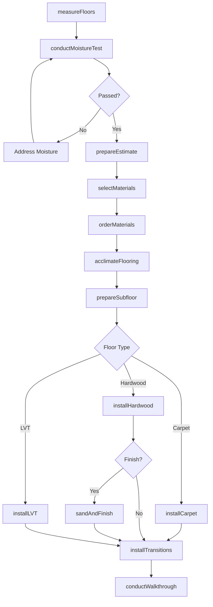
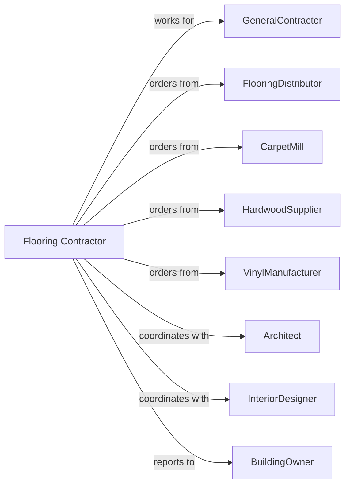

# Flooring Contractors

> Business-as-Code definition for flooring contracting operations. Models the complete lifecycle from measurement through installation for carpet, hardwood, laminate, vinyl, and resilient flooring systems.

## Overview

Flooring contractors specialize in installing carpet, hardwood, laminate, luxury vinyl, and resilient flooring materials. Work includes subfloor preparation, moisture testing, and floor covering installation. This definition exposes actions for site assessment, subfloor prep, and material installation while managing acclimation, adhesive curing, and transition detailing.

## Actors

| Actor | Description |
|-------|-------------|
| GeneralContractor | Prime contractor managing overall construction |
| FlooringDistributor | Supplies flooring materials and adhesives |
| CarpetMill | Manufactures carpet and padding |
| HardwoodSupplier | Provides solid and engineered hardwood |
| VinylManufacturer | Produces LVT and sheet vinyl |
| Architect | Specifies flooring materials and patterns |
| InteriorDesigner | Selects colors and materials |
| BuildingOwner | Approves material selections |

## Roles

| Role | Description |
|------|-------------|
| FlooringContractor | Business owner managing operations |
| Estimator | Measures and prepares proposals |
| ProjectManager | Coordinates materials and crews |
| Foreman | Leads installation crew |
| Installer | Skilled tradesperson installing flooring |
| SandingFinisher | Specializes in hardwood refinishing |
| CarpetSeamer | Joins carpet rolls using hot-melt seaming tape and iron |

## Entities

| Entity | Description |
|--------|-------------|
| Project | The flooring scope with specifications |
| Estimate | Cost proposal with labor and materials |
| Subfloor | Base surface receiving floor covering |
| Carpet | Soft floor covering with padding |
| Hardwood | Solid or engineered wood flooring |
| LVT | Luxury vinyl tile or plank |
| Laminate | Floating floor with decorative surface |
| Adhesive | Bonding material for floor installation |
| Transition | Strip joining different floor materials |
| MoistureTest | Subfloor moisture measurement |

## Actions

| Action | Description |
|--------|-------------|
| measureFloors | Calculate square footage by area |
| conductMoistureTest | Test subfloor moisture levels |
| prepareEstimate | Calculate materials and labor |
| selectMaterials | Coordinate material selection |
| orderMaterials | Purchase flooring and supplies |
| prepareSubfloor | Level, patch, and prime substrate |
| acclimateFlooring | Allow materials to adjust to environment |
| installCarpet | Stretch and seam broadloom carpet |
| installHardwood | Nail or glue hardwood planks |
| installLVT | Adhere or float vinyl planks |
| installTransitions | Place strips at floor junctions |
| sandAndFinish | Sand and coat hardwood floors |
| conductWalkthrough | Review completed work |

## Events

| Event | Description |
|-------|-------------|
| floorsMeasured | Square footage calculated |
| moistureTestPassed | Substrate moisture acceptable |
| estimatePresented | Proposal delivered |
| materialsSelected | Products and colors approved |
| materialsDelivered | Flooring on site |
| subfloorPrepared | Substrate ready for install |
| flooringAcclimated | Materials adjusted to site conditions |
| carpetInstalled | Carpet installation complete |
| hardwoodInstalled | Wood floor installation complete |
| lvtInstalled | Vinyl installation complete |
| transitionsInstalled | Junctions completed |
| floorFinished | Sanding and coating complete |
| walkthroughComplete | Customer accepted work |

## Searches

| Search | Description |
|--------|-------------|
| findProjects | List projects by status or GC |
| getMaterialSchedule | View specified materials by area |
| getMoistureResults | Retrieve moisture test data |
| getCrewSchedule | View installer assignments |
| getDeliveryStatus | Track material deliveries |
| getAcclimationStatus | Check material acclimation time |
| getPunchlist | List items requiring correction |

## Workflow



## Actor Relationships



## Usage

### Calling Actions

```typescript
import { finishFlooringContractors } from '@headlessly/finish-flooring-contractors'

const floorer = finishFlooringContractors()

// Conduct moisture testing
const moistureTest = await floorer.conductMoistureTest({
  projectId: 'office-buildout-123',
  area: 'main-floor',
  testMethod: 'calcium-chloride',
  acceptableLevel: 3.0
})

// Install luxury vinyl plank
await floorer.installLVT({
  projectId: 'office-buildout-123',
  area: 'open-office',
  product: 'Shaw-Floorte-Pro',
  style: 'Heritage-Oak',
  squareFeet: 5500,
  installMethod: 'floating'
})

// Sand and finish hardwood
await floorer.sandAndFinish({
  projectId: 'historic-renovation-456',
  area: 'main-hall',
  sandingGrits: [36, 60, 80, 100],
  finishType: 'water-based-poly',
  sheen: 'satin',
  coats: 3
})
```

### Event-Driven Automation

```typescript
// Auto-prepare subfloor when materials acclimated
floorer.flooringAcclimated(async ({ projectId, area }) => {
  await floorer.prepareSubfloor({
    projectId,
    area,
    tasks: ['level', 'prime'],
    startDate: addDays(new Date(), 1)
  })
})

// Auto-schedule walkthrough when transitions complete
floorer.transitionsInstalled(async ({ projectId }) => {
  await floorer.conductWalkthrough({
    projectId,
    walkthroughDate: addDays(new Date(), 1)
  })
})
```
