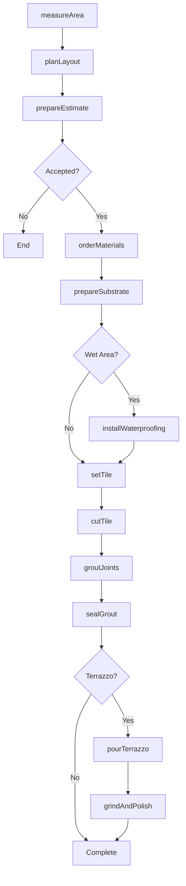
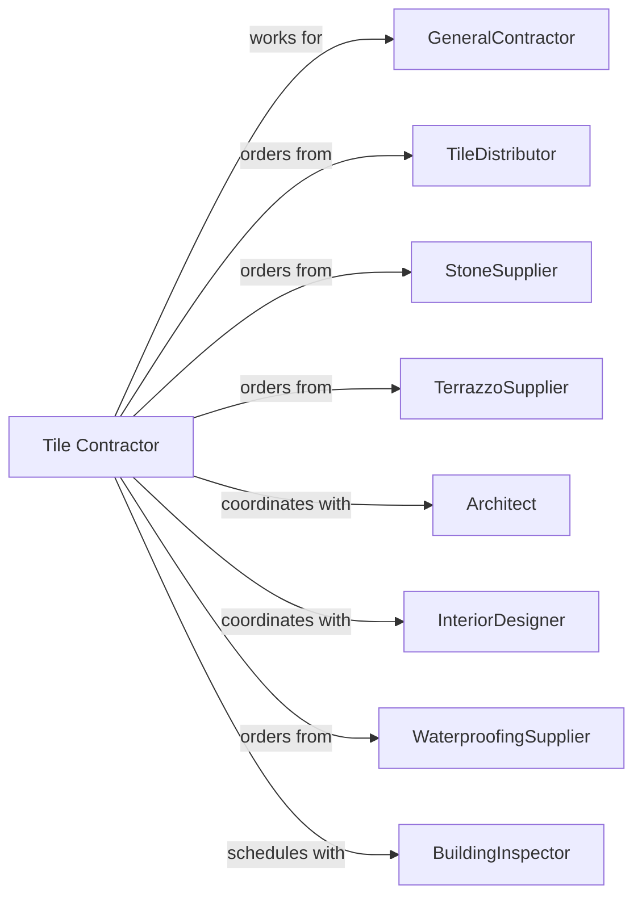

# Tile and Terrazzo Contractors

> Business-as-Code definition for tile and terrazzo contracting operations. Models the complete lifecycle from layout through grouting for ceramic, porcelain, stone, and terrazzo floor and wall installations.

## Overview

Tile and terrazzo contractors specialize in installing ceramic tile, porcelain tile, natural stone, and terrazzo flooring and wall coverings. Work includes substrate preparation, waterproofing, setting, and grouting. This definition exposes actions for layout planning, substrate prep, and tile setting while managing expansion joints, waterproofing, and grout sealing.

## Actors

| Actor | Description |
|-------|-------------|
| GeneralContractor | Prime contractor managing overall construction |
| TileDistributor | Supplies tile, thinset, and grout |
| StoneSupplier | Provides natural stone and marble |
| TerrazzoSupplier | Provides aggregate, epoxy, and divider strips |
| Architect | Specifies tile patterns and materials |
| InteriorDesigner | Selects colors and layouts |
| WaterproofingSupplier | Provides membranes and barriers |
| BuildingInspector | Verifies waterproofing compliance |

## Roles

| Role | Description |
|------|-------------|
| TileContractor | Business owner managing operations |
| Estimator | Measures and prepares proposals |
| ProjectManager | Coordinates materials and schedules |
| Foreman | Leads installation crew |
| TileSetter | Skilled tradesperson setting tile |
| TerrazzoMechanic | Specializes in terrazzo installation |
| Grouter | Applies and finishes grout joints |

## Entities

| Entity | Description |
|--------|-------------|
| Project | The tile scope with specifications |
| Estimate | Cost proposal with labor and materials |
| Tile | Ceramic, porcelain, or stone unit |
| Terrazzo | Poured aggregate flooring system |
| Thinset | Adhesive morite for setting tile |
| Grout | Joint filler between tiles |
| Waterproofing | Membrane protecting substrate |
| Layout | Planned tile pattern and positioning |
| ExpansionJoint | Movement accommodation joint |
| Dividerstrip | Metal or plastic terrazzo joint |

## Actions

| Action | Description |
|--------|-------------|
| measureArea | Calculate tile quantities needed |
| planLayout | Design tile pattern and starting points |
| prepareEstimate | Calculate materials and labor |
| orderMaterials | Purchase tile, thinset, and grout |
| prepareSubstrate | Level and waterproof surface |
| installWaterproofing | Apply membrane in wet areas |
| setTile | Adhere tiles to substrate |
| cutTile | Cut tiles for edges and penetrations |
| groutJoints | Fill joints between tiles |
| sealGrout | Apply sealer to grout joints |
| pourTerrazzo | Place terrazzo mix on substrate |
| grindAndPolish | Finish terrazzo surface |
| installDividerStrips | Place metal strips for patterns |

## Events

| Event | Description |
|-------|-------------|
| areaMeasured | Quantities calculated |
| layoutPlanned | Pattern designed and approved |
| estimatePresented | Proposal delivered |
| materialsDelivered | Tile and supplies on site |
| substratePrepared | Surface ready for setting |
| waterproofingInstalled | Membrane applied |
| tileSet | Tiles adhered to substrate |
| groutingComplete | Joints filled |
| groutSealed | Sealer applied |
| terrazzoPoured | Mix placed and cured |
| terrazzoPolished | Surface ground and polished |
| dividerStripsInstalled | Pattern strips in place |
| installationComplete | Work finished |

## Searches

| Search | Description |
|--------|-------------|
| findProjects | List projects by status or GC |
| getMaterialSchedule | View specified tiles by area |
| getLayoutDrawings | Retrieve tile pattern drawings |
| getCrewSchedule | View tile setter assignments |
| getDeliveryStatus | Track tile deliveries |
| getGroutSchedule | View grouting timeline |
| getPunchlist | List items needing correction |

## Workflow



## Actor Relationships



## Usage

### Calling Actions

```typescript
import { finishTileTerrazzo } from '@headlessly/finish-tile-terrazzo'

const tiler = finishTileTerrazzo()

// Check material schedule and delivery status
const materials = await tiler.getMaterialSchedule({ projectId: 'hotel-lobby-789' })
const deliveries = await tiler.getDeliveryStatus({ projectId: 'hotel-lobby-789' })

// Plan tile layout
const layout = await tiler.planLayout({
  projectId: 'hotel-lobby-789',
  area: 'main-lobby',
  tileSize: '24x24',
  pattern: 'herringbone',
  startingPoint: 'center',
  groutWidth: '3/16-inch'
})

// Set large format porcelain tile
await tiler.setTile({
  projectId: 'hotel-lobby-789',
  area: 'main-lobby',
  tileType: 'porcelain',
  size: '24x24',
  squareFeet: 2500,
  thinsetType: 'large-format-mortar',
  lippage: '1/16-inch'
})

// Pour epoxy terrazzo
await tiler.pourTerrazzo({
  projectId: 'museum-floor-456',
  area: 'gallery-A',
  system: 'epoxy-thin-set',
  aggregate: 'marble-chips',
  baseColor: 'white',
  squareFeet: 4000,
  dividerPattern: 'geometric'
})
```

### Event-Driven Automation

```typescript
// Auto-grout when tile set
tiler.tileSet(async ({ projectId, area }) => {
  await tiler.groutJoints({
    projectId,
    area,
    groutType: 'epoxy',
    startDate: addDays(new Date(), 1)
  })
})

// Auto-polish when terrazzo cured
tiler.terrazzoPoured(async ({ projectId, area }) => {
  await tiler.grindAndPolish({
    projectId,
    area,
    startDate: addDays(new Date(), 7),
    grits: [50, 100, 200, 400, 800, 1500]
  })
})
```
