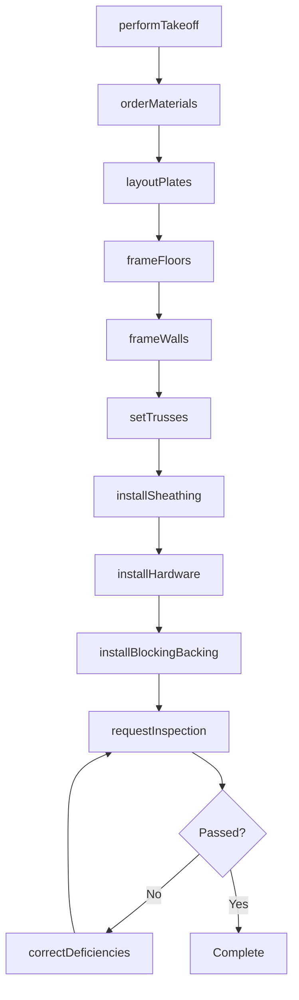
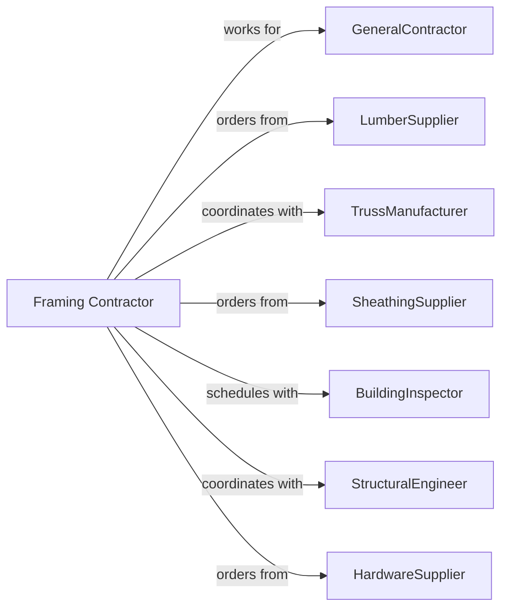

# Framing Contractors

> Business-as-Code definition for framing contractor operations. Models the complete lifecycle from takeoff through sheathing for wood and steel stud framing in residential and commercial construction.

## Overview

Framing contractors specialize in constructing structural frames using wood lumber, engineered wood products, or light-gauge steel studs. Work includes floor systems, wall framing, roof trusses, and sheathing installation. This definition exposes actions for material takeoff, layout, framing, and sheathing while managing lumber deliveries, truss coordination, and weather protection.

## Actors

| Actor | Description |
|-------|-------------|
| GeneralContractor | Prime contractor or builder hiring the framing crew |
| LumberSupplier | Provides dimensional lumber and engineered products |
| TrussManufacturer | Designs and delivers roof and floor trusses |
| SheathingSupplier | Provides plywood, OSB, and structural panels |
| BuildingInspector | Verifies framing code compliance |
| StructuralEngineer | Provides framing plans and details |
| HardwareSupplier | Provides connectors, hangers, and fasteners |

## Roles

| Role | Description |
|------|-------------|
| FramingContractor | Business owner managing crews and estimates |
| LeadFramer | Experienced carpenter leading crew operations |
| Carpenter | Skilled tradesperson cutting and assembling framing |
| LayoutPerson | Marks plates and transfers dimensions to field |
| Laborer | Supports material handling and cleanup |
| TrussInstaller | Specializes in roof and floor truss setting |
| SheathingCrew | Applies structural sheathing panels after framing |

## Entities

| Entity | Description |
|--------|-------------|
| Project | The framing scope with plans and schedule |
| Takeoff | Quantity list of lumber and materials needed |
| FloorSystem | Joists, rim board, and subfloor assembly |
| WallFrame | Studs, plates, and headers forming walls |
| RoofTruss | Engineered roof framing component |
| Sheathing | Structural panels covering frame |
| Header | Beam spanning door or window opening |
| Connector | Metal hardware joining framing members |
| BlockingBacking | Short members for attachment points |
| WallPlate | Horizontal top or bottom of wall frame |

## Actions

| Action | Description |
|--------|-------------|
| performTakeoff | Calculate lumber and materials from plans |
| orderMaterials | Purchase lumber, trusses, and hardware |
| layoutPlates | Mark stud locations on wall plates |
| frameFloors | Install joists, blocking, and subfloor |
| frameWalls | Assemble and raise wall sections |
| setTrusses | Install roof or floor trusses |
| frameSoffits | Build dropped ceiling and soffit framing |
| installSheathing | Attach structural panels to frame |
| installHardware | Apply connectors and straps |
| frameStairs | Construct stair stringers and platforms |
| installBlockingBacking | Add blocking for fixtures and trim |
| requestInspection | Schedule framing inspection |
| correctDeficiencies | Address inspector comments |

## Events

| Event | Description |
|-------|-------------|
| takeoffComplete | Material quantities calculated |
| materialsOrdered | Lumber and trusses purchased |
| materialsDelivered | Lumber arrived on site |
| platesLaidOut | Stud locations marked |
| floorsFramed | Floor system complete |
| wallsFramed | Wall framing complete |
| trussesSet | Roof trusses installed |
| sheathingInstalled | Panels attached to frame |
| hardwareInstalled | Connectors and straps applied |
| stairsFramed | Stair construction complete |
| blockingInstalled | Backing added for fixtures |
| inspectionRequested | Framing inspection scheduled |
| inspectionPassed | Building official approved frame |

## Searches

| Search | Description |
|--------|-------------|
| findProjects | List projects by status or builder |
| getMaterialNeeds | View outstanding material requirements |
| getDeliverySchedule | Check lumber and truss deliveries |
| getCrewSchedule | View crew assignments by project |
| getInspectionStatus | Check inspection requests and results |
| getTrussLayouts | Retrieve truss placement diagrams |
| getHardwareList | View required connectors by project |

## Workflow



## Actor Relationships



## Usage

### Calling Actions

```typescript
import { installFraming } from '@headlessly/install-framing'

const framer = installFraming()

// Perform material takeoff
const takeoff = await framer.performTakeoff({
  projectId: 'custom-home-789',
  plans: ['floor-plan.pdf', 'elevations.pdf', 'sections.pdf'],
  squareFootage: 3200,
  stories: 2
})

// Frame walls for first floor
await framer.frameWalls({
  projectId: 'custom-home-789',
  level: 'first-floor',
  studSize: '2x6',
  spacing: 16,
  exteriorWalls: true,
  interiorWalls: true
})

// Set roof trusses
await framer.setTrusses({
  projectId: 'custom-home-789',
  trussType: 'common',
  spacing: 24,
  craneRequired: true,
  setDate: '2024-07-20'
})
```

### Event-Driven Automation

```typescript
// Auto-set trusses when walls framed
framer.wallsFramed(async ({ projectId, level }) => {
  if (level === 'second-floor') {
    await framer.setTrusses({
      projectId,
      startDate: addDays(new Date(), 2)
    })
  }
})

// Auto-request inspection when hardware installed
framer.hardwareInstalled(async ({ projectId }) => {
  await framer.requestInspection({
    projectId,
    inspectionType: 'framing',
    preferredDate: addDays(new Date(), 3)
  })
})
```
