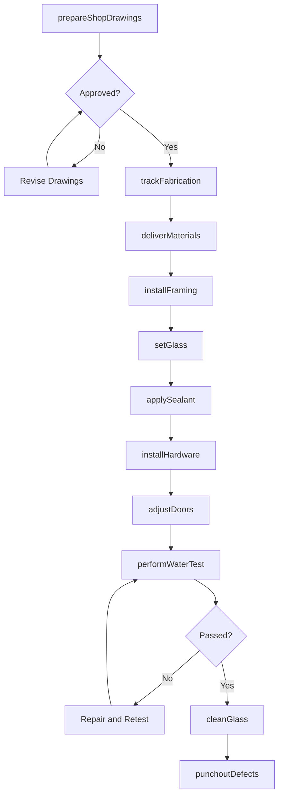
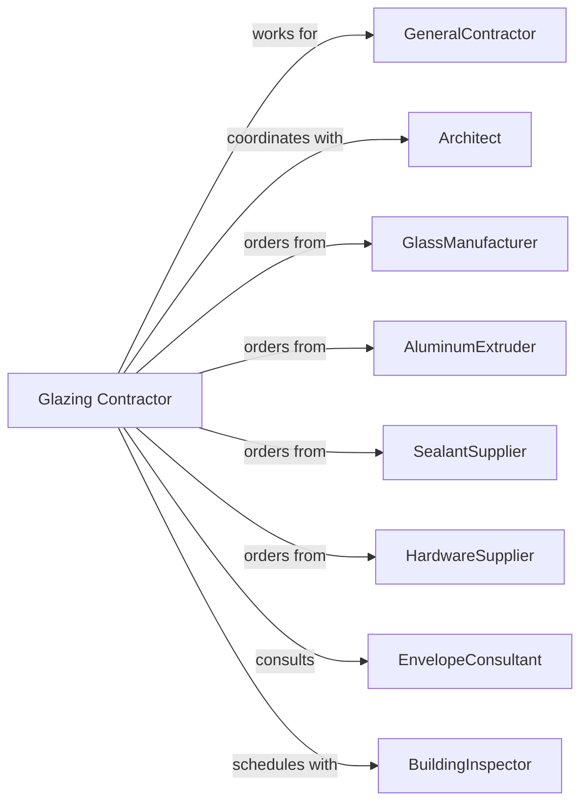

# Glass and Glazing Contractors

> Business-as-Code definition for glass and glazing contracting operations. Models the complete lifecycle from shop drawings through installation for curtain walls, storefronts, windows, and decorative glass.

## Overview

Glass and glazing contractors specialize in installing glass panes, curtain wall systems, storefronts, windows, and decorative glass elements. Work includes aluminum framing, glass cutting, setting, and sealing. This definition exposes actions for shop drawing coordination, fabrication tracking, and field installation while managing glass handling safety, weatherproofing, and aesthetic requirements.

## Actors

| Actor | Description |
|-------|-------------|
| GeneralContractor | Prime contractor managing overall construction |
| Architect | Specifies glazing systems and aesthetic requirements |
| GlassManufacturer | Produces tempered, laminated, and insulated units |
| AluminumExtruder | Manufactures curtain wall and storefront framing |
| SealantSupplier | Provides weatherproofing and structural sealants |
| HardwareSupplier | Provides hinges, closers, and glass hardware |
| EnvelopeConsultant | Reviews glazing systems for performance |
| BuildingInspector | Verifies code compliance and safety glazing |

## Roles

| Role | Description |
|------|-------------|
| GlazingContractor | Business owner managing operations and sales |
| ProjectManager | Coordinates submittals, schedule, and budget |
| ShopForeman | Oversees fabrication and glass cutting |
| FieldSuperintendent | Manages installation crews on site |
| Glazier | Skilled tradesperson installing glass and frames |
| CaulkerSealant | Applies structural silicone and weather sealants at glass joints |
| Detailer | Produces shop drawings and cut lists |

## Entities

| Entity | Description |
|--------|-------------|
| Project | The glazing scope with specifications |
| ShopDrawing | Detailed fabrication and installation drawings |
| CurtainWall | Exterior glass and aluminum facade system |
| Storefront | Ground-level commercial glass entrance system |
| Window | Operable or fixed window unit |
| InsulatedGlassUnit | Double or triple pane sealed unit |
| Sealant | Weatherproofing material at glass edges |
| Mullion | Vertical framing member in glazing system |
| Transom | Horizontal framing member above doors |
| Hardware | Hinges, pivots, and operating mechanisms |

## Actions

| Action | Description |
|--------|-------------|
| prepareShopDrawings | Create detailed fabrication drawings |
| trackFabrication | Monitor frame and glass production |
| deliverMaterials | Ship frames and glass to jobsite |
| installFraming | Set aluminum mullions and transoms |
| setGlass | Install glass units in prepared openings |
| applySealant | Apply weatherproofing at perimeter |
| installHardware | Mount hinges, closers, and operators |
| adjustDoors | Align and adjust glass door operation |
| performWaterTest | Verify weatherproofing with spray test |
| cleanGlass | Remove labels and construction debris |
| punchoutDefects | Correct scratches and installation issues |
| coordinateOccupancy | Support building commissioning activities |

## Events

| Event | Description |
|-------|-------------|
| shopDrawingsApproved | Drawings accepted by architect |
| fabricationComplete | Frames and glass manufactured |
| materialsDelivered | Glass and frames on site |
| framingInstalled | Aluminum system erected |
| glassSet | Glass units installed |
| sealantApplied | Weatherproofing complete |
| hardwareInstalled | Operating hardware mounted |
| doorsAdjusted | Glass doors operating properly |
| waterTestPassed | No leaks detected |
| glassCleaned | Final cleaning complete |
| defectsCorrected | Punchlist items resolved |
| systemAccepted | Owner accepted glazing work |

## Searches

| Search | Description |
|--------|-------------|
| findProjects | List projects by status or GC |
| trackFabricationStatus | Monitor production progress |
| getDeliverySchedule | View glass and frame deliveries |
| getInstallationProgress | Track completion by area |
| getWaterTestResults | View spray test documentation |
| getPunchlist | List defects requiring correction |
| getWarrantyInfo | Retrieve warranty terms by system |

## Workflow



## Actor Relationships



## Usage

### Calling Actions

```typescript
import { installGlassGlazing } from '@headlessly/install-glass-glazing'

const glazier = installGlassGlazing()

// Prepare shop drawings
const drawings = await glazier.prepareShopDrawings({
  projectId: 'tower-project-789',
  system: 'curtain-wall',
  elevations: ['north', 'south', 'east', 'west'],
  glassType: '1-inch-IGU-low-e'
})

// Install curtain wall framing
await glazier.installFraming({
  projectId: 'tower-project-789',
  elevation: 'north',
  floors: [2, 3, 4, 5],
  systemType: 'stick-built',
  anchorType: 'embed'
})

// Set insulated glass units
await glazier.setGlass({
  projectId: 'tower-project-789',
  elevation: 'north',
  floors: [2, 3],
  glassType: '1-inch-IGU',
  visionUnits: 120,
  spandelUnits: 45
})
```

### Event-Driven Automation

```typescript
// Auto-apply sealant when glass set
glazier.glassSet(async ({ projectId, elevation, floors }) => {
  await glazier.applySealant({
    projectId,
    elevation,
    floors,
    sealantType: 'structural-silicone',
    backupRod: true
  })
})

// Auto-schedule water test when sealant cured
glazier.sealantApplied(async ({ projectId, elevation }) => {
  await glazier.performWaterTest({
    projectId,
    elevation,
    testDate: addDays(new Date(), 7),
    testStandard: 'AAMA-501.2'
  })
})
```
