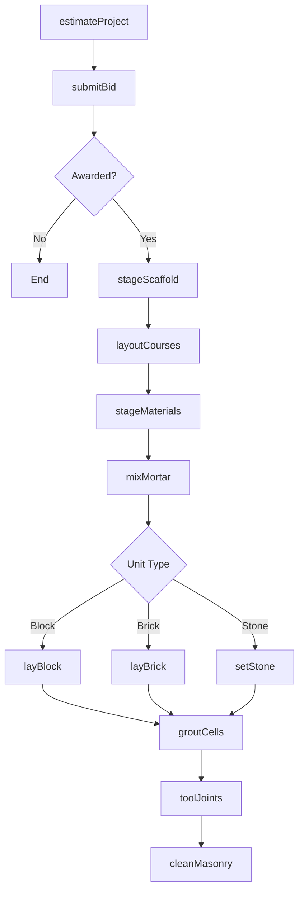
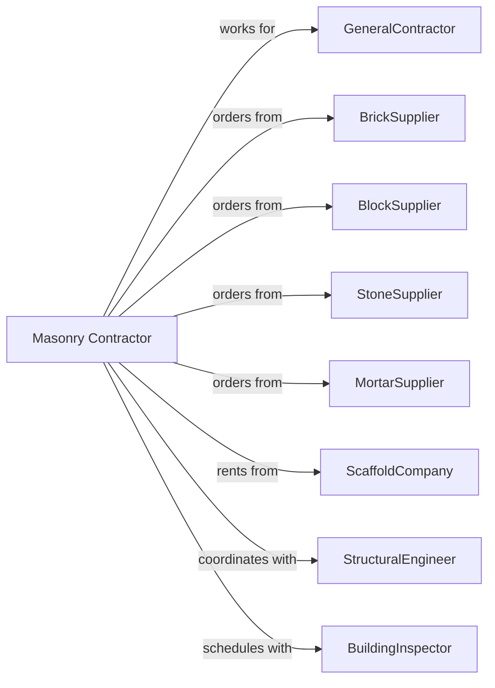

# Masonry Contractors

> Business-as-Code definition for masonry contracting operations. Models the complete lifecycle from estimating through finishing for brick, block, stone, and stucco work in commercial and residential construction.

## Overview

Masonry contractors specialize in laying brick, concrete block, stone, and applying stucco finishes. Work includes structural block walls, brick veneer, stone facades, and decorative masonry elements. This definition exposes actions for layout, material staging, unit placement, and grouting while managing mortar mixing, scaffold setup, and weather conditions.

## Actors

| Actor | Description |
|-------|-------------|
| GeneralContractor | Prime contractor hiring masonry subcontractor |
| BrickSupplier | Provides face brick and pavers |
| BlockSupplier | Provides concrete masonry units (CMU) |
| StoneSupplier | Provides natural or manufactured stone |
| MortarSupplier | Provides mortar, grout, and admixtures |
| ScaffoldCompany | Provides scaffolding and access equipment |
| StructuralEngineer | Specifies reinforcement and grouting |
| BuildingInspector | Verifies code compliance and grouting |

## Roles

| Role | Description |
|------|-------------|
| MasonryContractor | Business owner managing operations |
| Superintendent | Oversees multiple crews and projects |
| Foreman | Leads individual masonry crew |
| Bricklayer | Skilled tradesperson laying units |
| TenderHod | Mixes mortar and stages materials |
| Pointer | Performs tuckpointing and mortar joint repair on existing walls |
| Laborer | Supports scaffolding and cleanup |

## Entities

| Entity | Description |
|--------|-------------|
| Project | The masonry scope with specifications |
| Estimate | Cost proposal with labor and materials |
| BrickVeneer | Exterior brick cladding over backup |
| CMUWall | Structural concrete block wall |
| StoneFacade | Natural or manufactured stone cladding |
| Mortar | Binding material between units |
| Grout | Fluid mixture filling block cells |
| Rebar | Reinforcement within grouted cells |
| Flashing | Waterproofing at shelf angles and openings |
| Scaffold | Access platform for elevated work |

## Actions

| Action | Description |
|--------|-------------|
| estimateProject | Calculate labor, materials, and equipment |
| submitBid | Present proposal to general contractor |
| layoutCourses | Mark first course and control joints |
| stageScaffold | Erect access platforms for work |
| stageMaterials | Position brick, block, and mortar |
| mixMortar | Prepare mortar to specification |
| layBlock | Install CMU with mortar and rebar |
| layBrick | Install face brick with proper bond |
| setStone | Install stone veneer or ashlar |
| installFlashing | Place waterproofing at critical locations |
| groutCells | Fill reinforced cells with grout |
| toolJoints | Strike and finish mortar joints |
| cleanMasonry | Remove mortar smears and efflorescence |
| applyStucco | Apply three-coat stucco system |

## Events

| Event | Description |
|-------|-------------|
| bidSubmitted | Proposal delivered to GC |
| contractAwarded | Subcontract executed |
| scaffoldErected | Access platforms in place |
| coursesLaidOut | First course marked and set |
| materialStaged | Units and mortar positioned |
| blockLaid | CMU installation complete |
| brickLaid | Face brick installation complete |
| stoneSet | Stone installation complete |
| flashingInstalled | Waterproofing complete |
| cellsGrouted | Grout pour complete |
| jointsTooled | Mortar joints finished |
| masonryCleaned | Surface cleaning complete |
| stuccoApplied | Stucco system complete |

## Searches

| Search | Description |
|--------|-------------|
| findProjects | List projects by status or GC |
| getMaterialNeeds | View outstanding unit requirements |
| getDeliverySchedule | Check brick and block deliveries |
| getCrewSchedule | View crew assignments |
| getGroutLog | Retrieve grout pour records |
| getScaffoldStatus | Check scaffold setup by area |
| getInspectionStatus | View grout inspection results |

## Workflow



## Actor Relationships



## Usage

### Calling Actions

```typescript
import { installMasonry } from '@headlessly/install-masonry'

const mason = installMasonry()

// Estimate brick veneer project
const estimate = await mason.estimateProject({
  projectId: 'office-building-123',
  scope: 'brick-veneer',
  squareFeet: 15000,
  brickType: 'modular',
  bondPattern: 'running-bond',
  openings: 45
})

// Lay CMU structural wall
await mason.layBlock({
  projectId: 'office-building-123',
  area: 'elevator-shaft',
  blockSize: '8x8x16',
  coursesHigh: 32,
  reinforced: true,
  rebarSpacing: 48
})

// Grout reinforced cells
await mason.groutCells({
  projectId: 'office-building-123',
  area: 'elevator-shaft',
  liftHeight: 5,
  groutStrength: 3000,
  vibrated: true
})
```

### Event-Driven Automation

```typescript
// Auto-grout when block laid to lift height
mason.blockLaid(async ({ projectId, area, coursesComplete }) => {
  if (coursesComplete % 8 === 0) {
    await mason.groutCells({
      projectId,
      area,
      lift: coursesComplete / 8
    })
  }
})

// Auto-clean when joints tooled
mason.jointsTooled(async ({ projectId, area }) => {
  await mason.cleanMasonry({
    projectId,
    area,
    cleaningMethod: 'dilute-acid',
    waitDays: 7
  })
})
```
