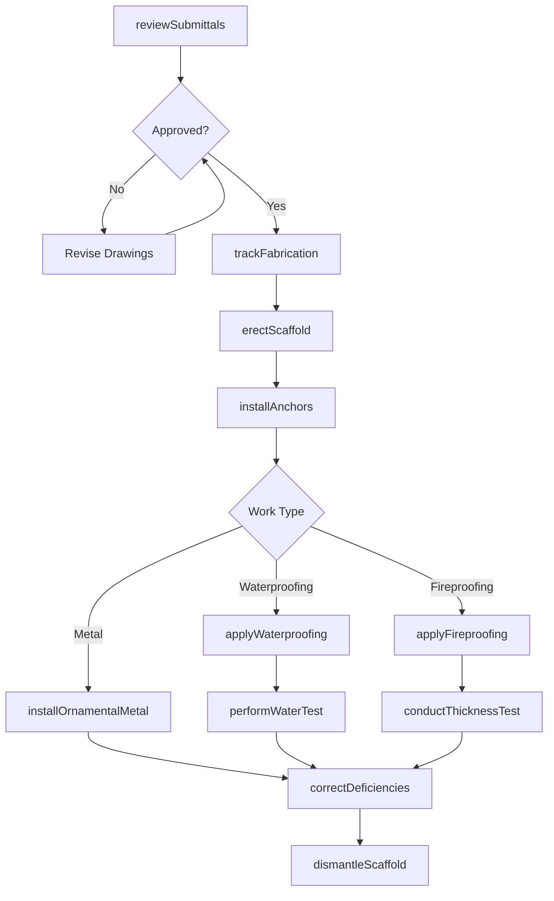
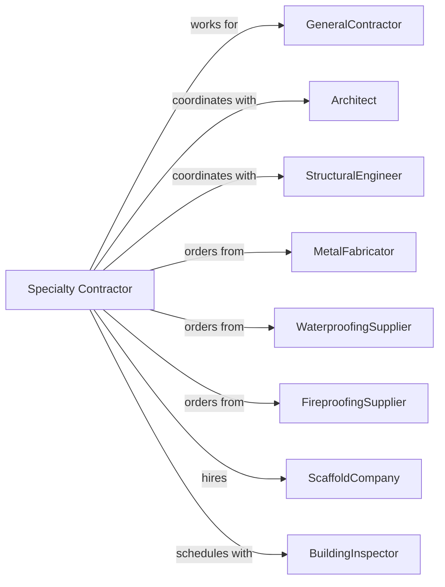

# Other Foundation, Structure, and Building Exterior Contractors

> Business-as-Code definition for specialized foundation and exterior contracting operations. Models the complete lifecycle for curtain wall installation, ornamental metal, waterproofing, and other specialized exterior work.

## Overview

Other foundation and exterior contractors perform specialized work including curtain wall metal installation, ornamental ironwork, waterproofing, fireproofing, and scaffolding erection. Work requires coordination with structural and architectural systems. This definition exposes actions for shop drawing coordination, specialized installation, and quality verification while managing technical specifications and safety requirements.

## Actors

| Actor | Description |
|-------|-------------|
| GeneralContractor | Prime contractor managing overall construction |
| Architect | Specifies aesthetic and performance requirements |
| StructuralEngineer | Provides attachment and load requirements |
| MetalFabricator | Manufactures ornamental and structural metal |
| WaterproofingSupplier | Provides membranes, coatings, and sealants |
| FireproofingSupplier | Provides spray-applied and board fireproofing |
| ScaffoldCompany | Provides suspended and supported scaffolding |
| BuildingInspector | Verifies code compliance and fire ratings |

## Roles

| Role | Description |
|------|-------------|
| SpecialtyContractor | Business owner managing operations |
| ProjectManager | Coordinates submittals and schedules |
| Superintendent | Oversees field installation crews |
| Ironworker | Installs ornamental and structural metal |
| Waterproofer | Applies membranes and coatings |
| Fireproofer | Applies spray-applied fireproofing |

## Entities

| Entity | Description |
|--------|-------------|
| Project | The specialty scope with specifications |
| ShopDrawing | Detailed fabrication and installation drawings |
| OrnamentalMetal | Decorative railings, gates, and screens |
| CurtainWallMetal | Exterior metal panel cladding |
| Waterproofing | Below-grade and above-grade membrane systems |
| Fireproofing | Spray-applied or board fire protection |
| Scaffold | Temporary access and work platforms |
| Anchor | Connection to building structure |
| Flashing | Waterproofing at transitions |
| FireRating | Required fire resistance duration |

## Actions

| Action | Description |
|--------|-------------|
| reviewSubmittals | Coordinate shop drawings with design team |
| trackFabrication | Monitor production at fabricator |
| erectScaffold | Install access platforms for work |
| installAnchors | Set attachment points in structure |
| installOrnamentalMetal | Mount railings, gates, and screens |
| installMetalPanels | Attach exterior metal cladding |
| applyWaterproofing | Install membranes and coatings |
| applyFireproofing | Spray or install fire protection |
| installFlashing | Waterproof transitions and penetrations |
| conductThicknessTest | Verify fireproofing coverage |
| performWaterTest | Verify waterproofing integrity |
| dismantleScaffold | Remove access platforms |
| correctDeficiencies | Address punchlist items |

## Events

| Event | Description |
|-------|-------------|
| submittalsApproved | Shop drawings accepted by team |
| fabricationCompleted | Metal components manufactured |
| scaffoldErected | Access platforms in place |
| anchorsInstalled | Attachment points set |
| ornamentalMetalInstalled | Railings and screens mounted |
| metalPanelsInstalled | Exterior cladding complete |
| waterproofingApplied | Membranes and coatings complete |
| fireproofingApplied | Fire protection installed |
| flashingInstalled | Transitions waterproofed |
| thicknessVerified | Fireproofing coverage confirmed |
| waterTestPassed | No leaks detected |
| scaffoldDismantled | Access platforms removed |
| deficienciesCorrected | Punchlist complete |

## Searches

| Search | Description |
|--------|-------------|
| findProjects | List projects by status or GC |
| getSubmittalStatus | Track approval progress |
| getFabricationStatus | Monitor production |
| getScaffoldPlan | View scaffold erection schedule |
| getThicknessReports | Retrieve fireproofing test results |
| getWaterTestResults | View waterproofing test documentation |
| getInspectionSchedule | Check upcoming inspections |

## Workflow



## Actor Relationships



## Usage

### Calling Actions

```typescript
import { installFoundation } from '@headlessly/install-foundation'

const contractor = installFoundation()

// Check submittal approval progress
const submittals = await contractor.getSubmittalStatus({ projectId: 'tower-456' })

// Review scaffold erection schedule
const scaffold = await contractor.getScaffoldPlan({ projectId: 'tower-456' })

// Install ornamental metal railings
await contractor.installOrnamentalMetal({
  projectId: 'tower-456',
  element: 'stair-railings',
  material: 'stainless-steel',
  finish: 'brushed',
  linearFeet: 450,
  floors: [1, 2, 3, 4, 5]
})

// Apply below-grade waterproofing
await contractor.applyWaterproofing({
  projectId: 'parking-garage-789',
  area: 'foundation-walls',
  systemType: 'sheet-membrane',
  manufacturer: 'Carlisle',
  squareFeet: 12000
})

// Apply spray fireproofing
await contractor.applyFireproofing({
  projectId: 'office-building-123',
  element: 'steel-beams',
  material: 'SFRM',
  fireRating: '2-hour',
  thickness: 1.5,
  squareFeet: 45000
})
```

### Event-Driven Automation

```typescript
// Auto-test waterproofing when applied
contractor.waterproofingApplied(async ({ projectId, area }) => {
  await contractor.performWaterTest({
    projectId,
    area,
    testDate: addDays(new Date(), 3),
    testDuration: 24
  })
})

// Auto-verify fireproofing thickness
contractor.fireproofingApplied(async ({ projectId, element }) => {
  await contractor.conductThicknessTest({
    projectId,
    element,
    testFrequency: '100-sqft',
    acceptanceCriteria: 'specified-minimum'
  })
})
```
