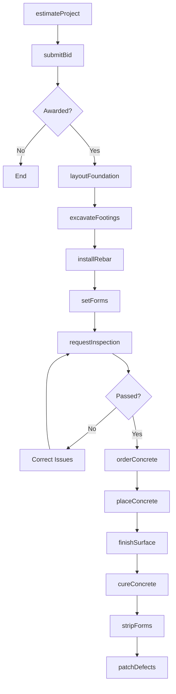
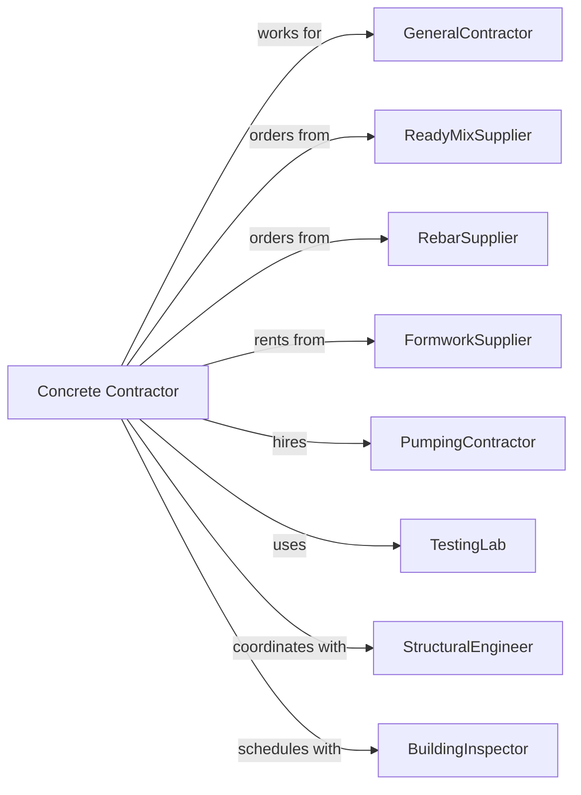

# Poured Concrete Foundation and Structure Contractors

> Business-as-Code definition for poured concrete foundation and structure contracting operations. Models the complete lifecycle from estimating through finishing for foundations, slabs, walls, and structural concrete elements.

## Overview

Poured concrete contractors specialize in forming, placing, and finishing concrete foundations, structural elements, and flatwork. Work includes footings, foundation walls, slabs-on-grade, elevated decks, and decorative concrete. This definition exposes actions for formwork installation, concrete placement, and finishing operations while managing mix designs, weather conditions, and curing requirements.

## Actors

| Actor | Description |
|-------|-------------|
| GeneralContractor | Prime contractor hiring the concrete subcontractor |
| ReadyMixSupplier | Delivers concrete to the jobsite |
| RebarSupplier | Provides reinforcing steel and accessories |
| FormworkSupplier | Provides forming systems and accessories |
| PumpingContractor | Operates concrete pumps for placement |
| TestingLab | Performs slump tests and cylinder breaks |
| StructuralEngineer | Designs structural concrete elements |
| BuildingInspector | Verifies code compliance and placement |

## Roles

| Role | Description |
|------|-------------|
| ConcreteContractor | Business owner managing operations and estimating |
| Superintendent | Oversees multiple crews and project coordination |
| Foreman | Leads individual crew and daily operations |
| Carpenter | Builds and strips concrete formwork |
| Finisher | Floats, trowels, and finishes concrete surfaces |
| Rodman | Places and ties reinforcing steel bars in forms |
| PumpOperator | Operates concrete boom pump for placing concrete |
| Laborer | Supports placement, vibration, and cleanup |

## Entities

| Entity | Description |
|--------|-------------|
| Project | The concrete scope with specifications and schedule |
| Estimate | Cost proposal with labor, material, and equipment |
| Foundation | Below-grade structural element supporting building |
| Slab | Horizontal concrete surface on grade or elevated |
| Wall | Vertical concrete element formed and poured |
| Formwork | Temporary structure shaping poured concrete |
| Rebar | Reinforcing steel within concrete elements |
| MixDesign | Concrete specification with strength and admixtures |
| Pour | Individual concrete placement operation |
| Cylinder | Test specimen for compressive strength verification |

## Actions

| Action | Description |
|--------|-------------|
| estimateProject | Calculate labor, materials, and equipment costs |
| submitBid | Present proposal to general contractor |
| layoutFoundation | Mark excavation and footing locations |
| excavateFootings | Dig trenches for foundation footings |
| installRebar | Place and tie reinforcing steel |
| setForms | Build and brace concrete formwork |
| orderConcrete | Schedule delivery from ready-mix supplier |
| placeConcrete | Pour and consolidate concrete in forms |
| finishSurface | Float, trowel, and texture concrete surfaces |
| cureConcrete | Apply curing compound or wet cure |
| stripForms | Remove formwork after concrete sets |
| patchDefects | Repair honeycombs and surface imperfections |
| requestInspection | Schedule building official inspection |

## Events

| Event | Description |
|-------|-------------|
| bidSubmitted | Proposal delivered to general contractor |
| contractAwarded | Subcontract executed |
| foundationLaidOut | Locations marked for excavation |
| footingsExcavated | Trenches ready for rebar |
| rebarInstalled | Reinforcing steel placed and inspected |
| formsSet | Formwork complete and ready for pour |
| concreteOrdered | Delivery scheduled with supplier |
| concretePlaced | Pour completed and consolidated |
| surfaceFinished | Finishing operations complete |
| concreteCured | Curing period complete |
| formsStripped | Formwork removed |
| inspectionPassed | Building official approved work |
| defectsPatched | Surface repairs complete |

## Searches

| Search | Description |
|--------|-------------|
| findProjects | List projects by status or general contractor |
| getPourSchedule | View upcoming concrete placements |
| getDeliveryTickets | Retrieve ready-mix delivery records |
| getCylinderBreaks | View compressive strength test results |
| getCrewAssignments | Check crew schedules by project |
| getMaterialUsage | Track concrete and rebar quantities |
| getInspectionStatus | View inspection requests and results |

## Workflow



## Actor Relationships



## Usage

### Calling Actions

```typescript
import { installPouredConcrete } from '@headlessly/install-poured-concrete'

const contractor = installPouredConcrete()

// Estimate foundation project
const estimate = await contractor.estimateProject({
  projectId: 'gc-project-123',
  scope: 'foundation-complete',
  footingLinearFeet: 450,
  wallSquareFeet: 2800,
  slabSquareFeet: 2200,
  mixDesign: '4000-psi'
})

// Place concrete for foundation walls
await contractor.placeConcrete({
  projectId: 'gc-project-123',
  element: 'foundation-walls',
  cubicYards: 85,
  pumpRequired: true,
  finishType: 'form-finish',
  placementDate: '2024-05-15'
})

// Finish garage slab
await contractor.finishSurface({
  projectId: 'gc-project-123',
  element: 'garage-slab',
  finishType: 'broom-finish',
  curingMethod: 'curing-compound'
})
```

### Event-Driven Automation

```typescript
// Auto-order concrete when forms inspected
contractor.inspectionPassed(async ({ projectId, element }) => {
  await contractor.orderConcrete({
    projectId,
    element,
    deliveryDate: getNextBusinessDay(),
    startTime: '7:00 AM',
    cubicYards: calculateYards(element)
  })
})

// Auto-strip forms after cure time
contractor.concreteCured(async ({ projectId, element }) => {
  await contractor.stripForms({
    projectId,
    element,
    stripDate: new Date()
  })
})
```
