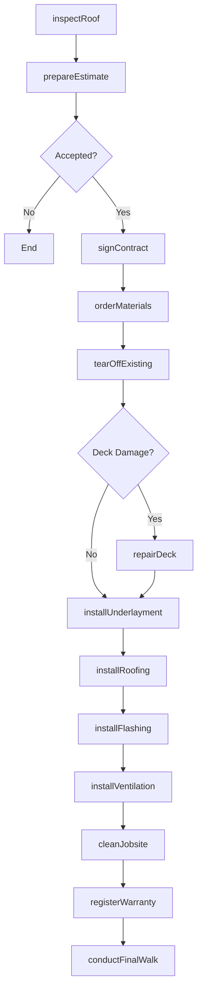
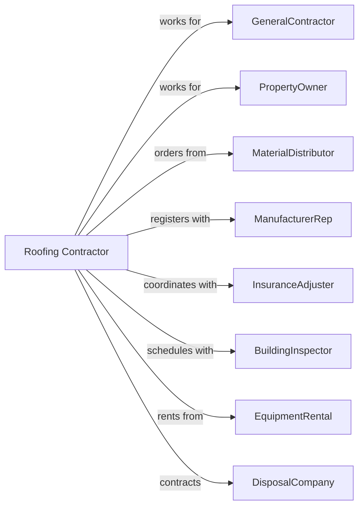

# Roofing Contractors

> Business-as-Code definition for roofing contracting operations. Models the complete lifecycle from inspection through warranty for residential and commercial roofing systems including shingles, metal, and flat roof membranes.

## Overview

Roofing contractors specialize in installing, repairing, and maintaining roof systems including asphalt shingles, metal roofing, single-ply membranes, and built-up roofing. Work includes tear-off, deck repair, underlayment, and flashing installation. This definition exposes actions for roof inspection, material ordering, installation, and warranty registration while managing weather conditions and safety requirements.

## Actors

| Actor | Description |
|-------|-------------|
| GeneralContractor | Prime contractor on new construction projects |
| PropertyOwner | Building owner for re-roofing and repair work |
| MaterialDistributor | Supplies shingles, membranes, and accessories |
| ManufacturerRep | Provides technical support and warranty registration |
| InsuranceAdjuster | Assesses storm damage claims |
| BuildingInspector | Verifies code compliance |
| EquipmentRental | Provides lifts, hoists, and safety equipment |
| DisposalCompany | Removes old roofing materials |

## Roles

| Role | Description |
|------|-------------|
| RoofingContractor | Business owner managing operations and sales |
| Estimator | Inspects roofs and prepares proposals |
| ProjectManager | Coordinates crews, materials, and schedules |
| Foreman | Leads roofing crew on site |
| Roofer | Skilled tradesperson installing roof systems |
| KettleOperator | Operates hot asphalt kettles for built-up roofing applications |
| Laborer | Supports tear-off, cleanup, and material handling |

## Entities

| Entity | Description |
|--------|-------------|
| Project | The roofing scope with specifications |
| Estimate | Cost proposal with materials and labor |
| RoofSystem | Complete assembly from deck to surface |
| Shingle | Asphalt or architectural roof covering |
| Membrane | Single-ply or built-up flat roof covering |
| Underlayment | Water-resistant layer under roofing |
| Flashing | Waterproofing at penetrations and edges |
| Ventilation | Ridge vents, soffit vents, and exhausts |
| Warranty | Manufacturer and workmanship coverage |
| Inspection | Roof condition assessment report |

## Actions

| Action | Description |
|--------|-------------|
| inspectRoof | Assess existing roof condition |
| prepareEstimate | Calculate materials, labor, and disposal |
| signContract | Execute roofing agreement |
| orderMaterials | Purchase roofing products and accessories |
| tearOffExisting | Remove old roofing materials |
| repairDeck | Fix damaged sheathing and framing |
| installUnderlayment | Apply ice and water shield and felt |
| installRoofing | Apply shingles, metal, or membrane |
| installFlashing | Waterproof penetrations and transitions |
| installVentilation | Add ridge vents and exhaust vents |
| cleanJobsite | Remove debris and magnetic sweep |
| registerWarranty | Submit warranty documentation to manufacturer |
| conductFinalWalk | Review completed work with customer |

## Events

| Event | Description |
|-------|-------------|
| roofInspected | Condition assessment complete |
| estimatePresented | Proposal delivered to customer |
| contractSigned | Agreement executed |
| materialsDelivered | Roofing products on site |
| tearOffComplete | Old roofing removed |
| deckRepaired | Sheathing damage corrected |
| underlaymentInstalled | Water-resistant layer applied |
| roofingInstalled | Primary roof covering complete |
| flashingInstalled | All penetrations waterproofed |
| ventilationInstalled | Exhaust and intake vents complete |
| jobsiteCleaned | Debris removed and area cleared |
| warrantyRegistered | Manufacturer warranty activated |
| finalWalkComplete | Customer accepted completed work |

## Searches

| Search | Description |
|--------|-------------|
| findProjects | List projects by status or customer |
| getEstimates | View pending proposals |
| getMaterialOrders | Track roofing material deliveries |
| getCrewSchedule | View crew assignments by date |
| getWeatherForecast | Check conditions for scheduling |
| getWarrantyStatus | Verify warranty registration |
| getInspectionReports | Retrieve roof condition assessments |

## Workflow



## Actor Relationships



## Usage

### Calling Actions

```typescript
import { installRoofing } from '@headlessly/install-roofing'

const roofer = installRoofing()

// Check weather conditions for scheduling
const weather = await roofer.getWeatherForecast({ location: 'home-456' })

// Review material delivery status
const materials = await roofer.getMaterialOrders({ projectId: 'reroof-789' })

// Inspect existing roof
const inspection = await roofer.inspectRoof({
  propertyId: 'home-456',
  address: '789 Oak Street',
  roofType: 'asphalt-shingle',
  roofAge: 18,
  reportedIssues: ['missing-shingles', 'visible-damage']
})

// Install new roof system
await roofer.installRoofing({
  projectId: 'reroof-789',
  roofType: 'architectural-shingle',
  manufacturer: 'GAF',
  product: 'Timberline-HDZ',
  color: 'Charcoal',
  squares: 32
})

// Register manufacturer warranty
await roofer.registerWarranty({
  projectId: 'reroof-789',
  manufacturer: 'GAF',
  warrantyType: 'golden-pledge',
  installDate: '2024-06-15',
  installerCertification: 'master-elite'
})
```

### Event-Driven Automation

```typescript
// Auto-order materials when contract signed
roofer.contractSigned(async ({ projectId, scope }) => {
  await roofer.orderMaterials({
    projectId,
    deliveryDate: getStartDate(projectId),
    materials: calculateMaterials(scope)
  })
})

// Auto-register warranty when installation complete
roofer.roofingInstalled(async ({ projectId }) => {
  await roofer.registerWarranty({
    projectId,
    registrationDate: new Date()
  })
})
```
