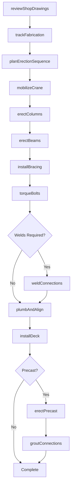
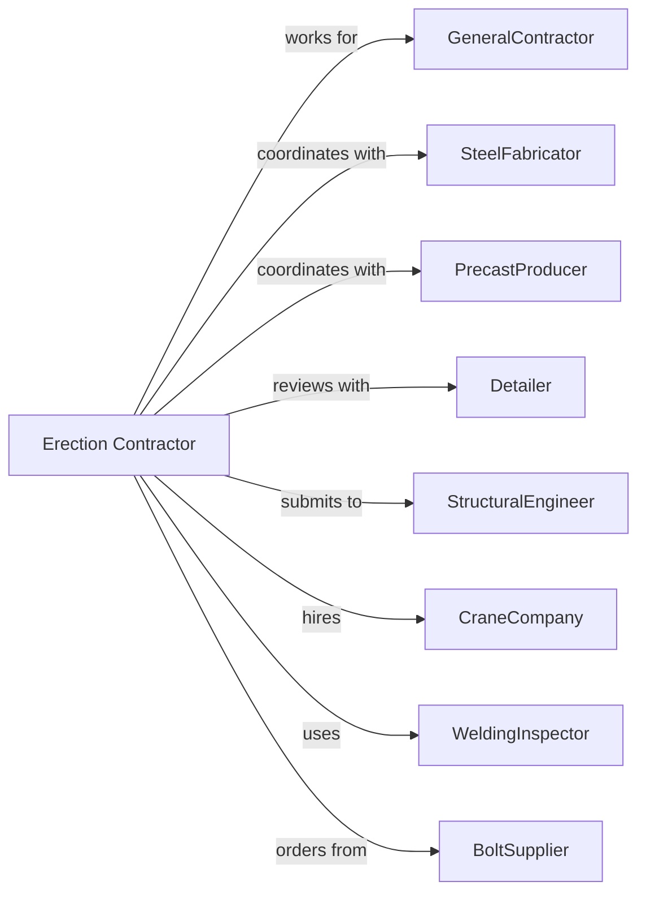

# Structural Steel and Precast Concrete Contractors

> Business-as-Code definition for structural steel and precast concrete erection operations. Models the complete lifecycle from detailing through erection for steel frames, precast elements, and reinforcing steel installation.

## Overview

Structural steel and precast contractors specialize in erecting steel frames, installing precast concrete elements, and placing reinforcing steel. Work includes steel columns, beams, joists, deck, precast panels, and rebar installation. This definition exposes actions for detailing coordination, fabrication tracking, and erection sequencing while managing crane operations, connection torquing, and safety protocols.

## Actors

| Actor | Description |
|-------|-------------|
| GeneralContractor | Prime contractor managing overall construction |
| SteelFabricator | Manufactures structural steel members |
| PrecastProducer | Manufactures precast concrete elements |
| Detailer | Produces shop drawings and erection plans |
| StructuralEngineer | Designs structural systems and reviews submittals |
| CraneCompany | Provides cranes and operators for erection |
| WeldingInspector | Certifies welders and inspects welds |
| BoltSupplier | Provides high-strength bolts and hardware |

## Roles

| Role | Description |
|------|-------------|
| ErectionContractor | Business owner managing operations |
| ProjectManager | Coordinates schedule, budget, and submittals |
| ErectionSuperintendent | Oversees field erection operations |
| Ironworker | Connects and secures structural members |
| CraneOperator | Operates crane for member placement |
| Connector | Bolts and welds structural connections |

## Entities

| Entity | Description |
|--------|-------------|
| Project | The structural erection scope with schedule |
| ShopDrawing | Detailed fabrication and erection drawings |
| SteelMember | Individual beam, column, or brace |
| PrecastElement | Manufactured concrete panel or component |
| ErectionSequence | Planned order of member installation |
| Connection | Joint between structural members |
| Bolt | High-strength fastener for connections |
| Weld | Fused connection between steel members |
| Plumb | Vertical alignment of structural frame |
| Deck | Metal floor or roof decking |

## Actions

| Action | Description |
|--------|-------------|
| reviewShopDrawings | Coordinate detailing with engineer |
| trackFabrication | Monitor production at fabricator |
| planErectionSequence | Develop member installation order |
| mobilizeCrane | Position crane for erection operations |
| erectColumns | Set and plumb vertical members |
| erectBeams | Place and connect horizontal members |
| installBracing | Connect lateral bracing elements |
| torqueBolts | Tighten connections to specification |
| weldConnections | Complete field welds at connections |
| plumbAndAlign | Adjust frame to plumb and level |
| installDeck | Place and attach metal decking |
| erectPrecast | Set precast panels and elements |
| groutConnections | Fill precast connections with grout |

## Events

| Event | Description |
|-------|-------------|
| shopDrawingsApproved | Detailing complete and engineer approved |
| fabricationCompleted | Steel or precast members manufactured |
| materialsDelivered | Members delivered to jobsite |
| craneMobilized | Crane positioned and operational |
| columnsErected | Vertical members installed |
| beamsErected | Horizontal members connected |
| bracingInstalled | Lateral system complete |
| boltsTorqued | Connections tensioned to spec |
| weldsCompleted | Field welding finished |
| framePlumbed | Structure aligned and secured |
| deckInstalled | Metal decking attached |
| precastErected | Precast elements set |
| connectionsGrouted | Precast joints filled |

## Searches

| Search | Description |
|--------|-------------|
| findProjects | List projects by status or general contractor |
| getErectionSchedule | View planned sequence and dates |
| trackFabricationStatus | Monitor member production |
| getDeliverySchedule | View material delivery dates |
| getBoltingRecords | Retrieve torque verification logs |
| getWeldingReports | View weld inspection results |
| getCrewAssignments | Check ironworker crew schedules |

## Workflow



## Actor Relationships



## Usage

### Calling Actions

```typescript
import { installStructuralSteel } from '@headlessly/install-structural-steel'

const contractor = installStructuralSteel()

// Review erection sequence and schedule
const schedule = await contractor.getErectionSchedule({ projectId: 'office-tower-456' })

// Check ironworker crew assignments
const crews = await contractor.getCrewAssignments({ projectId: 'office-tower-456', week: 'current' })

// Track fabrication progress
await contractor.trackFabrication({
  projectId: 'office-tower-456',
  fabricatorId: 'steel-works-inc',
  sequence: 1,
  members: ['C1-C20', 'B1-B45'],
  targetShipDate: '2024-06-01'
})

// Erect columns for first tier
await contractor.erectColumns({
  projectId: 'office-tower-456',
  tier: 1,
  columns: ['C1', 'C2', 'C3', 'C4'],
  craneId: 'tower-crane-1',
  erectionDate: '2024-06-15'
})

// Torque bolted connections
await contractor.torqueBolts({
  projectId: 'office-tower-456',
  tier: 1,
  connectionType: 'slip-critical',
  tensionMethod: 'turn-of-nut',
  verificationRate: 0.10
})
```

### Event-Driven Automation

```typescript
// Auto-schedule beam erection when columns complete
contractor.columnsErected(async ({ projectId, tier }) => {
  await contractor.erectBeams({
    projectId,
    tier,
    startDate: addDays(new Date(), 1)
  })
})

// Auto-install deck when frame plumbed
contractor.framePlumbed(async ({ projectId, tier }) => {
  await contractor.installDeck({
    projectId,
    tier,
    deckType: 'composite-3-inch',
    attachmentMethod: 'puddle-weld'
  })
})
```
