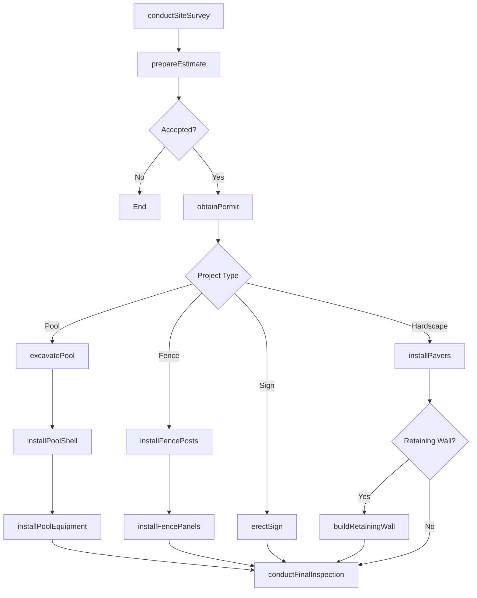
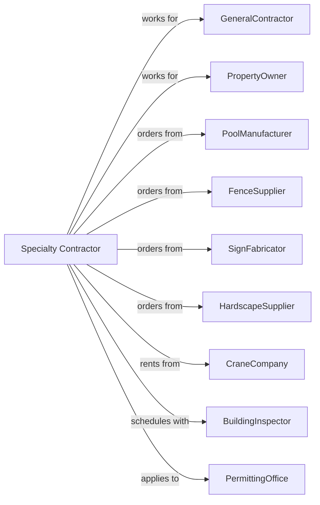

# All Other Specialty Trade Contractors

> Business-as-Code definition for miscellaneous specialty trade contracting operations. Models the complete lifecycle from estimation through completion for swimming pools, fencing, signage, pavers, and other specialized construction services.

## Overview

All other specialty trade contractors perform specialized construction work not classified elsewhere, including swimming pool construction, fence installation, sign erection, paver and hardscape work, and specialty equipment rental with operators. This definition exposes actions for project scoping, material coordination, and installation while managing specialized equipment, permits, and quality standards across diverse trade categories.

## Actors

| Actor | Description |
|-------|-------------|
| GeneralContractor | Prime contractor managing overall construction |
| PropertyOwner | Residential or commercial customer |
| PoolManufacturer | Produces pool shells, liners, and equipment |
| FenceSupplier | Provides fencing materials and gates |
| SignFabricator | Manufactures custom signage |
| HardscapeSupplier | Provides pavers, stone, and materials |
| CraneCompany | Provides crane rental with operators |
| BuildingInspector | Verifies code compliance |
| PermittingOffice | Issues construction permits |

## Roles

| Role | Description |
|------|-------------|
| SpecialtyContractor | Business owner managing operations |
| Estimator | Measures and prepares proposals |
| ProjectManager | Coordinates schedule and materials |
| Foreman | Leads installation crew |
| Installer | Skilled tradesperson performing work |
| EquipmentOperator | Operates cranes and specialty equipment |

## Entities

| Entity | Description |
|--------|-------------|
| Project | The specialty work scope with specifications |
| Estimate | Cost proposal with labor and materials |
| SwimmingPool | In-ground or above-ground pool system |
| Fence | Perimeter enclosure with posts and panels |
| Sign | Commercial or wayfinding signage |
| Paver | Unit paving stone for hardscape |
| Retaining Wall | Structure holding back soil or grade |
| Firepit | Outdoor fire feature |
| Pergola | Outdoor shade structure |
| Permit | Government authorization for work |

## Actions

| Action | Description |
|--------|-------------|
| conductSiteSurvey | Assess conditions and access |
| prepareEstimate | Calculate materials and labor costs |
| obtainPermit | Secure required construction permits |
| excavatePool | Dig pool cavity to specifications |
| installPoolShell | Set fiberglass or gunite pool structure |
| installPoolEquipment | Connect pumps, filters, and heaters |
| installFencePosts | Set posts in concrete footings |
| installFencePanels | Attach panels and gates |
| erectSign | Install signage on posts or buildings |
| installPavers | Lay unit pavers on prepared base |
| buildRetainingWall | Construct block or stone retaining structure |
| installWaterFeature | Set fountains and water elements |
| installOutdoorFirepit | Construct fire feature |
| buildPergola | Erect outdoor shade structure |
| conductFinalInspection | Verify work meets specifications |

## Events

| Event | Description |
|-------|-------------|
| siteSurveyed | Conditions documented |
| estimatePresented | Proposal delivered |
| permitObtained | Authorization received |
| poolExcavated | Cavity dug to grade |
| poolShellInstalled | Structure set and backfilled |
| poolEquipmentInstalled | Mechanical systems connected |
| fencePostsSet | Posts installed and cured |
| fencePanelsInstalled | Fence complete and gated |
| signErected | Signage mounted and illuminated |
| paversInstalled | Hardscape surface complete |
| retainingWallBuilt | Wall structure complete |
| waterFeatureInstalled | Fountain operational |
| firepitInstalled | Fire feature complete |
| pergolaBuilt | Shade structure finished |
| finalInspectionPassed | Work accepted and approved |

## Searches

| Search | Description |
|--------|-------------|
| findProjects | List projects by status or type |
| getPermitStatus | Track permit applications |
| getMaterialOrders | View material deliveries |
| getCrewSchedule | Check installer assignments |
| getEquipmentSchedule | View crane and equipment bookings |
| getInspectionSchedule | Track inspection requests |
| getWarrantyInfo | Retrieve warranty documentation |

## Workflow



## Actor Relationships



## Usage

### Calling Actions

```typescript
import { installSpecialtyTrade } from '@headlessly/install-specialty-trade'

const contractor = installSpecialtyTrade()

// Check permit application status
const permits = await contractor.getPermitStatus({ projectId: 'backyard-oasis-123' })

// Review equipment and crane bookings
const equipment = await contractor.getEquipmentSchedule({ week: 'current' })

// Install in-ground swimming pool
await contractor.installPoolShell({
  projectId: 'backyard-oasis-123',
  poolType: 'gunite',
  dimensions: { length: 40, width: 20, depth: 8 },
  features: ['spa', 'tanning-ledge', 'waterfall'],
  finish: 'pebble-tec'
})

// Install privacy fence
await contractor.installFencePanels({
  projectId: 'residential-fence-456',
  material: 'cedar',
  style: 'board-on-board',
  height: 72,
  linearFeet: 320,
  gateCount: 2
})

// Install paver patio
await contractor.installPavers({
  projectId: 'outdoor-living-789',
  paverType: 'travertine',
  pattern: 'herringbone',
  squareFeet: 800,
  baseDepth: 6,
  edgeRestraint: 'aluminum'
})
```

### Event-Driven Automation

```typescript
// Auto-install equipment when pool shell set
contractor.poolShellInstalled(async ({ projectId }) => {
  await contractor.installPoolEquipment({
    projectId,
    equipment: ['variable-speed-pump', 'salt-chlorinator', 'heater'],
    startDate: addDays(new Date(), 3)
  })
})

// Auto-schedule inspection when fence complete
contractor.fencePanelsInstalled(async ({ projectId }) => {
  await contractor.conductFinalInspection({
    projectId,
    inspectionDate: addDays(new Date(), 2)
  })
})
```
