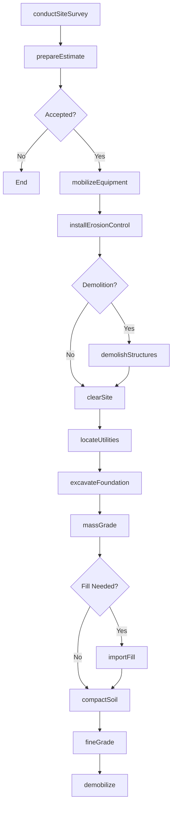
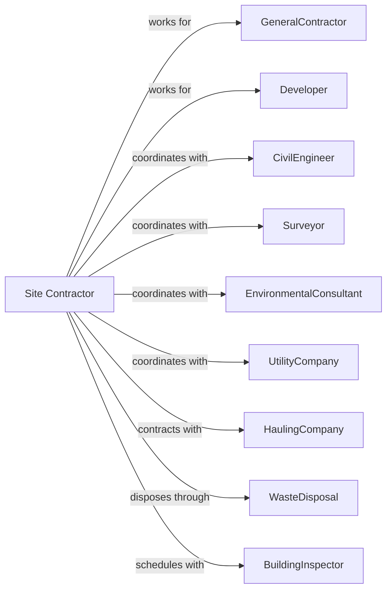

# Site Preparation Contractors

> Business-as-Code definition for site preparation contracting operations. Models the complete lifecycle from site survey through final grading for excavation, demolition, grading, and earthwork services.

## Overview

Site preparation contractors specialize in preparing land for construction through excavation, grading, demolition, and earthmoving activities. Work includes clearing vegetation, removing existing structures, excavating foundations, and establishing finished grades. This definition exposes actions for site assessment, demolition coordination, and earthwork execution while managing soil conditions, utility protection, and erosion control.

## Actors

| Actor | Description |
|-------|-------------|
| GeneralContractor | Prime contractor managing overall construction |
| Developer | Land owner initiating site development |
| CivilEngineer | Designs grading plans and drainage |
| Surveyor | Stakes property lines and grades |
| EnvironmentalConsultant | Assesses soil conditions and contamination |
| UtilityCompany | Locates and protects underground utilities |
| HaulingCompany | Transports excavated material and imports fill |
| WasteDisposal | Accepts demolition debris and contaminated soil |
| BuildingInspector | Verifies footing excavations and compaction |

## Roles

| Role | Description |
|------|-------------|
| SiteContractor | Business owner managing operations |
| ProjectManager | Coordinates schedule and subcontractors |
| Superintendent | Oversees daily field operations |
| EquipmentOperator | Operates excavators, dozers, and loaders |
| GradeChecker | Verifies elevations and slopes |
| DemolitionForeman | Leads selective and total demolition operations |
| Laborer | Performs manual work and utility location |

## Entities

| Entity | Description |
|--------|-------------|
| Project | The site work scope with specifications |
| Estimate | Cost proposal with quantities and rates |
| GradingPlan | Engineering drawings showing elevations |
| CutFill | Calculation of earth to move |
| Excavation | Dug area for foundation or utility |
| Demolition | Structure removal scope |
| ErosionControl | Measures preventing soil runoff |
| Spoils | Excavated material requiring disposal |
| ImportFill | Material brought to site for fill |
| Compaction | Soil density specification |

## Actions

| Action | Description |
|--------|-------------|
| conductSiteSurvey | Assess existing conditions and access |
| prepareEstimate | Calculate quantities and pricing |
| mobilizeEquipment | Deliver machines to job site |
| installErosionControl | Place silt fence and inlet protection |
| clearSite | Remove vegetation and debris |
| demolishStructures | Raze existing buildings and slabs |
| locateUtilities | Mark underground lines before excavation |
| excavateFoundation | Dig footings and basement areas |
| massGrade | Cut and fill to establish rough grade |
| importFill | Haul and place fill material |
| compactSoil | Achieve specified density |
| fineGrade | Establish finished elevations |
| installSeptic | Excavate and place septic systems |
| stockpileMaterial | Store topsoil for later use |
| demobilize | Remove equipment from site |

## Events

| Event | Description |
|-------|-------------|
| siteSurveyed | Existing conditions documented |
| estimatePresented | Proposal delivered |
| equipmentMobilized | Machines on site and ready |
| erosionControlInstalled | Runoff protection in place |
| siteCleared | Vegetation and debris removed |
| structuresDemolished | Buildings razed and hauled |
| utilitiesLocated | Underground lines marked |
| foundationExcavated | Footings dug to grade |
| massGradingComplete | Rough grades established |
| fillImported | Material placed and spread |
| compactionVerified | Density tests passed |
| fineGradingComplete | Finished elevations achieved |
| septicInstalled | System placed and covered |
| materialStockpiled | Topsoil stored for restoration |
| siteComplete | All earthwork finished |

## Searches

| Search | Description |
|--------|-------------|
| findProjects | List projects by status or GC |
| getGradingPlans | Retrieve engineering drawings |
| getCutFillQuantities | View earthwork calculations |
| getCompactionReports | Retrieve density test results |
| getEquipmentStatus | Check machine availability |
| getHaulTickets | Track material import and export |
| getUtilityLocates | View marked utility locations |

## Workflow



## Actor Relationships



## Usage

### Calling Actions

```typescript
import { contractSitePreparation } from '@headlessly/contract-site-preparation'

const siteContractor = contractSitePreparation()

// Excavate building foundation
await siteContractor.excavateFoundation({
  projectId: 'commercial-plaza-456',
  footingDepth: 48,
  basementDepth: 96,
  area: 'building-A',
  soilType: 'clay',
  dewateringRequired: true
})

// Mass grading for parking lot
await siteContractor.massGrade({
  projectId: 'commercial-plaza-456',
  area: 'parking-lot',
  cutYards: 8500,
  fillYards: 3200,
  balanceOnSite: true,
  targetElevation: 425.5
})

// Demolish existing structure
await siteContractor.demolishStructures({
  projectId: 'redevelopment-789',
  structures: ['warehouse-A', 'office-building'],
  totalSquareFeet: 45000,
  abatementRequired: true,
  recyclingTarget: 75
})
```

### Event-Driven Automation

```typescript
// Auto-excavate when utilities located
siteContractor.utilitiesLocated(async ({ projectId, area }) => {
  await siteContractor.excavateFoundation({
    projectId,
    area,
    startDate: addDays(new Date(), 1)
  })
})

// Auto-compact when fill placed
siteContractor.fillImported(async ({ projectId, area }) => {
  await siteContractor.compactSoil({
    projectId,
    area,
    targetDensity: 95,
    testFrequency: 'every-lift'
  })
})
```
