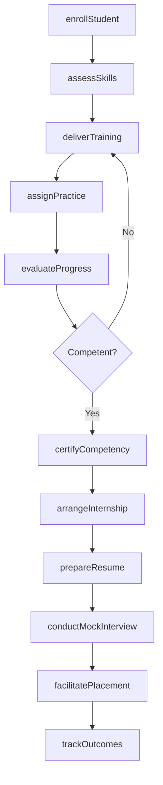
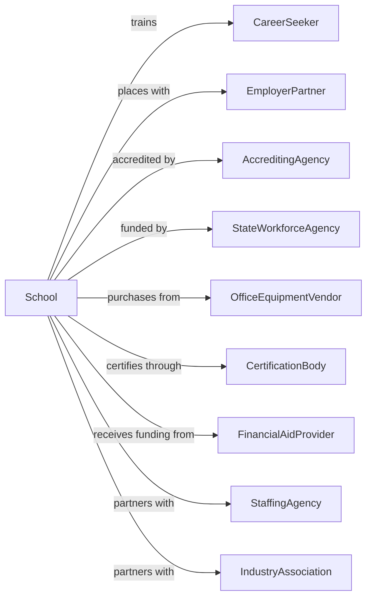

# Business and Secretarial Schools

> Business-as-Code definition for vocational business training institutions. Models the complete training lifecycle from enrollment through job placement.

## Overview

Business and secretarial schools provide career-focused training in office administration, clerical skills, and business operations for individuals seeking employment in administrative roles. This definition exposes actions for student enrollment, skills training, certification, and career placement, along with events for workflow automation and searches for program data.

## Actors

| Actor | Description |
|-------|-------------|
| CareerSeeker | Individual enrolling for vocational training |
| EmployerPartner | Company hiring graduates for administrative positions |
| AccreditingAgency | Body certifying program quality and outcomes |
| StateWorkforceAgency | Government entity funding vocational training |
| OfficeEquipmentVendor | Supplier of training equipment and software |
| CertificationBody | Organization issuing industry credentials |
| FinancialAidProvider | Lender or agency providing student funding |
| StaffingAgency | Firm placing graduates in temporary and permanent roles |
| IndustryAssociation | Professional group setting skills standards |

## Roles

| Role | Description |
|------|-------------|
| SchoolDirector | Leads the institution and manages operations |
| Instructor | Teaches office skills and business procedures |
| CareerCounselor | Guides students on job search and placement |
| AdmissionsCoordinator | Processes applications and enrolls students |
| LabTechnician | Maintains training equipment and software |
| PlacementSpecialist | Connects graduates with employment opportunities |
| KeyboardingInstructor | Teaches typing speed and accuracy using structured drills and timed assessments |

## Entities

| Entity | Description |
|--------|-------------|
| Student | Individual enrolled in training programs |
| Program | Course sequence leading to credential |
| Course | Individual training module with learning objectives |
| Enrollment | Record of student registration |
| Certificate | Credential awarded upon program completion |
| Skill | Competency measured and certified |
| Assessment | Test evaluating student proficiency |
| Placement | Job obtained by graduate |
| Internship | Supervised work experience during training |
| LabStation | Workstation with training equipment |
| Transcript | Record of courses completed and grades |
| Tuition | Fees charged for training programs |

## Actions

| Action | Description |
|--------|-------------|
| enrollStudent | Register student for training program |
| assessSkills | Evaluate baseline competencies |
| deliverTraining | Conduct classroom and lab instruction |
| assignPractice | Provide hands-on exercises for skill development |
| evaluateProgress | Test student mastery of course objectives |
| certifyCompetency | Award credential for demonstrated skills |
| arrangeInternship | Place student in supervised work experience |
| prepareResume | Assist student with job application materials |
| conductMockInterview | Practice interview skills with feedback |
| facilitatePlacement | Connect graduate with employer opportunities |
| processFinancialAid | Administer loans, grants, and payment plans |
| trackOutcomes | Monitor graduate employment and satisfaction |
| updateCurriculum | Revise programs based on industry needs |
| maintainEquipment | Service and upgrade lab technology |
| reportCompliance | Submit required data to accreditors and regulators |

## Events

| Event | Description |
|-------|-------------|
| studentEnrolled | Registration completed for program |
| skillsAssessed | Baseline evaluation completed |
| trainingDelivered | Instruction session completed |
| practiceAssigned | Hands-on exercise distributed |
| progressEvaluated | Assessment completed and scored |
| competencyCertified | Credential awarded to student |
| internshipArranged | Work placement confirmed |
| resumePrepared | Job application materials finalized |
| mockInterviewConducted | Practice session completed |
| placementFacilitated | Graduate connected with employer |
| financialAidProcessed | Funding disbursed to student account |
| outcomesTracked | Employment data recorded |
| curriculumUpdated | Program content revised |
| equipmentMaintained | Lab service completed |
| complianceReported | Regulatory filing submitted |

## Searches

| Search | Description |
|--------|-------------|
| findStudents | Query students by program, status, or cohort |
| getPrograms | List available training programs |
| getCourses | Retrieve courses by program or skill area |
| getEnrollments | Query registrations by term or program |
| getCertificates | List credentials issued to students |
| getPlacements | Track graduate employment outcomes |
| getInternships | Find active work placements |
| getEmployerPartners | List companies hiring graduates |

## Workflow



## Actor Relationships



## Usage

### Calling Actions

```typescript
import { trainBusiness } from '@headlessly/train-business'

const school = trainBusiness()

// List available training programs
const programs = await school.getPrograms({ category: 'office-administration' })

// Track graduate employment outcomes
const placements = await school.getPlacements({ cohort: '2024-spring' })

// Enroll a new student
const enrollment = await school.enrollStudent({
  firstName: 'Maria',
  lastName: 'Santos',
  programId: 'office-admin-certificate',
  startDate: '2025-09-01',
  fundingSource: 'workforce-grant'
})

// Assess baseline skills
const assessment = await school.assessSkills({
  studentId: enrollment.studentId,
  skills: ['typing', 'spreadsheet', 'communication', 'filing']
})

// Certify competency upon completion
await school.certifyCompetency({
  studentId: enrollment.studentId,
  credential: 'certified-administrative-professional',
  skills: ['word-processing', 'spreadsheets', 'office-management'],
  issueDate: '2025-12-15'
})
```

### Event-Driven Automation

```typescript
// Auto-arrange internship when training complete
school.competencyCertified(async ({ studentId, credential }) => {
  const student = await school.findStudents({ id: studentId })
  const partners = await school.getEmployerPartners({
    skillsRequired: credential.skills,
    hasInternships: true
  })

  if (partners.length > 0) {
    await school.arrangeInternship({
      studentId,
      employerId: partners[0].id,
      duration: '4-weeks',
      startDate: nextMonday()
    })
  }
})

// Track outcomes 90 days after placement
school.placementFacilitated(async ({ studentId, employerId, startDate }) => {
  await scheduleFollowUp({
    date: addDays(startDate, 90),
    action: async () => {
      await school.trackOutcomes({
        studentId,
        employerId,
        employed: true,
        salary: null,
        satisfaction: null
      })
    }
  })
})
```
