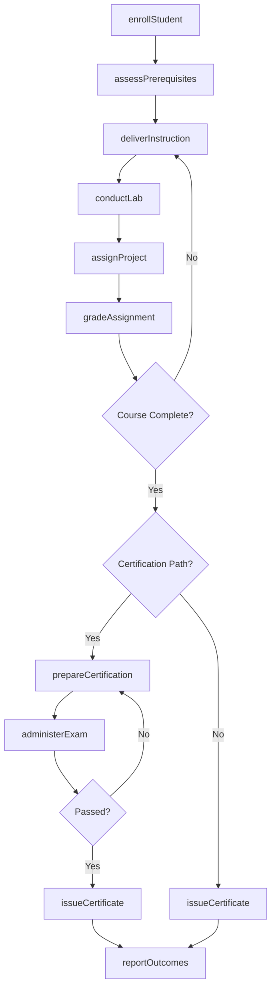
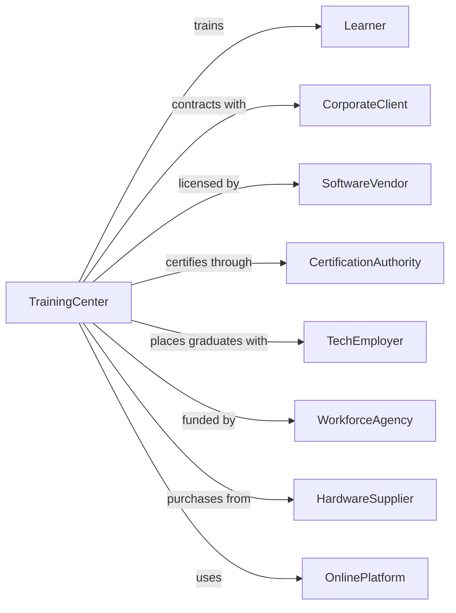

# Computer Training

> Business-as-Code definition for computer and technology training providers. Models the complete learning lifecycle from enrollment through certification and job placement.

## Overview

Computer training establishments provide instruction in programming, software applications, network administration, cybersecurity, and other technology skills for career advancement or personal enrichment. This definition exposes actions for student enrollment, curriculum delivery, skills assessment, and industry certification, along with events for workflow automation and searches for program data.

## Actors

| Actor | Description |
|-------|-------------|
| Learner | Individual seeking technology skills training |
| CorporateClient | Organization sponsoring employee training |
| SoftwareVendor | Publisher providing software licenses and training materials |
| CertificationAuthority | Body issuing industry-recognized credentials |
| TechEmployer | Company hiring trained technology professionals |
| WorkforceAgency | Government entity funding technology training programs |
| HardwareSupplier | Provider of computers and lab equipment |
| OnlinePlatform | Digital learning management system provider |
| IndustryPartner | Technology company collaborating on curriculum |

## Roles

| Role | Description |
|------|-------------|
| TrainingDirector | Oversees curriculum and operations |
| TechInstructor | Delivers technology training and labs |
| CurriculumDeveloper | Creates and updates course content |
| LabAdministrator | Maintains computer systems and software |
| StudentAdvisor | Guides learners on course selection and career paths |
| CorporateTrainer | Delivers customized training to business clients |
| CertificationProctor | Administers vendor certification exams at authorized testing center stations |

## Entities

| Entity | Description |
|--------|-------------|
| Student | Individual enrolled in training courses |
| Course | Training module with defined learning objectives |
| Curriculum | Sequence of courses for a skill path |
| Enrollment | Record of student registration in a course |
| Certification | Industry credential earned through examination |
| Lab | Computer environment for hands-on practice |
| Assessment | Test measuring technical competency |
| License | Software authorization for training use |
| Project | Practical assignment demonstrating applied skills |
| Transcript | Record of courses completed and scores |
| Schedule | Timetable of class sessions |
| CorporateContract | Agreement for bulk or customized training |

## Actions

| Action | Description |
|--------|-------------|
| enrollStudent | Register learner for training course or program |
| assessPrerequisites | Evaluate baseline knowledge for course placement |
| deliverInstruction | Conduct classroom or online training sessions |
| conductLab | Facilitate hands-on practice exercises |
| assignProject | Distribute practical coding or configuration tasks |
| gradeAssignment | Evaluate student work and provide feedback |
| prepareCertification | Ready student for industry credential examination |
| administerExam | Conduct certification test as authorized center |
| issueCertificate | Award completion credential to student |
| customizeTraining | Develop tailored curriculum for corporate client |
| provisionLab | Configure software and systems for training |
| trackProgress | Monitor student advancement through curriculum |
| updateCurriculum | Revise content to reflect technology changes |
| processPayment | Handle tuition and corporate billing |
| reportOutcomes | Submit completion and certification data |

## Events

| Event | Description |
|-------|-------------|
| studentEnrolled | Registration completed for course |
| prerequisitesAssessed | Baseline evaluation completed |
| instructionDelivered | Training session conducted |
| labCompleted | Hands-on exercise finished |
| projectSubmitted | Practical assignment turned in |
| assignmentGraded | Work evaluated with feedback |
| certificationPrepared | Exam readiness confirmed |
| examAdministered | Certification test completed |
| certificateIssued | Credential awarded to student |
| trainingCustomized | Corporate curriculum finalized |
| labProvisioned | Training environment configured |
| progressTracked | Student advancement recorded |
| curriculumUpdated | Course content revised |
| paymentProcessed | Tuition or contract payment received |
| outcomesReported | Completion data submitted |

## Searches

| Search | Description |
|--------|-------------|
| findStudents | Query learners by course, status, or employer |
| getCourses | List courses by technology or skill level |
| getCertifications | Retrieve credentials earned by students |
| getEnrollments | Query registrations by course or date |
| getLabSchedule | Find available lab times and resources |
| getCorporateContracts | List active business training agreements |
| getProgressReports | Retrieve student advancement data |
| getInstructors | List trainers by specialty or availability |

## Workflow



## Actor Relationships



## Usage

### Calling Actions

```typescript
import { trainComputers } from '@headlessly/train-computers'

const center = trainComputers()

// Enroll a student in a course
const enrollment = await center.enrollStudent({
  learnerId: 'learner-456',
  courseId: 'aws-solutions-architect',
  format: 'hybrid',
  startDate: '2025-09-08',
  paymentMethod: 'employer-sponsored'
})

// Provision lab environment
await center.provisionLab({
  courseId: 'aws-solutions-architect',
  sessionId: enrollment.sessionId,
  resources: ['ec2-instances', 's3-buckets', 'vpc-config'],
  duration: '4-hours'
})

// Administer certification exam
const examResult = await center.administerExam({
  studentId: enrollment.studentId,
  certification: 'AWS-SAA-C03',
  proctor: 'instructor-789',
  date: '2025-11-15'
})
```

### Event-Driven Automation

```typescript
// Auto-issue certificate when exam passed
center.examAdministered(async ({ studentId, certification, passed, score }) => {
  if (passed) {
    await center.issueCertificate({
      studentId,
      credential: certification,
      score,
      issueDate: new Date().toISOString(),
      expirationDate: addYears(new Date(), 3)
    })
  } else {
    await scheduleRetake({
      studentId,
      certification,
      earliestDate: addDays(new Date(), 14)
    })
  }
})

// Notify corporate client of employee completions
center.certificateIssued(async ({ studentId, credential }) => {
  const student = await center.findStudents({ id: studentId })

  if (student.sponsorType === 'corporate') {
    const contract = await center.getCorporateContracts({
      clientId: student.sponsorId
    })

    await sendReport({
      to: contract.hrContact,
      subject: `Employee Certification: ${credential}`,
      data: { employee: student.name, credential, date: new Date() }
    })
  }
})
```
