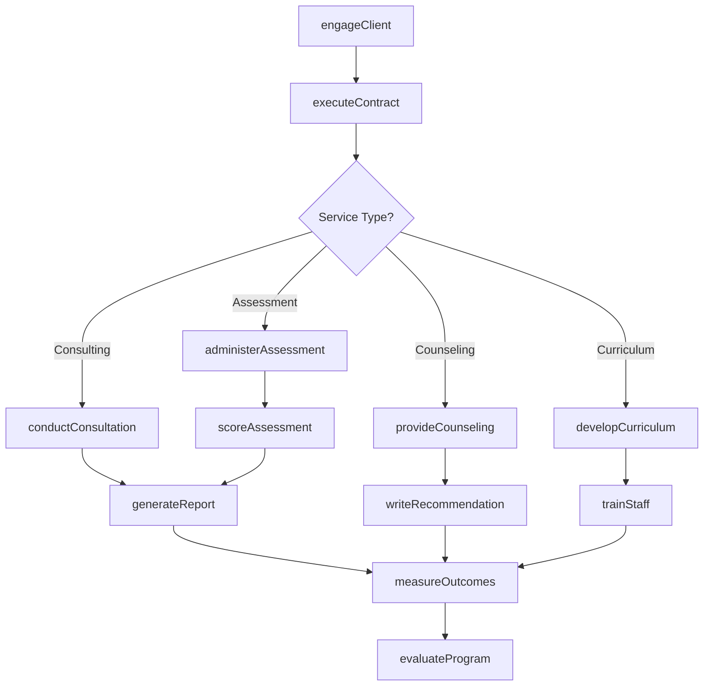
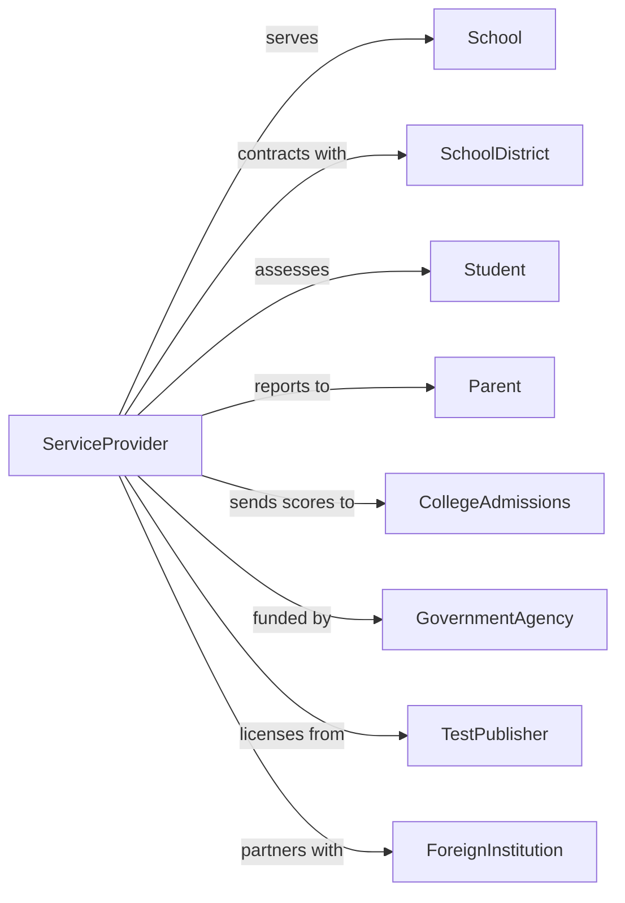

# Educational Support Services

> Business-as-Code definition for non-instructional educational support providers. Models the complete service lifecycle from client engagement through outcome measurement.

## Overview

Educational support services establishments provide non-instructional services that support educational processes, including educational consulting, testing services, guidance counseling, student exchange programs, and curriculum development. This definition exposes actions for client engagement, service delivery, assessment administration, and outcome reporting, along with events for workflow automation and searches for program data.

## Actors

| Actor | Description |
|-------|-------------|
| School | Educational institution purchasing support services |
| SchoolDistrict | Administrative body contracting services |
| Student | Individual receiving assessment or counseling services |
| Parent | Guardian of student receiving services |
| CollegeAdmissions | Institution receiving test scores and applications |
| GovernmentAgency | Regulatory body funding or mandating services |
| TestPublisher | Developer of standardized assessments |
| ForeignInstitution | Partner school for exchange programs |
| FoundationFunder | Grant provider supporting educational initiatives |

## Roles

| Role | Description |
|------|-------------|
| ManagingDirector | Oversees service operations and client relationships |
| EducationalConsultant | Advises schools on improvement strategies |
| AssessmentSpecialist | Develops and administers educational tests |
| GuidanceCounselor | Provides student counseling and advising |
| ExchangeCoordinator | Manages international student programs |
| CurriculumDeveloper | Creates instructional content and standards |
| StandardizedTestProctor | Administers high-stakes exams under timed conditions ensuring security and procedural compliance |

## Entities

| Entity | Description |
|--------|-------------|
| Client | School or district purchasing services |
| Contract | Agreement for service delivery |
| Assessment | Standardized test or evaluation instrument |
| Report | Analysis of assessment results or consulting findings |
| Student | Individual receiving direct services |
| ExchangeProgram | International student placement arrangement |
| Curriculum | Instructional content and standards |
| Consultation | Advisory engagement with client |
| CounselingSession | Guidance meeting with student |
| Grant | Funding supporting service delivery |
| TestScore | Result of administered assessment |
| Recommendation | Counselor report for college application |

## Actions

| Action | Description |
|--------|-------------|
| engageClient | Establish relationship with school or district |
| executeContract | Formalize service agreement |
| conductConsultation | Deliver advisory services to client |
| developCurriculum | Create instructional content and standards |
| administerAssessment | Deliver standardized tests to students |
| scoreAssessment | Process and evaluate test responses |
| generateReport | Produce analysis of results or findings |
| provideCounseling | Conduct guidance session with student |
| writeRecommendation | Prepare college application support document |
| coordinateExchange | Manage student placement abroad |
| evaluateProgram | Assess effectiveness of educational initiative |
| submitGrant | Apply for foundation or government funding |
| trainStaff | Provide professional development to educators |
| auditCompliance | Review adherence to educational standards |
| measureOutcomes | Track impact of services on student achievement |

## Events

| Event | Description |
|-------|-------------|
| clientEngaged | Relationship established with institution |
| contractExecuted | Service agreement formalized |
| consultationConducted | Advisory session completed |
| curriculumDeveloped | Instructional content created |
| assessmentAdministered | Tests delivered to students |
| assessmentScored | Results processed |
| reportGenerated | Analysis document produced |
| counselingProvided | Guidance session conducted |
| recommendationWritten | Application document prepared |
| exchangeCoordinated | Student placement arranged |
| programEvaluated | Initiative effectiveness assessed |
| grantSubmitted | Funding application filed |
| staffTrained | Professional development delivered |
| complianceAudited | Standards review completed |
| outcomesMeasured | Impact data recorded |

## Searches

| Search | Description |
|--------|-------------|
| findClients | Query schools and districts by contract status |
| getContracts | List active service agreements |
| getAssessments | Query tests by type or administration date |
| getReports | Retrieve analysis documents by client |
| getCounselingSessions | Find guidance meetings by student |
| getExchangePrograms | List international placements |
| getGrants | Query funding sources and applications |
| getTestScores | Retrieve results by student or school |

## Workflow



## Actor Relationships



## Usage

### Calling Actions

```typescript
import { supportSchools } from '@headlessly/support-schools'

const provider = supportSchools()

// Engage a new school district client
const engagement = await provider.engageClient({
  clientType: 'district',
  name: 'Westside Unified School District',
  contactName: 'Dr. Sarah Mitchell',
  contactEmail: 'smitchell@westside.k12.us',
  servicesNeeded: ['assessment', 'consulting', 'curriculum']
})

// Execute service contract
const contract = await provider.executeContract({
  clientId: engagement.clientId,
  services: ['benchmark-assessment', 'data-analysis', 'improvement-planning'],
  term: '2025-2026',
  value: 125000,
  deliverables: ['quarterly-assessments', 'annual-report', 'pd-workshops']
})

// Administer district-wide assessment
await provider.administerAssessment({
  contractId: contract.id,
  assessmentType: 'reading-benchmark',
  grades: [3, 4, 5, 6, 7, 8],
  window: { start: '2025-09-15', end: '2025-09-30' },
  format: 'online'
})
```

### Event-Driven Automation

```typescript
// Generate report when assessment scoring complete
provider.assessmentScored(async ({ assessmentId, clientId }) => {
  const results = await provider.getTestScores({ assessmentId })
  const client = await provider.findClients({ id: clientId })

  const report = await provider.generateReport({
    assessmentId,
    clientId,
    reportType: 'benchmark-analysis',
    includeComponents: ['aggregate-scores', 'growth-trends', 'recommendations'],
    format: 'pdf'
  })

  await sendNotification({
    to: client.contactEmail,
    subject: `Assessment Results Ready: ${results.assessmentName}`,
    template: 'assessment-report-ready',
    attachments: [report.url]
  })
})

// Measure outcomes at end of school year
provider.contractExecuted(async ({ contractId, term }) => {
  await scheduleTask({
    date: getSchoolYearEnd(term),
    action: async () => {
      await provider.measureOutcomes({
        contractId,
        metrics: ['student-achievement-growth', 'staff-satisfaction', 'implementation-fidelity'],
        comparisonPeriod: 'year-over-year'
      })

      await provider.evaluateProgram({
        contractId,
        scope: 'comprehensive',
        includeROI: true
      })
    }
  })
})
```
